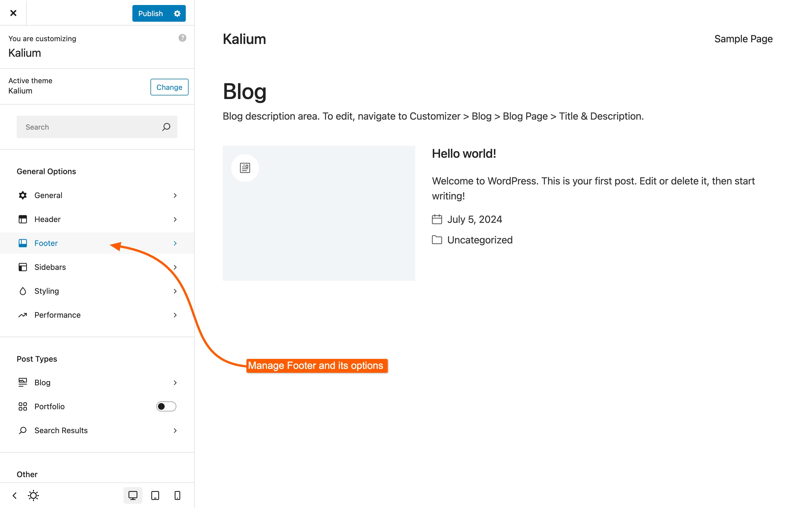

# Footer

The Kalium footer is highly flexible and user-friendly, utilizing widget areas for easy customization. With the Block Editor, you can effortlessly add and arrange text, images, menus, and other elements, making it simple to create a footer that fits your design and functional needs.

To edit footer options and its structure go to **Appearance -> Customize -> Footer**

<figure><figcaption></figcaption></figure>

In the **Footer** customizer section, you will find the following settings to design your footer:

<figure><figcaption>
Footer Options
</figcaption></figure> <figure><figcaption>
Footer Builder with drag and drop interface
</figcaption></figure>

### Footer Options

Footer options offer straightforward functionalities, such as the ability to completely disable the footer if you use a separate plugin to build it.​

#### Type

The footer type determines its positioning on the page. Setting it to **Normal** will keep it within the document flow, aligning it below the main content. Selecting **Fixed** will position the footer behind the main content wrapper, adding extra scrolling space and allowing for a smooth revealing animation such as _Fade_ or _Slide_.

#### In Page Footer Options

To edit footer settings for individual pages or other post types, go to the edit screen of the specific post or page, then scroll to **Parameters and Options -> Page Options -> Footer Options**

<figure><figcaption>
In Page Footer options
</figcaption></figure>

#### Footer Visibility

Overrides the global setting to enable or disable the footer on the current page.​

#### Fixed Footer

Apply a different footer type specifically for the current page.

### Footer Layout

Creating your desired footer layout is straightforward. Click **Add Footer Row** to choose from a range of pre-defined footer row structures as shown below:

<figure><figcaption>
Available footer row structures
</figcaption></figure>

You can add as many rows as needed to customize your footer layout.

### Footer Elements

Similar to the header, the footer also utilizes a drag-and-drop builder for arranging elements. Below is the list of elements that footer supports:

#### Row

A row is a flexible container that can include multiple columns. It offers various Flexbox[^1] options to control the arrangement of both the container and its columns.​ You can also set the row width to full width.

It supports custom backgrounds, link and text colors, and common CSS properties like padding, margin, borders, as well as custom CSS classes.

The row element also offers responsive visibility options, allowing you to control when and how it appears based on different device screen sizes.

#### Column

The column element allows you to divide a row into multiple sections, each with customizable width and alignment. It also supports Flexbox and other CSS properties. Additionally, you can assign custom CSS classes for further styling.

The column element also includes responsive visibility options, similar to the row element.​

#### Widget Area

After inserting the row and columns, they will automatically include Widget Area elements, which pulls content from the defined sidebar widgets. Currently, there are **6 available widget areas**, which are sufficient for creating a versatile footer structure:

<figure><figcaption></figcaption></figure>

Each widget area stacks content vertically by default. To arrange the content in columns, adjust the **Widgets per Row** option by clicking the three dots in the **Widget Area** element options:

<figure><figcaption>
Set the number of columns (optional)
</figcaption></figure>

You can hide elements temporarily by toggling the :eye: eye icon next to each one.

In the following section, you’ll learn how to create the content for footer widgets.

[^1]: Flexbox is a CSS layout model that simplifies arranging items within a container with flexible and responsive alignment.
