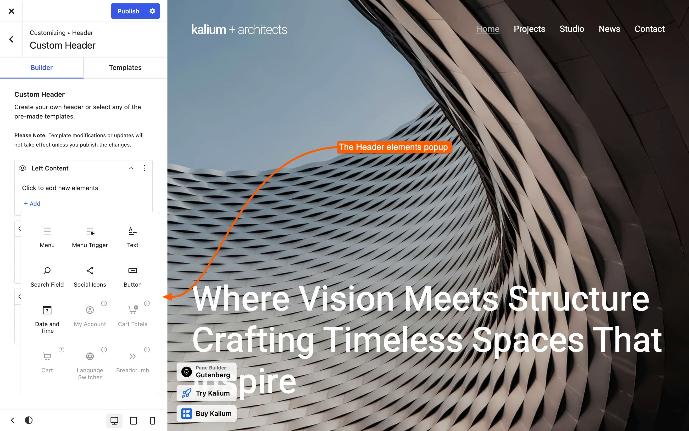
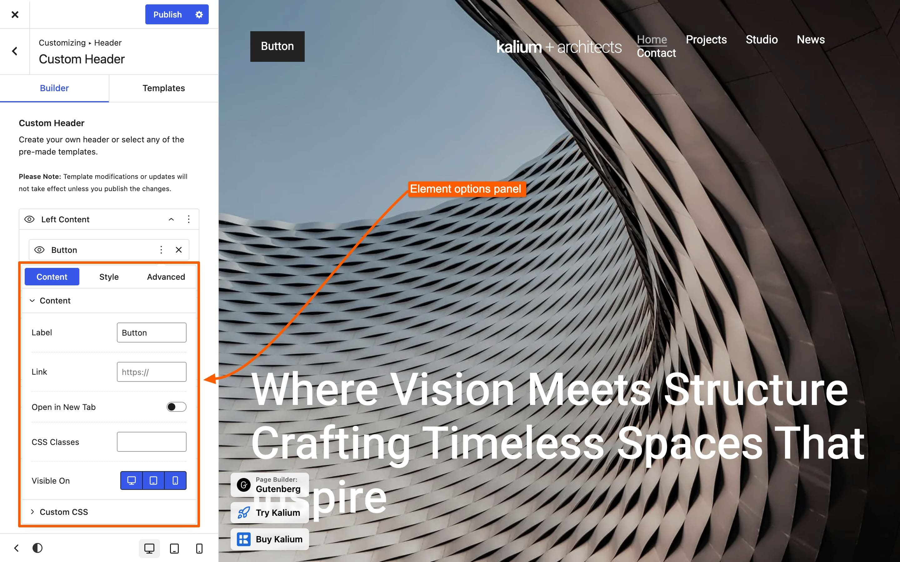

# Custom Header

Custom Header type offers a flexible drag-and-drop interface, allowing you to design your header with _12 unique, customizable elements_. Each element comes with its own set of options and can be tailored for visibility across different device viewports. For further customization, you can also apply Custom CSS on element level, giving you full control over its styling.

Once you select the Custom type, the Header Builder section will appear. Clicking on it will take you to the layout builder.

<figure><figcaption>
Content sections on header builder
</figcaption></figure>

* **Left Content**\
  Includes elements positioned to the left of the logo. If left empty, the container will be hidden, resulting in a main row structure with the logo and header elements aligned to the right.
* **Right Content**\
  Includes elements positioned to the right of the logo.
* **Bottom Content**\
  Includes elements positioned below the logo in the bottom row.

***

### How to use the builder

The builder works the same way everywhere it appears, so learning it here covers the footer, the top bar, the mobile menu and the product cards too.

#### 1. Add an element

Click the **Add** button inside the region you want to fill. A list of available elements opens.

Where a canvas has many elements, a search field appears above the list, type a few letters rather than scrolling.

<figure><figcaption></figcaption></figure>


**Grayed-out elements need a plugin.** Cart, Cart Totals and My Account need WooCommerce active. Language Switcher needs WPML, and Breadcrumb needs Breadcrumb NavXT. They stay in the list so you know they exist.


#### 2. Move things around

**Drag an element** to reorder it within a region, or drag it into a different region entirely. The preview updates as you go.

#### 3. Change an element's settings

**Click an element** and its settings open beside the canvas. Each element has its own, the Menu element has menu settings, the Search element has search settings.

<figure><figcaption></figcaption></figure>

#### 4. Hide something without deleting it

Click the :eye: **eye icon** on an element to switch it off. It stays in place with everything configured, and clicking again brings it back.

This is far better than deleting when you're experimenting, you don't have to set it up again.

#### 5. Set different values per device

Many settings have small **device icons** beside them for desktop, tablet and mobile. Click one, set the value for that device.

**An empty device inherits from the one above it**, so a desktop value applies to tablet and mobile until you give those their own.

#### 6. Save

**Click Publish in the Customizer.** The preview updates live as you work, but nothing is stored until you publish.


**"My changes aren't on the site."** This is almost always it, the builder previews live, which makes it easy to forget the changes aren't saved yet.


***

### Regions can't be removed

Left, Right and Bottom already exist and are the structure of the header. There's no delete button for them, and that's intentional.

**To empty a region**, remove the elements inside it or hide them with the eye icon. An empty Left Content region hides itself, leaving the logo and elements aligned right.

***

### Where else you'll find this builder

The same editor is used in nine other places. Once you know it here, you know it everywhere:

| Where                                                   | What you're building          |
| ------------------------------------------------------- | ----------------------------- |
| **Header -> Top Bar -> Top Bar Content**                | The strip above the header    |
| **Header -> Mobile Menu -> Mobile Menu Content**        | The mobile panel              |
| **Footer -> Footer Content**                            | The footer                    |
| **General -> Social Icons**                             | Your social accounts          |
| **Blog / Portfolio / WooCommerce -> Social Sharing**    | Which share buttons appear    |
| **WooCommerce -> Product Catalog -> Grid Product Card** | The product card in grid view |
| **WooCommerce -> Product Catalog -> List Product Card** | The product card in list view |


**The product cards work slightly differently.** They start from a **template** you pick and you rearrange what's inside it, rather than filling fixed regions. Everything else about the builder is the same.


***

### Spacing in the header builder

Header, Top Bar and Mobile Menu elements are deliberately leaner than the footer and product card ones. Each carries **its own settings, plus Visible On and Custom CSS**, but no Margin, Padding, Border or Dimensions. Two exceptions: the **Row** has only its Content Align, and the **Button** has its own Padding and Border Radius. In the Mobile Menu, no element has Visible On.

Spacing in the header comes from three places instead:

* **The Row element**, whose **Content Align** spreads or groups everything in a row
* **Each element's own spacing setting**, such as **Menu Item Spacing** on the Menu
* **The header's Style tab** in the Customizer, for padding around the whole thing

This keeps headers consistent between sites. Elsewhere in the builder, the footer and product cards, elements do carry the full set of layout, border and spacing options.


[styling.md](../styling.md)


***

To add a new element click :heavy\_plus\_sign: **Add** and the popup with element types will be shown. Disabled elements require certain plugin to be active in order to be enabled.

The following article will detail the purpose and usage of each element.​


[elements.md](elements.md)


***

### When the builder doesn't behave

**I can't delete a region.**\
Regions are fixed. Remove or hide the elements inside instead.

**An element is missing from the list.**\
Cart, Cart Totals and My Account need WooCommerce. Language Switcher needs WPML, and Breadcrumb needs Breadcrumb NavXT.

**My changes aren't on the site.**\
Publish the Customizer. The preview updates live, but nothing saves until you do.

**An element looks right on desktop but wrong on mobile.**\
Its settings are per device, switch to the mobile icon and set it there.

**The product card ignores my changes.**\
Check you edited the card matching **Shop Products View**. Grid and list are separate builders.

**My header text isn't translatable.**\
WPML picks up builder text when the Customizer is saved. Save it once and the strings appear.


[translating-with-wpml.md](../../../translation/translating-with-wpml.md)

