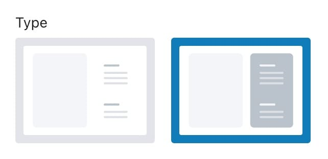
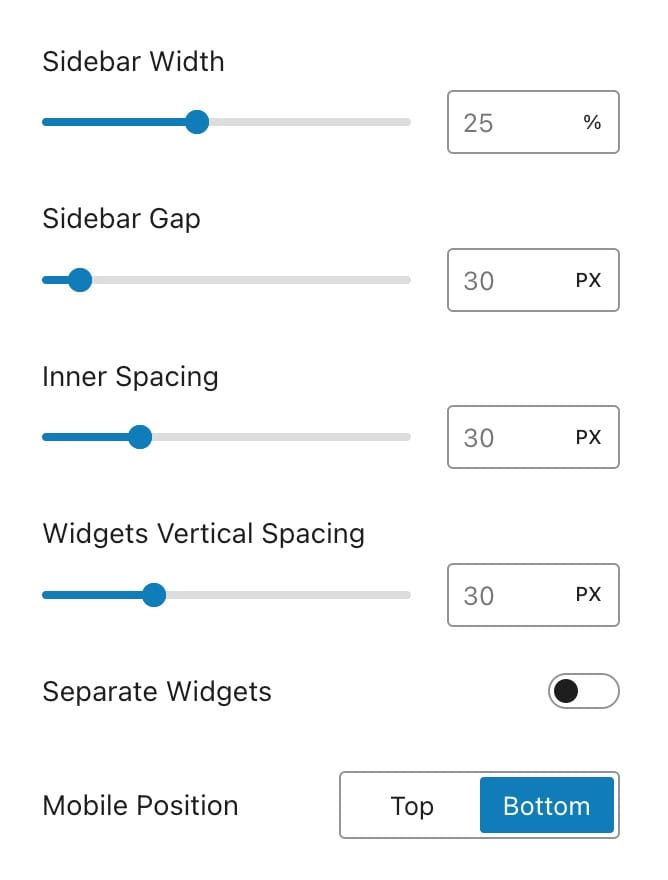
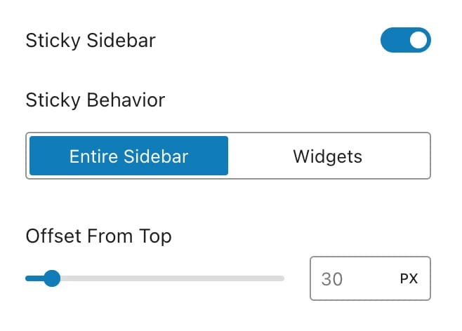
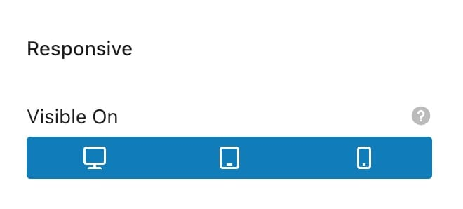
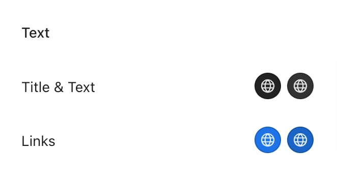
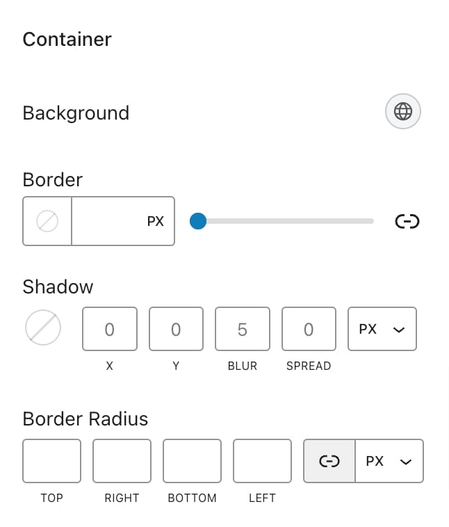

# Sidebars



Kalium offers extensive options to customize the sidebars on your website, allowing you to create the perfect layout for your content. The sidebar settings can be accessed by navigating to **Appearance -> Customizer -> Sidebars** in your WordPress dashboard. Below is a detailed guide to the different customization options available for sidebars in Kalium.

### Sidebar Types

Kalium provides two distinct types of sidebars, each offering different design capabilities:

<figure><figcaption></figcaption></figure>

* **Type 1:** This is a traditional sidebar without any background or border. It's ideal for a clean, minimalist look.
* **Type 2:** This type allows you to add more design elements, such as a background, border, border radius, and shadow, giving you greater control over the appearance of your sidebar.

### Sidebar Options

<figure><figcaption></figcaption></figure>

#### Sidebar Width

You can set the width of the sidebar as a percentage of the overall page width. This allows you to control how much space the sidebar occupies relative to the main content area.

#### Sidebar Gap

This setting controls the gap between the sidebar and the main content. Adjusting this can help to create a more balanced layout.

#### Inner Spacing _(Type 2)_

Allows you to define the inner spacing (padding) within the sidebar or widget if they are separated. It’s useful for ensuring that your sidebar content has enough breathing room.

#### Widget Vertical Spacing

This option sets the gap between individual widgets within the sidebar. It helps maintain consistent spacing and a clean look.

#### Separate Widgets _(Type 2)_

Allows you to separate each widget within the sidebar, giving them a distinct appearance.

#### Mobile Position

This setting lets you choose whether the sidebar should appear at the top or bottom of the page when viewed on mobile devices.

### Sticky Sidebar

Kalium offers a sticky sidebar feature that keeps the sidebar visible as the user scrolls down the page. You can toggle this feature on or off and customize it with the following options:

<figure><figcaption></figcaption></figure>

* **Sticky Behaviour:**&#x20;
  * Entire Sidebar: The entire sidebar remains sticky.
  * Widget&#x73;**:** Set the number of the bottom widgets that you want to remain sticky.
* **Offset from Top:** This setting controls the distance from the top of the page when the sidebar becomes sticky.

### Responsive Visibility

You can control whether the sidebar is visible on different devices by toggling the respective options:

* Desktop
* Tablet
* Mobile

<figure><figcaption></figcaption></figure>

***

### Style

The Style tab provides a range of customization options that allow you to style the sidebar's text and container to match your website's design.

#### Text

* **Title and Text Color:** Customize the color of the sidebar titles and text.
* **Links Color and Hover Color:** Set the color for links and the color that appears when hovering over them.

<figure><figcaption></figcaption></figure>

#### Container _(Type 2)_

* **Background Color:** Choose a background color for your sidebar container.
* **Border Width, Type, and Color:** Define the border's width, style, and color for the sidebar or widgets if separated option is on.
* **Shadow:** Add a shadow effect to the sidebar for a more dynamic look.
* **Border Radius:** Customize the corner rounding (radius) of the sidebar’s border.

<figure><figcaption></figcaption></figure>
