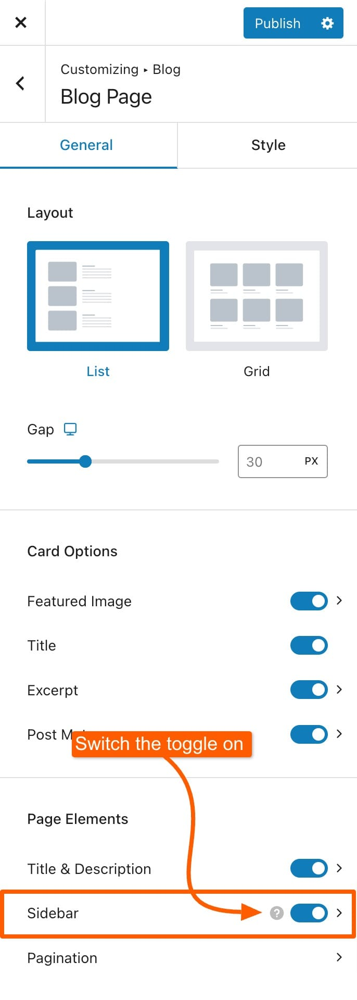

# Troubleshooting Sidebar

### Why Isn’t My Sidebar Showing?

If your sidebar isn’t appearing, keep in mind that the Sidebars section in **Appearance -> Customize -> Sidebars** only controls the global styling of sidebars. To display a sidebar on a specific page, you need to enable it in the settings for that page.

For example if you want to show it in the blog archive page, you will have it to enable for the blog only.

1. Navigate to **Appearance -> Customize**&#x20;
2. For example, to display a sidebar on your blog page, go to **Appearance -> Customize -> Blog -> Blog Page**.
3. Under **Page Elements,** make sure that the sidebar toggle is set to "**On**" for the relevant page.

Once the sidebar is enabled for the page where you want to show using the instructions above, you can adjust its alignment directly from the page settings, set it to the left or right based on your preference.

<figure><figcaption></figcaption></figure>

***

### Adding Widgets to Your Sidebar

You can add widgets to your sidebars using two methods: via the Customizer or the Widgets screen. The result is the same, but the method you choose depends on your preference and workflow. The Customizer offers a live preview of changes as you make them, while the Widgets screen provides a traditional interface for drag-and-drop widget management. Both methods allow you to effectively add and configure widgets for your sidebars.

#### Method 1: Using the Customizer

1. Go to **Appearance -> Customize** in your WordPress dashboard.
2. In the Customizer menu, find and click on the **Widgets** section.
3. Choose the sidebar area where you want to add widgets.
4. Click the **+** button. You will see a list of available widgets. Click on the widget you want to add, configure its settings if needed, and click **Publish** to save your changes.

<figure><figcaption></figcaption></figure>

#### Method 2: Using the Widgets Screen

1. Navigate to **Appearance -> Widgets** in your WordPress admin area.
2. On the Widgets page, you will see a list of available sidebars or widget areas. Expand on the sidebar area where you want to add widgets.
3. Click the big **+** button to add widgets from the list. Configure the widget settings as required and click **Save** to apply the changes.

<figure><figcaption></figcaption></figure>
