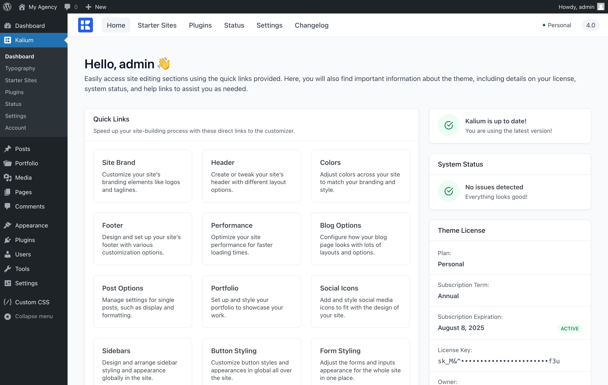

# Dashboard

Theme Dashboard is an important section where you can find useful information about the theme, manage your license, access quick links for site editing, find help resources, and explore other features related to Kalium.

You will see your currently purchased plan, including the remaining support period and the theme version number. These elements are interactive: they will display when your support is about to expire and notify you of available theme updates without needing to visit the Updates page.

You can easily navigate through several sections: **Starter Sites** for importing demo content, **Plugins** for managing and installing essential tools, **Status** for monitoring your site’s health, **Settings** for adjusting global theme options, and **Changelog** for reviewing recent updates and changes.

<figure><figcaption>
On overview of the welcome screen on Theme Dashboard
</figcaption></figure>

