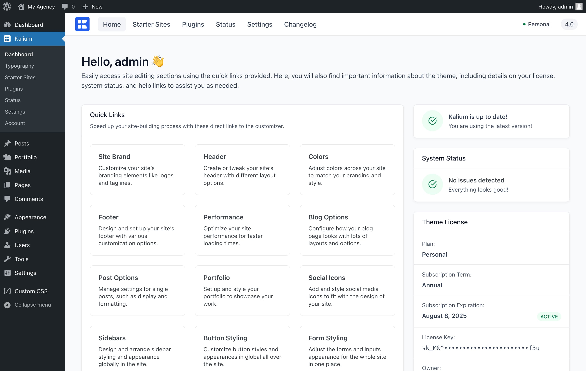

# Dashboard

Theme Dashboard is an important section where you can find useful information about the theme, manage your license, access quick links for site editing, find help resources, and explore other features related to Kalium.

You will see your currently purchased plan, including the remaining support period and the theme version number. These elements are interactive: they will display when your support is about to expire and notify you of available theme updates without needing to visit the Updates page.

<figure><figcaption>
On overview of the welcome screen on Theme Dashboard
</figcaption></figure>

***

### The screens

Everything Kalium adds to your admin lives under the **Kalium** menu.

#### Home

The welcome screen above, your plan, your support period, your theme version, and quick links to the things you'll need most.

This is also where you activate your license. If the **Kalium** menu has no sub-items yet, clicking it brings you here to enter your key.


[license-activation.md](installation/license-activation.md)


#### Starter Sites

Ready-made websites you can import in one step, a complete design with pages, menus and demo content, which you then replace with your own.

The fastest way to get a site that looks finished.


[importing-a-starter-site.md](installation/importing-a-starter-site.md)


#### Plugins

Where you install and update the plugins Kalium works with, including four premium ones bundled with your license: **ACF Pro**, **WPBakery Page Builder**, **Slider Revolution** and **LayerSlider**.


**Always install these from here**, not from the WordPress plugin directory. The bundled copies are licensed through Kalium, a copy from elsewhere won't match your license and will be overwritten.



[installing-required-plugins.md](installation/installing-required-plugins.md)


#### Status

Your site's health check, and **the first screen to open when something isn't working**.

It shows your PHP version, memory limit, whether your license is active, and whether your server can reach the internet. Kalium needs **PHP 7.4 or newer** and **at least 128 MB of memory**.

Support will almost always ask for a screenshot of this screen, so it's worth knowing where it is.

[TAKE THE SCREENSHOT OF THIS PARTICULAR SECTION AND POST HERE: the Kalium -> Status screen showing the system checks]

#### Settings

Where whole features are switched on and off, Template Parts, the portfolio module, theme backups, white labeling.

Different from the Customizer: **Settings decides whether a feature exists, the Customizer decides how it looks.**


[theme-settings](theme-settings/)


#### Template Parts

Reusable pieces of your site you build once and place anywhere, custom sections, replacement headers and footers, popups, and code snippets.


[what-are-template-parts.md](../template-parts/what-are-template-parts.md)


#### Typography

Every font on your site, adding them, sizing them, and choosing where each one applies.


[fonts](../typography/fonts/)


#### Changelog

What changed in each release. Worth a look before updating, and again if something behaves differently afterwards.

***

### If a screen is missing

Two things hide Kalium's screens, and neither is a fault:

**Your license isn't active.** The **Kalium** menu shows no sub-items until the theme is registered. Click **Kalium** and enter your key.

**White Label is hiding it.** **Kalium -> Settings -> White Label** can hide the Plugins, Starter Sites, Template Parts, Status, Changelog and Account screens, usually set up by whoever built the site.


[white-label.md](theme-settings/white-label.md)

