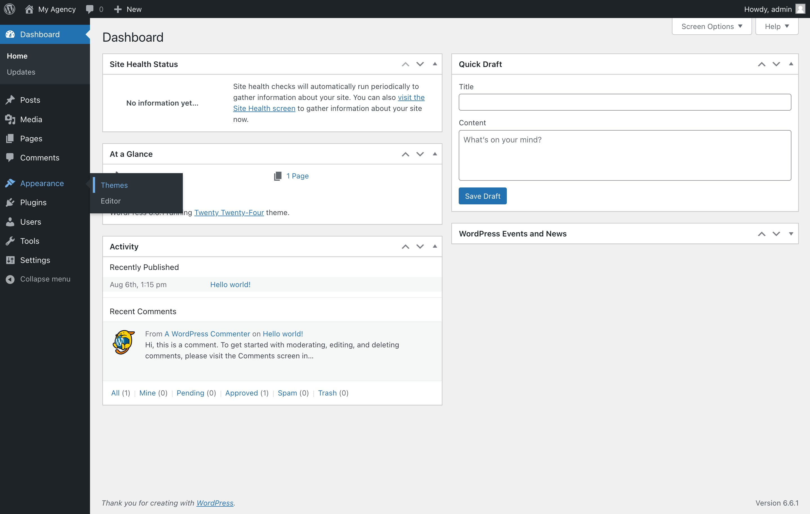
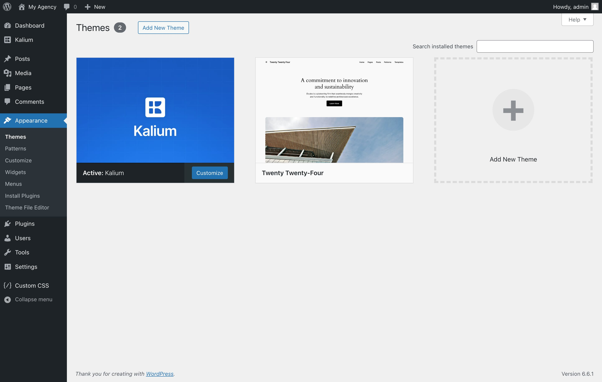
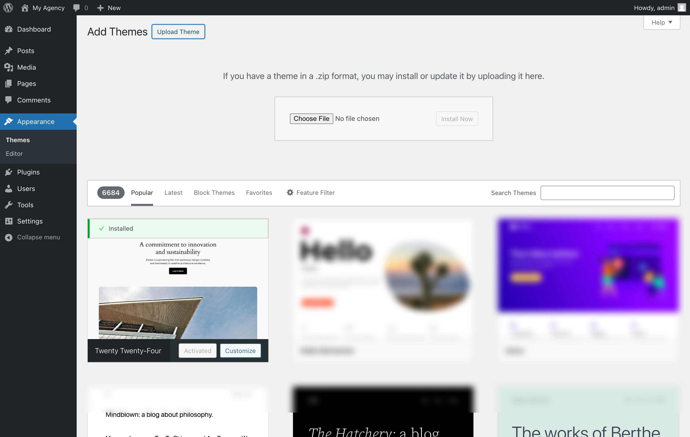
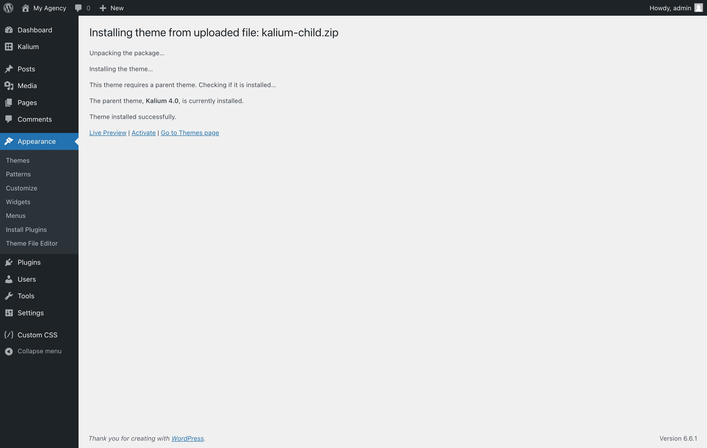
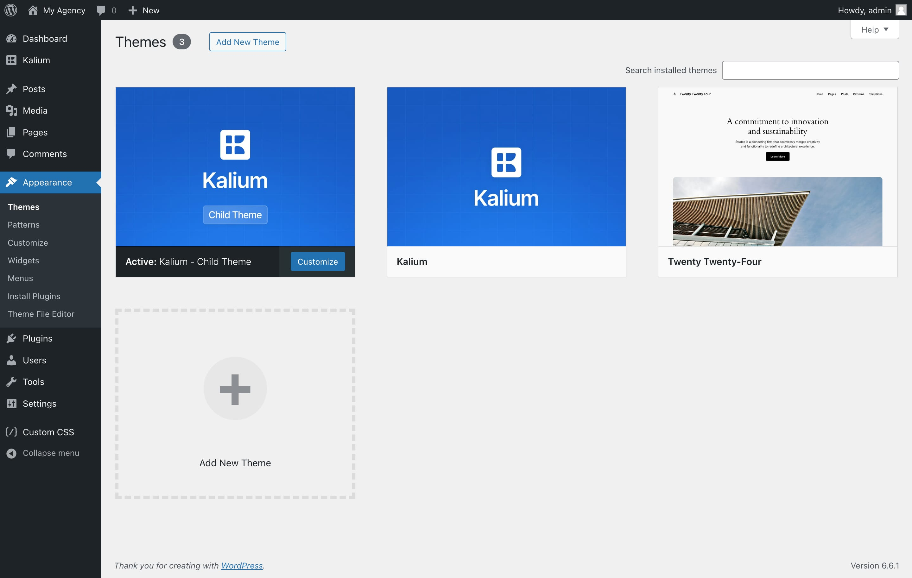

# Child Theme

Sometimes, you might need to add extra code or make personalized modifications. A child theme allows you to make these changes without modifying the original Kalium theme files. This guarantees your customizations remain unchanged even when you update the main theme. It’s a smart approach to keep your site looking and functioning exactly how you want it, while also staying up-to-date with Kalium’s latest features.

### What is a Child Theme?

A child theme is essentially a theme that builds on the features and style of another theme, known as the parent theme. In this case, the Kalium theme serves as the parent. Instead of modifying the Kalium theme’s files, you make the changes in the child theme directly. This way, your changes stay as they are and won't get lost even when Kalium is updated.

### Benefits of Using a Child Theme

1. **Keep Your Customizations Safe**: Changes made in a child theme are kept separate from the Kalium parent theme. This means your custom tweaks are preserved when the parent theme is updated.
2. **Easy Updates**: Updating the Kalium parent theme is straightforward since your changes are stored in the child theme. You’ll benefit from the latest features and security updates without losing your custom work.
3. **Better Management**: Child themes help you keep your customizations organized. You can focus on your specific changes without dealing with the entire parent theme’s code.
4. **Simplified Troubleshooting**: If issues arise, you can switch back to the default settings of the Kalium parent theme to troubleshoot and resolve problems.

### How to Install the Kalium Child Theme


**Note:** The child theme will not work if the [Kalium parent theme](installing-theme-via-wordpress.md) is not installed first. Make sure that you have the Kalium parent theme installed and activated before setting up and using the child theme.


Installing the Kalium child theme is simple. Follow these steps to get started:

1. [**Download Kalium Child Theme**](https://api.kaliumtheme.com/downloads/kalium-child.zip) :arrow\_down:&#x20;
2. Log in to your **WordPress dashboard**.
3.  Go to **Appearance -> Themes**\
    &#x20;

    <figure><figcaption></figcaption></figure>
4.  Click on the **Add New Theme** button at the top of the page\

    <figure><figcaption></figcaption></figure>
5.  Now click **Upload Theme** button in the same place\

    <figure><figcaption></figcaption></figure>
6. Click **Choose File**, then select the **kalium-child.zip** file you just downloaded.&#x20;
7. Click **Install Now**.
8.  The installation is complete, click **Activate** to enable Kalium Child Theme theme on your site\

    <figure><figcaption></figcaption></figure>

Once you have installed and activated the Kalium child theme, your WordPress dashboard's **Appearance -> Themes** section should display both the Kalium parent theme and the Kalium child theme. The Kalium child theme should be listed as the active theme, with the Kalium parent theme shown as an inactive theme. This setup confirms that the child theme is properly installed and ready for customization.

<figure><figcaption></figcaption></figure>

### Migrating from Parent Theme to Child Theme

If you have already completed your site using the Kalium parent theme and want to switch to the child theme without losing any of your customizations, you can do so easily by following a few simple steps. The Kalium child theme allows you to continue customizing your site while preserving all your previous settings and adjustments.

By following this process, you can ensure that all your theme options and personal settings are carried over to the child theme seamlessly, allowing you to take full advantage of the child theme’s benefits without starting from scratch. Let's migrate:

1. **Export Parent Theme Options**
   * Before activating the child theme, go to **Appearance -> Customize -> Manage Options**.
   * Export the options of the parent theme by clicking the **Export Theme Options** button.
   * A **yoursite-export.json** file should automatically start downloading in your computer.
2. **Activate the Child Theme**
   * Go to **Appearance -> Themes** and activate the **Kalium - Child Theme**, if you have not installed it yet follow the [guide above](child-theme.md#how-to-install-the-kalium-child-theme).
3. **Import Your Theme Options to Child Theme**
   * After activating the child theme, go to **Appearance -> Customize -> Manage Options**.
   * In the Import Options section select the **yoursite-export.json** file you just downloaded and click the **Import Theme Options** button.

That’s all! Your theme options will now be inherited by the child theme, preserving all your customizations.
