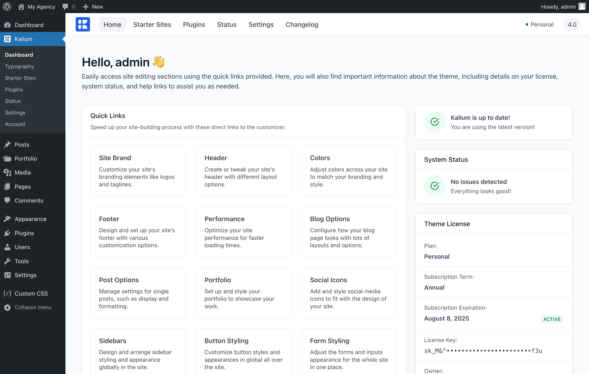

# Importing a Starter Site



Kalium offers a wide variety of full-paged starter sites, making it easy to kickstart your website for various types of businesses. These starter sites are crafted with Elementor and WPBakery Page Builder. With each big update, new starter sites are added, providing you with a growing selection of sites to choose from for your business.

### Before You Begin

Before importing any of our available starter sites, please make sure to check the system status. Go to the **System Status** tab to ensure your server meets all requirements for a successful import. Settings that need attention are listed in red.

### Step 1: Go to Starter Sites

First, access the Starter Sites section by navigating to the Kalium dashboard. In the top menu, click on “**Starter Sites**.” This section contains all the available starter sites:

<figure><figcaption></figcaption></figure>

### Step 2: Choose The Page Builder

Next, choose your preferred page builder. At the top right corner of the Starter Sites page, you will find a dropdown menu. Here, you can select either Elementor or WPBakery as your page builder.&#x20;

<figure><figcaption></figcaption></figure>

### Step 3: Select a Starter Site

Once you have selected your page builder, you can browse through the collection of starter sites. Hover over the desired template to see options to either import or preview it. Previewing the template allows you to see how it will look and function on your site before committing to the import. If you decide to use a template, click the “**Import**” button to proceed.

<figure><figcaption></figcaption></figure>

### Step 4: Choose What To Import

On the left side of this popup, you will see a list of required plugins for the starter site. These plugins will be automatically installed as part of the import process. On the right side of the popup, you can select specific content elements you want to import from the starter site. This customization allows you to import only the parts of the starter site that are relevant to your project.&#x20;

To begin the import process, click the “**Import**” button within the popup.&#x20;

<figure><figcaption></figcaption></figure>

The import process will start, and you will see a progress indicator explaining the status of the import. This indicator will provide real-time updates on what is being imported at each moment, from the list you have chosen will be imported, ensuring that you are informed about the progress and status of each element being imported.

<figure><figcaption></figcaption></figure>

### Site Successfully Imported

Now that your starter site is imported, you can start customizing it to fit your business needs. The imported site will include all the necessary elements and plugins, making it easy for you to tweak and personalize the design.&#x20;

<figure><figcaption></figcaption></figure>

