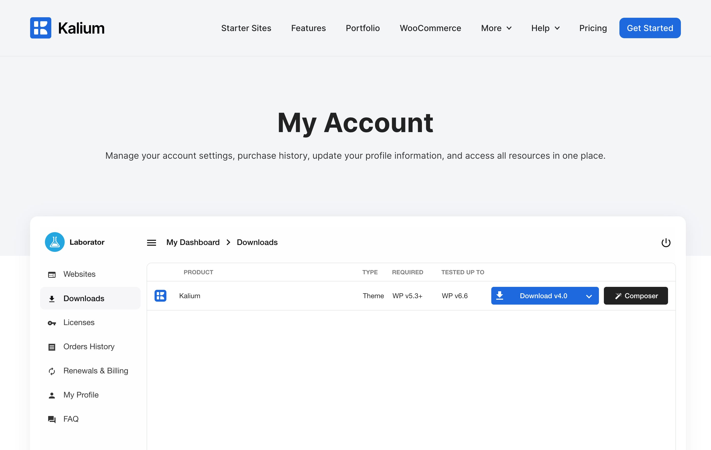

# Installing theme via FTP


If you haven’t tried [installing Kalium via WordPress](installing-theme-via-wordpress.md) yet, please read that guide first before proceeding with this FTP method.


If you prefer or need to use FTP to install the Kalium theme, this method involves uploading the theme files directly to your server. While it requires a few more steps compared to the WordPress method, it’s useful if you encounter any issues with the dashboard installation. Follow the instructions below to upload and activate Kalium using FTP.

### Step 1: Download Kalium

1. Log in to your [**Kalium Account**](https://kaliumtheme.com/account) page.
2. Go to the "**Downloads"** tab.&#x20;
3. Click “**Download**” button next to the Kalium theme to download the **kalium.zip** file.

<figure><figcaption>
My acount page with the Downloads tab active
</figcaption></figure>

### Step 2: Set Up or Use an FTP Client

To start, you’ll need an FTP client. Popular options include [FileZilla](https://filezilla-project.org/) _(available for Windows and Mac)_ and [Transmit](https://panic.com/transmit/) _(for Mac users)_. If you already use a different FTP client, you can continue with that.

1. Open your FTP client and log in to your website using your FTP credentials.
2. Once logged in, go to the `~/wp-content/themes/` directory on your server.

### Step 3: Upload the Theme Files

1. Unzip the downloaded Kalium theme file, named `kalium.zip`.&#x20;
2. Upload the unzipped `kalium` directory to the `themes` folder on your server. Make sure that you are placing the entire `kalium` folder inside `~/wp-content/themes/`.

<figure><figcaption>
The <strong>kalium</strong> directory should appear inside the <strong>~/wp-content/themes/</strong> folder
</figcaption></figure>

### Step 4: Activate the Theme

1. Login to your WordPress admin panel.
2. Go to **Appearances > Themes**.
3. Locate Kalium theme and click **Activate** to enable it on your site.

<figure><figcaption></figcaption></figure>

By following these steps, you’ll have Kalium installed and activated on your WordPress site. If you run into any issues, make sure to check that all files were uploaded correctly and that you’re using the latest version of the theme.
