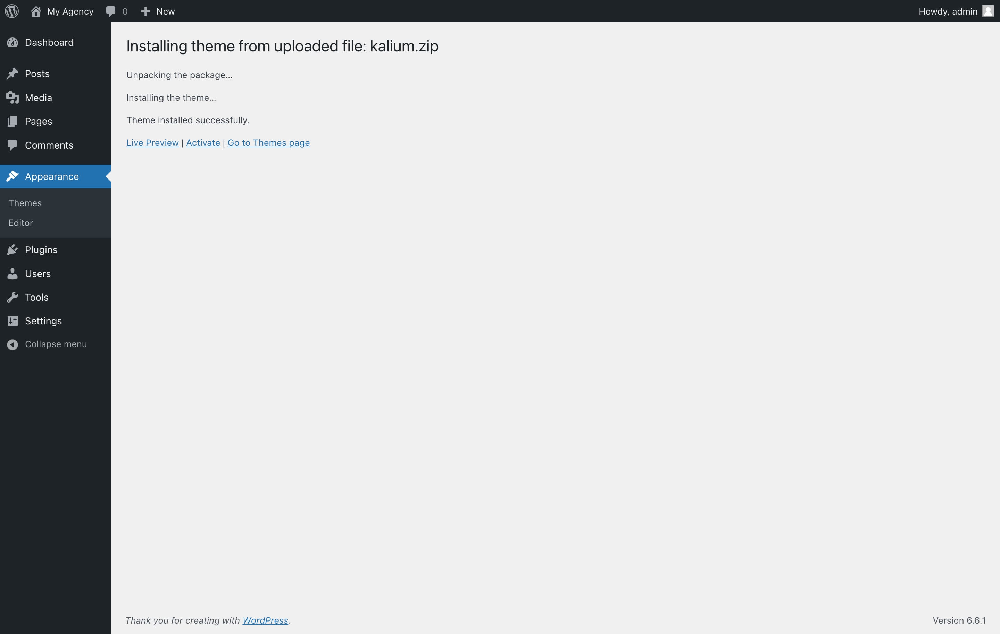

# Installing theme via WordPress



Installing the Kalium theme via WordPress is the simplest and most efficient method. This approach allows you to upload and activate the theme directly from your WordPress dashboard, making it quick and straightforward. Just follow the steps below to get Kalium up and running with minimal hassle.

### Step 1: Download Kalium

1. Log in to your [**Kalium Account**](https://kaliumtheme.com/account) page.
2. Go to the "**Downloads"** tab.
3. Click “**Download**” button next to the Kalium theme to download the **kalium.zip** file.

<figure><figcaption>
My acount page with the Downloads tab active
</figcaption></figure>

### Step 2: Install the Theme

1. Log in to your **WordPress dashboard**.
2.  Go to **Appearance -> Themes**\
    &#x20;

    <figure><figcaption></figcaption></figure>
3.  Click on the **Add New Theme** button at the top of the page\

    <figure><figcaption></figcaption></figure>
4.  Now click **Upload Theme** button in the same place\

    <figure><figcaption></figcaption></figure>
5. Click **Choose File**, then select the **kalium.zip** file you just downloaded.&#x20;
6. Click **Install Now**.
7.  The installation is complete, click **Activate** to enable Kalium theme on your site\

    <figure><figcaption></figcaption></figure>
