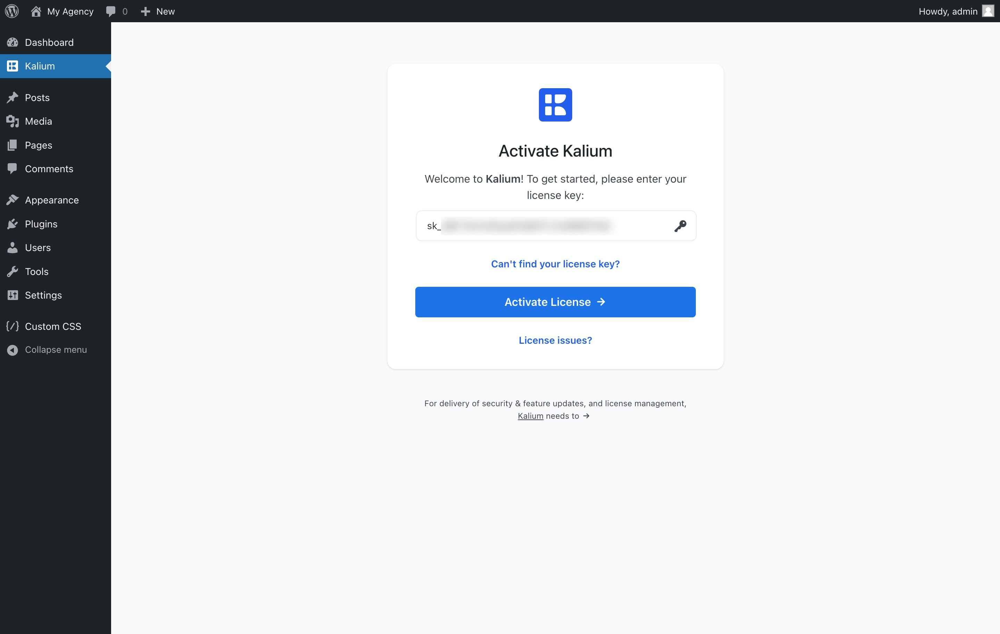

# License Activation



Now that you've successfully installed and activated the Kalium theme, you need to activate the license to start enjoying all the features and updates. Follow these simple steps to activate your license:

### Step 1: Log In to Your Account

Go to the [Kalium Account](https://kaliumtheme.com/account) page and log in with your credentials.



### Step 2: Copy Your License Key

Click on the "**Licenses**" tab on the left side of the page to see the licenses you have purchased, next to your Kalium license you have the key, when hovering you’ll see a copy icon — click this icon to automatically copy the license key to your clipboard.

<figure><figcaption></figcaption></figure>

### Step 3: Activate License

Navigate to your WordPress admin dashboard and on the left side click **Kalium**, a license activation page should appear. Paste the license code you copied into the input field and click on the **Activate License** button to activate your license..

<figure><figcaption></figcaption></figure>

Once you complete the activation you should see the Kalium Dashboard page with a welcome message, you're all set — the license has been successfully activated and you have access to all theme features, updates and premium plugins.&#x20;

<figure><figcaption></figcaption></figure>
