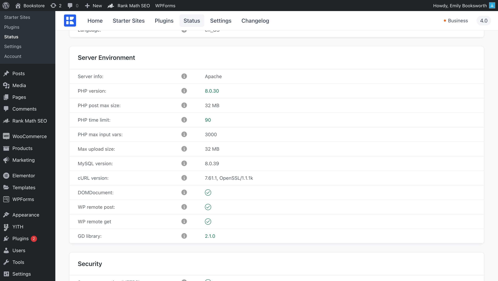

# Server Requirements

To get the most out of Kalium and have smooth experience with WordPress, it’s important that your hosting meets the following requirements:

* Using the latest version of [WordPress](https://wordpress.org/).
* [PHP](https://www.php.net/) version 7.4 or greater. _(Note: Kalium is compatible with PHP 8.2)_
* [MySQL](https://www.mysql.com/) version 8.0 or greater OR [MariaDB](https://mariadb.org/) version 10.5 or greater.
* [HTTPS](https://wordpress.org/news/2016/12/moving-toward-ssl/) support
* The minimum [requirements](https://wordpress.org/about/requirements/) to run WordPress.

### Recommended PHP configuration limits <a href="#recommended-php-configuration-limits" id="recommended-php-configuration-limits"></a>

If you’re experiencing issues like a white screen, problems with importing starter sites, blank pages, or issues with saving settings, it’s likely due to low PHP configuration limits. The best fix is to increase these limits.

You can either adjust these settings yourself or ask your web host to increase them for you. We recommend setting the limits to at least the following:

```
max_execution_time = 120
```

```
memory_limit = 128M
```

```
post_max_size = 32M
```

```
upload_max_filesize = 32M
```

```
max_input_time = 60
```

```
max_input_vars = 3000
```

### How to Check Your Current PHP Limits

To check your PHP limits, go to the WordPress admin dashboard and under **Kalium > Status** find the **Server Environment** section . If you need help, you can also contact your hosting provider to find out your current settings and ask them to make adjustments if needed. Remember, you’re paying for your hosting service, so make sure you’re getting the full value.

<figure><figcaption></figcaption></figure>

### How to upgrade PHP version and increase server limits

In cases where you cannot update the PHP version yourself, you need to contact your host about this. The upgrade process is an easy process and should be something your host can do for you without impacting your website or charging you a fee. Here’s a letter you can send to your hosting company:

<details>

<summary>Emailing your hosting provider</summary>

Dear Support Team,

I hope this message finds you well. I am currently using the Kalium theme on my WordPress site, which recommends using PHP 7.4 or higher and MySQL 8.0 or MariaDB 10.5. WordPress also lists PHP 7.4 as the recommended version: https://wordpress.org/about/requirements/

Could you please confirm if my hosting supports PHP 7.4 or higher and provide instructions on how to upgrade? Additionally, I would appreciate it if you could increase the server limits to the following minimum values:

```
max_execution_time = 180
memory_limit = 128M
post_max_size = 64M
upload_max_filesize = 64M
max_input_time = 60
max_input_vars = 3000
```

Thank you for your assistance.

Best regards,\
\[Your Name]

</details>

