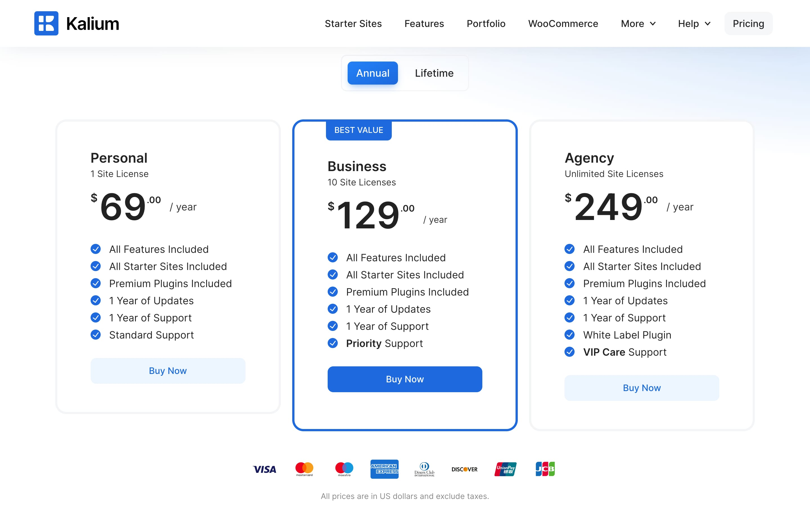
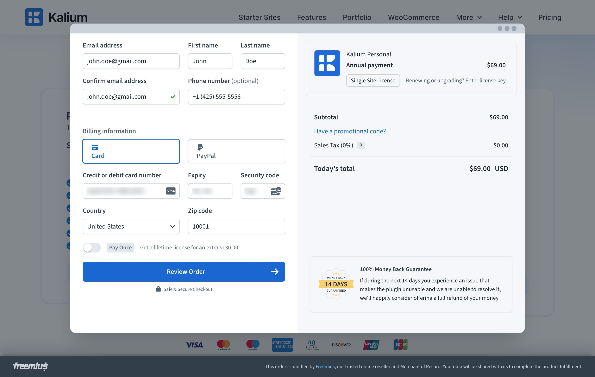
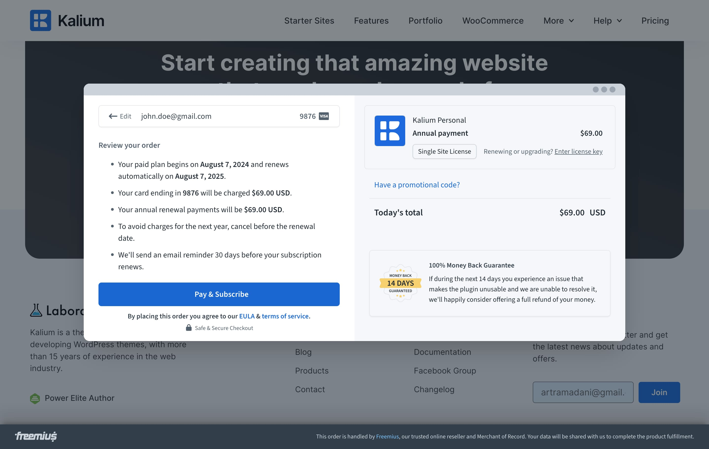
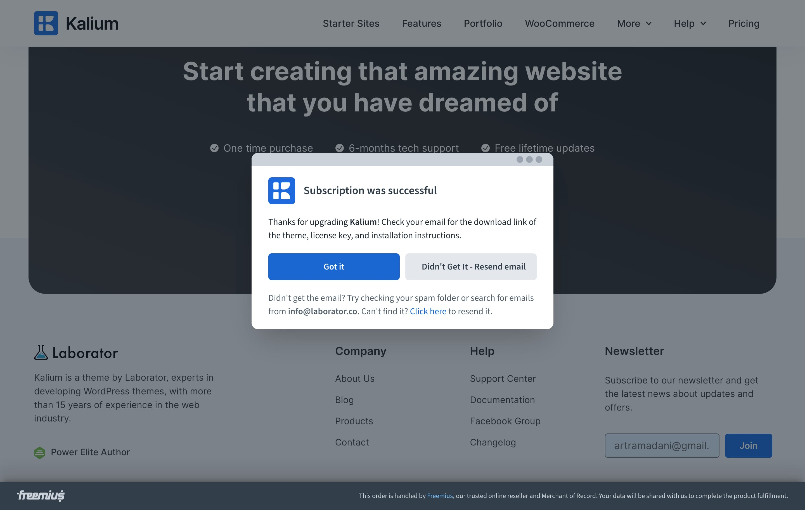
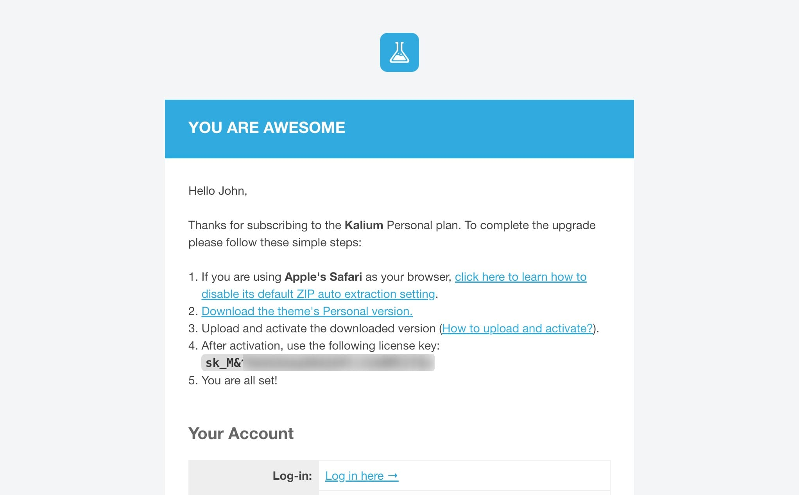

# How To Purchase Kalium

Kalium is available for purchase exclusively through our website, it is a quite simple and straightforward process. Our payment processing platform, managed by [Freemius](https://freemius.com), provides a secure and flexible payment option. Let’s get started with the purchase process by visiting the pricing page:&#x20;



### Step 1: Choose a Plan

<figure><figcaption></figcaption></figure>

Kalium offers three plans to suit different needs:

* **Personal**
* **Business**
* **Agency**

Each plan is available in two payment options:

* **Annual:** Provides access to the theme and support for one year, allowing you to receive updates, starter sites, and support for that duration.
* **Lifetime:** Offers lifetime access to the theme, including 3 years of support. The Lifetime plan ensures that you always have access to the theme and its features without worrying about annual renewals, providing long-term value and peace of mind.

After checking which plan fits you best, click the "**Buy Now**" button to continue with the purchasing journey.

If you change your mind about the plan you selected, don’t worry! You can easily upgrade or downgrade your license later on to better fit your needs.

### Step 2: Checkout

<figure><figcaption></figcaption></figure>

During the checkout process, you will need to provide the following information:

* **Email Address:** This is crucial as the license key will be sent to this email, and an account will automatically be created in our system.
* **First Name**
* **Last Name**
* **Phone Number (Optional)**

After entering your personal details, proceed to enter your billing information.

#### Select Your Payment Method

We support a variety of payment methods for flexibility and convenience:

* **Card:** You can pay using all major credit cards such as Visa, MasterCard, American Express, and Discover.
* **PayPal:** Alternatively, you can use your PayPal account for purchasing Kalium.

Once you have provided the necessary information and selected your payment method, click on the "**Review Order**" button to continue to the next step.

### Step 3: Review Your Order

<figure><figcaption></figcaption></figure>

After you have provided your personal and billing details, you will be directed to a new step where you can review your order. Here, you will see a summary of the information you’ve entered and the plan you’ve selected.

Take a moment to review the details, and once you’re satisfied, click on the **"Pay & Subscribe"** button to finalize your purchase.

### Step 4: Confirmation

Upon successful payment, a new screen will appear confirming that your subscription was successful. This screen will provide you with a confirmation message, as shown in the image below:

<figure><figcaption></figcaption></figure>

### Step 5: Check Your E-mail

After completing your purchase, check your email to confirm that your transaction was successful. The email will include all the important information as seen in the image below:

<figure><figcaption></figcaption></figure>

Thank you for choosing Kalium! Enjoy exploring all the powerful features and capabilities of your new theme. We’re excited to see what you create!
