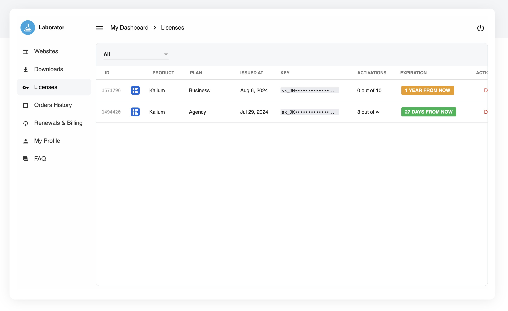

# Managing Licenses

Our licensing mechanism is efficiently managed by our trusted partner, [Freemius](https://freemius.com), ensuring a seamless and secure licensing experience for all our users.

This account management system allows you to view, update, and renew your licenses with ease. Additionally, it provides an overview of your license status, renewal dates, theme download, and access to any related documentation.

### Account Dashboard

The Account page is your central hub for managing licenses, subscription and billing details, and for downloading theme files.

To access the account dashboard visit this link:


https://kaliumtheme.com/account


Enter the login credentials you created at the time of purchase. If you previously bought from Freemius, you should already have your account credentials.

<figure><figcaption>
Users dashboard for managing licenses, downloading theme files and updating profile and billing details
</figcaption></figure>

### Licenses

Access your licenses by clicking **Licenses** link in the menu:

<figure><figcaption>
The list of purchased licenses
</figcaption></figure>

### License Details

In the list of licenses above, click on your desired license to view more details and perform additional tasks, such as viewing/copy **License Key,** **White Labeling**, **Restricting Sites**, or upgrading or downgrading your license. In case of upgrading or downgrading its important to read the [prorating-plan-updates.md](prorating-plan-updates.md "mention")

### Other Ways

You can also access your license information through the emails you received at the time of Kalium purchase. These emails contain all the important information about your license, including your credentials, which you can refer to as needed.
