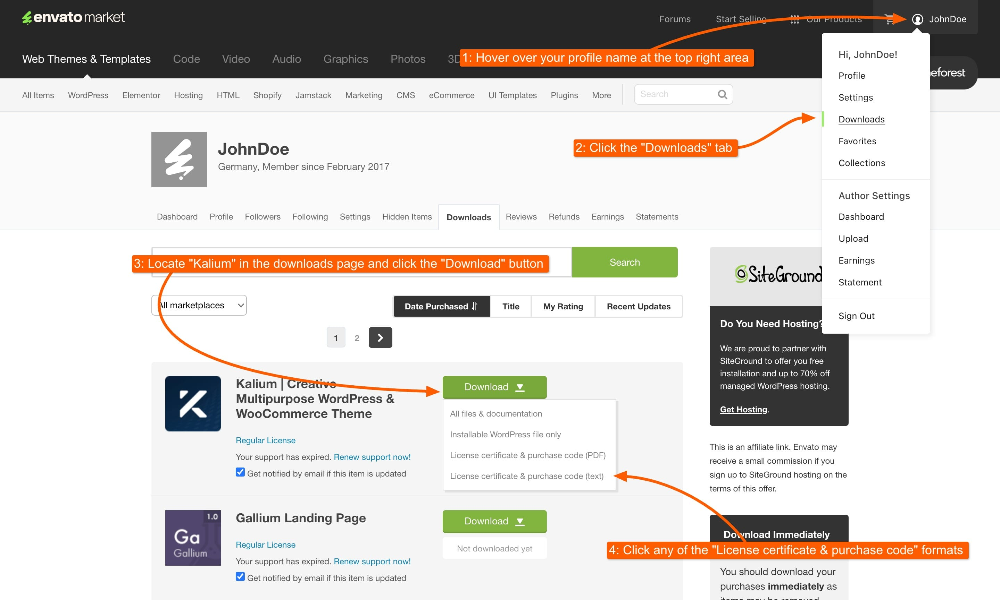
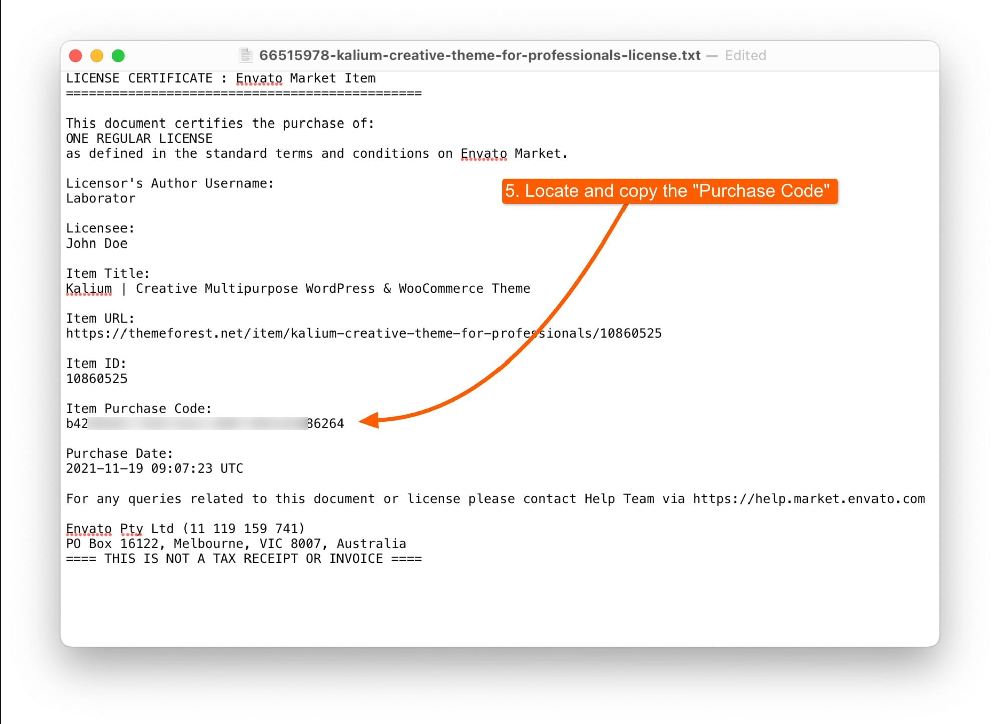

# Migrating Automatically

Upgrade from Kalium 3 to Kalium 4 effortlessly by following our step-by-step guide for automatic migration. This method streamlines the process through your WordPress dashboard, handling license transfer and theme updates with minimal effort on your part. Ideal for a smooth and hassle-free upgrade.

As part of our transition from Kalium 3 to Kalium 4, we’ve moved to a new licensing platform, Freemius. To continue receiving updates and access Kalium 4, you need to transfer your existing ThemeForest license to Freemius. This process is straightforward and ensures you maintain access to all the features of the new version.



### Step 1: Go to WordPress Dashboard

Start by logging into the WordPress dashboard on the site where you have Kalium installed. This is where you will initiate the license transfer and upgrade process.

***

### Step 2: Navigate to Laborator -> Kalium 4

In the WordPress dashboard, look for the Laborator section in the left-hand menu. Click on the **Kalium 4** button to proceed to the license transfer section. Once you’re on the Kalium 4 page, scroll down to find the “**Transfer Your License & Upgrade to Kalium 4**” section. This area will guide you through the steps needed to migrate your license and update your theme.

***

### Step 3: Enter your theme Purchase Code

You will need to use your Kalium 3 purchase code from ThemeForest, this can be obtained from ThemeForest by going to the top right area <mark style="color:blue;">Profile -> Downloads</mark>, in the Downloads page locate Kalium and choose any of the <mark style="color:blue;">License Certificate & Purchase Code</mark>. A file will be downloaded, where you can copy the purchase code.

<figure><figcaption>
How to get the Purchase Code
</figcaption></figure> <figure><figcaption>
Purchase code can be found here
</figcaption></figure>

### Step 4: Transfer License and Upgrade to 4

Go back to your WordPress dashboard. Under the “**Transfer Your License**” section, enter the email address you want to use for your Freemius account. Paste the Item **Purchase Code** you copied into the appropriate field.&#x20;

After entering your email and purchase code, a pop-up will appear asking if you have reviewed the migration steps. Confirm your understanding and click “**Upgrade Now**” to start the license transfer process.

The license transfer and theme upgrade will now proceed in the background. This process may take a few moments. Once the transfer is complete and your theme is updated to Kalium 4, you will be automatically redirected to the new Kalium 4 dashboard.

### Step 5: Run the Database Upgrade

Upon being redirected to the new dashboard, you will see a notice indicating “Database Upgrade Required”.  Kalium 4 automatically detects any earlier versions of the theme and will display a migration notice along with a **Run Upgrade** button: This notice means that you need to run a database upgrade to ensure compatibility with Kalium 4. Click the “**Run Upgrade**” button.


After clicking **Run Upgrade** button, the process will begin, and you should not interrupt it under any circumstances!


<figure><figcaption></figcaption></figure>

After the database upgrade is completed, the button will show this message "**Upgrade completed**”. This confirms that the migration and upgrade processes are fully finished. It’s a good practice to review your site to make sure everything is functioning as expected and make any necessary adjustments.

<figure><figcaption>
Upgrade in progress
</figcaption></figure> <figure><figcaption>
Upgrade completed
</figcaption></figure>

After this, ensure that your site appears as expected and make any necessary adjustments to address remaining issues.

You can also confirm if the upgrade was applied successfully by accessing System Status page at **Kalium -> Status -> Database Upgrades**:

<figure><figcaption></figcaption></figure>

Once everything is complete and you have confirmed that your staging site is functioning correctly, you can proceed to migrate the updates from staging to your live site. Follow the same steps used for the staging environment to ensure a smooth transition. This will help you apply the latest changes to your live site with minimal disruption and ensure that everything remains consistent and functional.​
