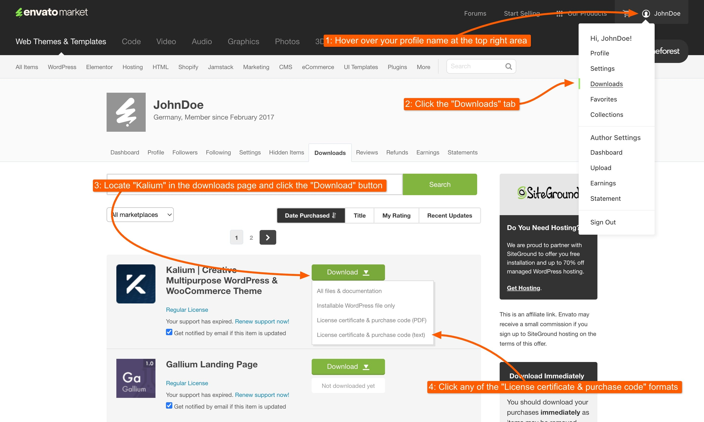

# Migrating Manually

For a more hands-on approach, our manual migration guide provides detailed instructions to upgrade from Kalium 3 to Kalium 4. This method involves transferring your license and updating the theme manually, giving you greater control over the process. Perfect for those who prefer or need a more involved migration, this guide will walk you through each step to ensure a successful upgrade.

## 1. Transfer License

As part of our transition from Kalium 3 to Kalium 4, we’ve moved to a new licensing platform, Freemius. To continue receiving updates and access Kalium 4, you need to transfer your existing ThemeForest license to Freemius. This process is straightforward and ensures you maintain access to all the features of the new version.

***

### Step 1: Go to the Transfer License page.



***

### Step 2: Enter your email address

Enter the email address you want to use for your account. If you already have a Freemius account, please use the same email address. If you don’t have an account yet, this process will create one for you.

***

### Step 3: Enter your theme Purchase Code

You will need to use your Kalium 3 purchase code from ThemeForest, this can be obtained from ThemeForest by going to the top right area <mark style="color:blue;">Profile -> Downloads</mark>, in the Downloads page locate Kalium and choose any of the <mark style="color:blue;">License Certificate & Purchase Code</mark>. A file will be downloaded, where you can copy the purchase code.

<figure><figcaption>
How to get the Purchase Code
</figcaption></figure> <figure><figcaption>
Purchase code can be found here
</figcaption></figure>

### Step 4: Click "Transfer License"

Once you click the "**Transfer License**" button, an account will be created for you automatically. You will receive an email with important information, with the login link, where you can download Kalium 4.&#x20;

You’ll also be able to set up your password for this account later on.

## 2. Install Kalium 4



After completing the second step, it's time to upload the latest version of Kalium:

1. [Upload the latest Kalium](../installation/installing-theme-via-wordpress.md) version to the staging environment.
2. [Activate the license](../installation/license-activation.md) in the staging environment.

## 3. Database Upgrade



Kalium 4 automatically detects any earlier versions of the theme and will display a migration notice along with a **Run Upgrade** button:

<figure><figcaption></figcaption></figure>

It is important to note that this notice only appears once the theme license is successfully activated. This prevents accidental upgrades, as you will need to access the Kalium dashboard post-upgrade, which requires theme license activation.


After clicking **Run Upgrade** button, the process will begin, and you should not interrupt it under any circumstances!


<figure><figcaption>
Upgrade in progress
</figcaption></figure> <figure><figcaption>
Upgrade completed
</figcaption></figure>

After this, ensure that your site appears as expected and make any necessary adjustments to address remaining issues.

You can also confirm if the upgrade was applied successfully by accessing System Status page at **Kalium -> Status -> Database Upgrades**:

<figure><figcaption></figcaption></figure>

Once everything is complete and you have confirmed that your staging site is functioning correctly, you can proceed to migrate the updates from staging to your live site. Follow the same steps used for the staging environment to ensure a smooth transition. This will help you apply the latest changes to your live site with minimal disruption and ensure that everything remains consistent and functional.​
