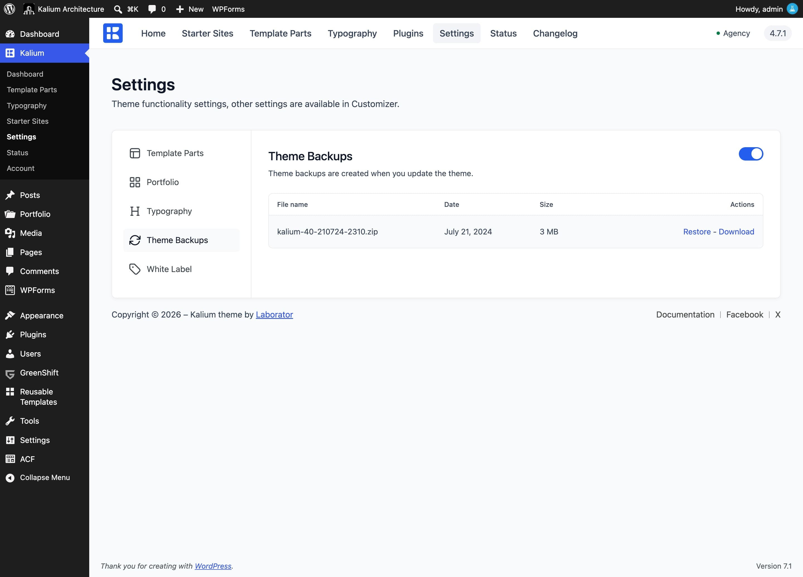

# Theme Backups

**Kalium -> Settings -> Theme Backups** keeps a copy of your theme from just before each update, so you can go back if something isn't right afterwards.

<figure><figcaption></figcaption></figure>

***

### Theme Backups

**On by default.** Leave it on.

With it enabled, Kalium copies your current theme before each update runs. Below the toggle, existing backups are listed with their **File name**, **Date** and **Size**, each offering **Download** and **Restore**.

***

### Two things to know

These both surprise people, so they're worth stating plainly.


**Backups are only taken when the theme updates.** Not on a schedule, not on demand. There is no "back up now" button. If you want a copy before making changes of your own, use a backup plugin or your host's backup tool.



**An active license is required.** Without one the backup step is skipped quietly: the setting still shows as on, the update still runs, and no backup is written.

If your license has lapsed, don't rely on this before updating. [Renew it](../license/) or take your own backup first.


***

### Restoring

Find the backup you want in the list and click **Restore**. Your theme returns to how it was at that point.

**Download** saves the backup as a file to your computer, useful before a big change, or if you want to keep a copy somewhere else.

***

### Where backups are stored

In your uploads folder, which means a full-site backup plugin picks them up along with everything else.

It also means they take up space. If your host is tight on disk, the older ones are worth clearing out from time to time.

***

### If an update stops with "Cannot create theme backup"

The update is deliberately cancelled rather than running without protection. This almost always means one of two things:

* **The uploads folder isn't writable.** Your host can fix folder permissions.
* **The disk is full.** Clear some space, or remove some old backups.

Sort out the cause and run the update again.


[updating-kalium.md](../installation/updating-kalium.md)

