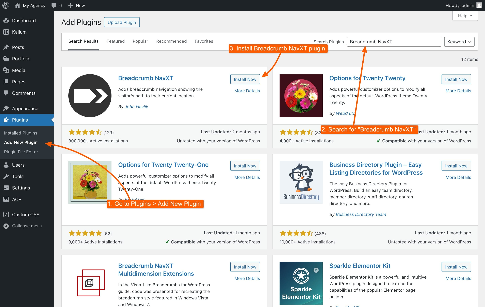
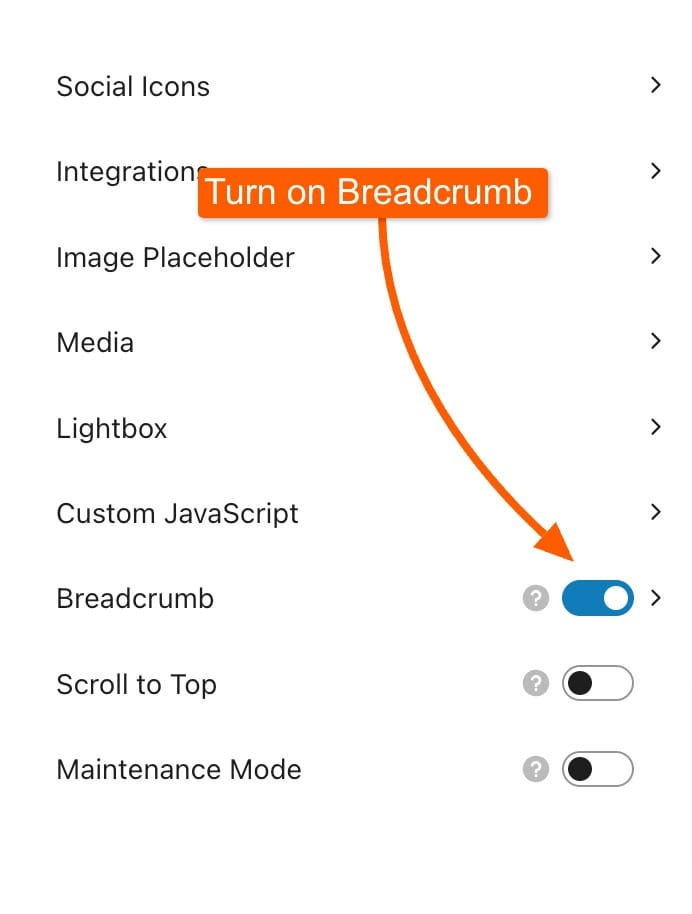
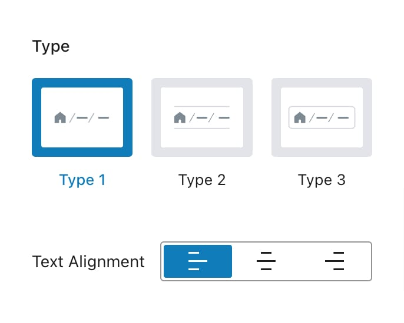
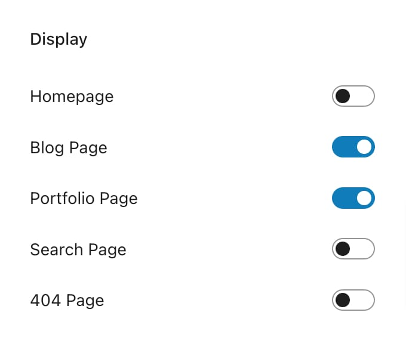
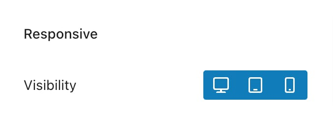
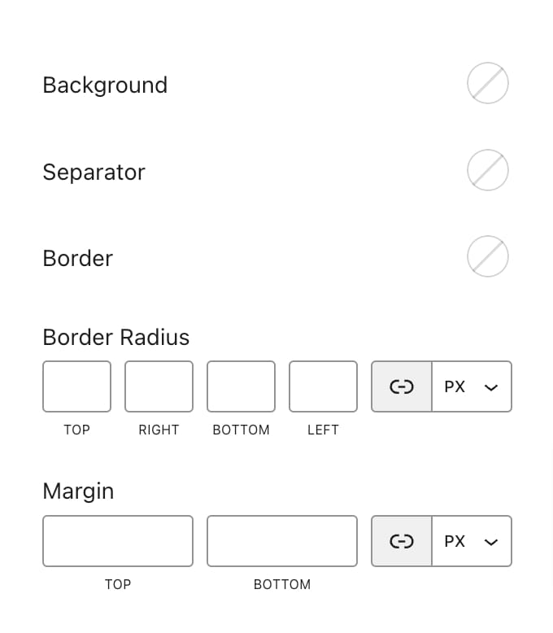

# Breadcrumbs

Breadcrumbs provide users with a clear path of their navigation history on your site, enhancing the user experience by showing their current location relative to the site structure. In Kalium, breadcrumbs can be customized via the **Appearance -> Customize -> General -> Breadcrumb** section. By default, breadcrumbs are disabled and require the [**Breadcrumb NavXT**](https://wordpress.org/plugins/breadcrumb-navxt/) plugin for functionality. Follow the steps below to set up and configure breadcrumbs:

### Setting Up Breadcrumbs

<figure><figcaption></figcaption></figure>

1. **Install Breadcrumb NavXT Plugin:**
   * Go to **Plugins -> Add New Plugin**.
   * Search for [**Breadcrumb NavXT**](https://wordpress.org/plugins/breadcrumb-navxt/) plugin.
   * Click **Install Now**, then **Activate**.
2. **Enable Breadcrumbs:**
   * Return to **Appearance -> Customize -> General -> Breadcrumb**.
   * Toggle the switch to enable breadcrumbs.

<figure><figcaption></figcaption></figure>

### Breadcrumb Options

Once breadcrumbs are enabled, you can customize them using the following options:

#### Type

<figure><figcaption></figcaption></figure>

* **Type 1:** Classic breadcrumb without a border.
* **Type 2:** Classic breadcrumb with borders at the top and bottom.
* **Type 3:** Modern breadcrumb with enhanced styling options.

#### Text Alignment

Choose the alignment for the breadcrumb text:

* **Left**
* **Center**
* **Right**

This alignment option is available for all breadcrumb types.

#### Display

Control where breadcrumbs are shown or hidden by toggling the options on or off. Additionally, breadcrumbs can be added directly to the header as a [header element](../general/header/custom-header/elements.md#breadcrumb).

<figure><figcaption></figcaption></figure>

#### Responsive

<figure><figcaption></figcaption></figure>

Manage the visibility of breadcrumbs across different devices:

* **Desktop**
* **Tablet**
* **Mobile**

Set preferences for each device type to ensure optimal display.

### Style

Customize the appearance of breadcrumbs to match your site's design. The following styling options are available:

<figure><figcaption></figcaption></figure>

#### Background

Set the background color for the breadcrumb.

#### Separator

Choose the color of the separator. The separator type can be further customized in the Breadcrumb NavXT plugin settings.

#### Border

Define the border color for Type 2 and Type 3 breadcrumbs.

#### Border Radius

Adjust the border radius for Type 1 and Type 3 breadcrumbs.

#### Margin

Set the vertical margin only; side margins are not adjustable.


The Breadcrumb NavXT plugin also offers extensive settings such as choosing where to show the breadcrumbs and selecting the separator type.

