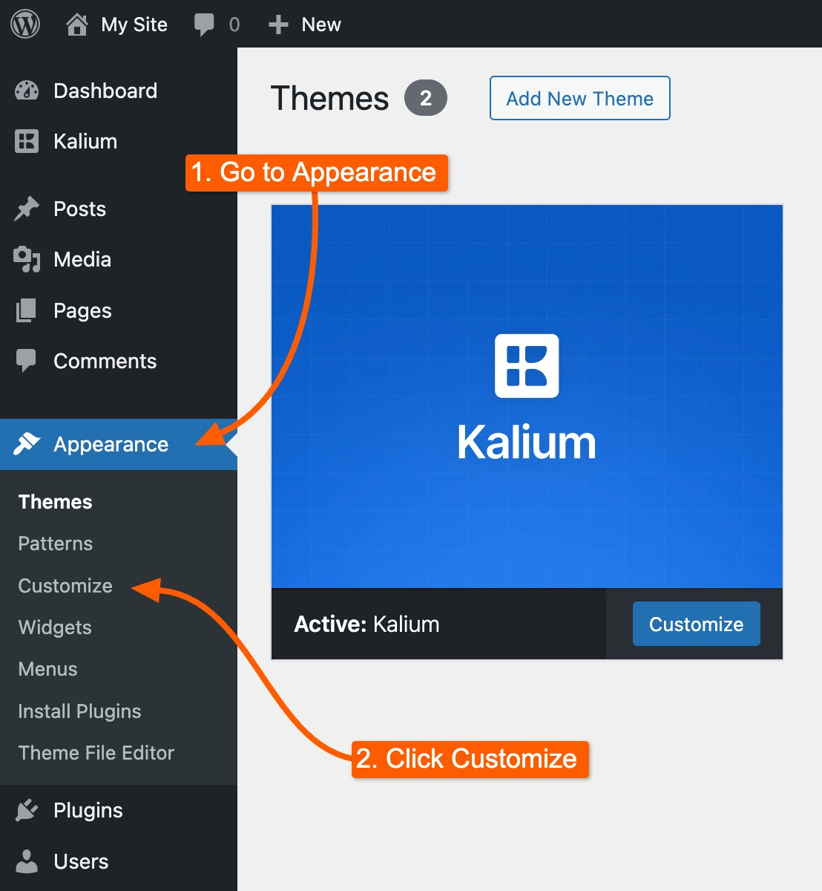

# Custom CSS

Customizing your WordPress site with your own CSS can be a great way to make your theme truly unique. One of the simplest and most user-friendly methods to do this is through the Theme Customizer. Here's how you can easily add your custom CSS to your WordPress site.

First, head over to your WordPress dashboard. Once there, navigate to **Appearance -> Customize**.

<figure><figcaption>
Access Customizer
</figcaption></figure>

Within the Customizer, you'll notice your site's live preview on the right side, and a panel full of customization options on the left. To start adding your custom CSS, click on the **Additional CSS** section.&#x20;

<figure><figcaption></figcaption></figure>

This section will slide open to reveal a simple code editor where you can input your custom CSS code.

<figure><figcaption></figcaption></figure>

As you start typing in your CSS rules, you'll see them take effect immediately in the live preview of your site.

Once you're happy with the changes, make sure to click the **Publish** button at the top of the Customizer. This will save your custom CSS and apply it to your live site.


Any custom CSS you add using the Theme Customizer is specific to the theme you’re currently using. If you switch to a different theme, your custom CSS won't carry over. To reuse your custom CSS with a new theme, simply copy the code from the Additional CSS box and paste it into the new theme using the same method.

