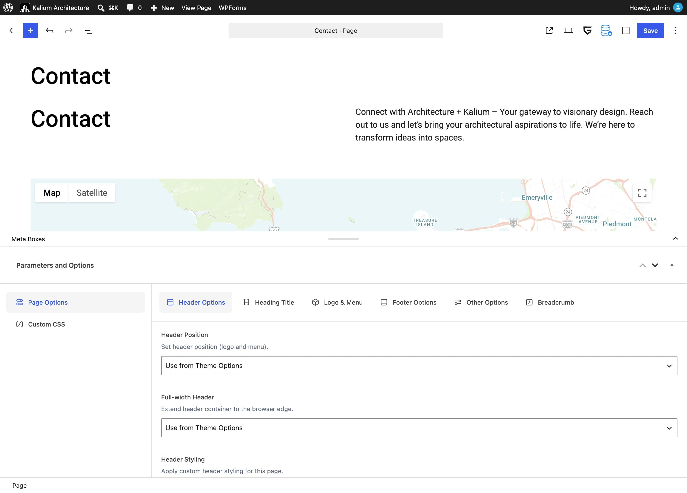

# Parameters and Options

The Customizer sets how your whole site looks. **Parameters and Options** is where you change that for **one** piece of content, hide the footer on a single landing page, use a different logo on the contact page, give one blog post a full-width featured image.

**Where to find it:** edit any post, page, portfolio item or product, then scroll **below** the content editor to the box titled **Parameters and Options**.

<figure><figcaption></figcaption></figure>

***

### How the panel behaves

Three things about this panel confuse people, and all three are by design.

**Tabs appear and disappear.** A tab only shows when it applies, the right post type, the right post format, the right project layout. This is why the panel looks completely different on a blog post than on a portfolio item, and why changing one dropdown can make new tabs appear.

**"Use from Theme Options" means the Customizer decides.** Almost every dropdown starts there (sometimes worded _Inherit from Theme Options_). Choose anything else and this one item overrides the site-wide setting. To go back, set it to _Use from Theme Options_ again.


For dropdowns, clearing a field is **not** the same as choosing _Use from Theme Options_. For color and spacing fields, though, an empty value does mean "inherit", so you can override one color and leave the rest alone.


**Your last tab is remembered.** Reopen the same item and the panel returns to where you left it.

***

### Which tabs appear where

| Tab                                           |    Post   |      Page     | Portfolio item | Product |
| --------------------------------------------- | :-------: | :-----------: | :------------: | :-----: |
| **Page Options**                              |    Yes    |      Yes      |       Yes      |   Yes   |
| **Custom CSS**                                |    Yes    |      Yes      |       Yes      |   Yes   |
| **Post Settings**                             |    Yes    |               |                |         |
| **Video / Audio / Gallery settings**          | by format |               |                |         |
| **Portfolio Settings**                        |           | template only |                |         |
| **Project Layout**                            |           |               |       Yes      |         |
| **General Details**                           |           |               |       Yes      |         |
| **Featured Video**                            |           |               |       Yes      |         |
| **Other Settings**                            |           |               |       Yes      |         |
| **Project Link, Checklists, Project Gallery** |           |               |    by layout   |         |


**Portfolio Settings catches everyone out.** It appears on a **page**, one using the Portfolio page template, not on a portfolio item. It configures the listing, not an individual project.


***

## Page Options

Available on everything. These settings are about the **frame** around your content (the header, the footer, the heading, the container width) rather than the content itself.

### Header Options

**Header Position**\
_&#x55;se from Theme Options_ · _Content Below (Static)_ · _Over the Content (Absolute)_. Choosing _Over the Content_ makes the header transparent and sits it on top of the page, which is what you want when a page opens with a full-width image.

**Header Spacing**\
Only appears when the position is _Over the Content_. Sets how much room to leave so your content isn't hidden behind the header.

**Full-width Header**\
Extends the header to the edges of the browser window on this page.

**Header Styling**\
Set this to _Yes_ and a complete set of color overrides appears for this page alone, background, borders, padding, text, submenu colors, mobile menu colors, and separate normal / hover / active colors for links and menu pills.

**Empty values are ignored**, so you can override a single color and leave everything else as it is.


[in-page-options.md](../general/header/in-page-options.md)


### Heading Title

Controls the title area at the top of the page.

**Heading Title**\
On or off. The rest of the tab only appears when it's on.

**Page Title Type**\
_&#x53;how this post title_ or _Enter custom title_, useful when the page's real title is long and you want something shorter on screen.

**Page Heading Description Type**\
_&#x55;se this post description_ or _Enter custom description_.

### Logo & Menu

**Custom Logo** and **Custom Logo Width**\
A different logo on this page. The width is the maximum in pixels, which matters if you upload a retina (@2x) image.

**Sticky Header**\
_&#x55;se from Theme Options_ · _Enable_ · _Disable_. This is how you turn the sticky header off on one page.

**Custom Sticky Logo**\
A different logo for when the header is stuck to the top.

**Sticky Header Style**\
Appears when sticky is set to _Enable_, a full set of color and spacing overrides for the sticky state on this page.

### Footer Options

**Footer Visibility**\
_&#x55;se from Theme Options_ · _Show footer on this page_ · _Hide footer on this page_. This is how you hide the footer on a landing page.

**Fixed Footer**\
_&#x55;se from Theme Options_ · _Normal_ · three _Fixed to Bottom_ variants: no animation, fade, or slide.

### Other Options

**Custom Container Width**\
Turn this on to set a different content width for this page. It reveals **Container Width** (_Large_, _Medium_, _Small_ or _Custom_) and a slider when you pick _Custom_.

**Fullwidth container**\
Appears with the same toggle and overrides the width entirely, running the content edge to edge. Turning it on hides **Container Width**.

### Breadcrumb

**Breadcrumb**\
_&#x49;nherit from Theme Options_ · _Enable_ · _Disable_. Everything below appears only when set to _Enable_.

The rest (background and text color, border type and color, radius, margins and alignment) overrides the site-wide breadcrumb styling for this page. Leave a color empty to inherit it.


Breadcrumbs need the **Breadcrumb NavXT** plugin. Without it these fields do nothing. See [Breadcrumbs](breadcrumbs.md).


***

## Custom CSS

**Custom Page Style**\
CSS that applies to this item only. Don't wrap it in `<style>` tags, just the CSS itself.

Good for a one-off tweak on a single page. For anything you'll reuse, a CSS snippet or Additional CSS is a better home.


[custom-css.md](custom-css.md)


***

## Post Settings

On blog posts only.

**Featured Image Placing**\
_&#x55;se from Theme Options_ · _Boxed_ · _Wide_ · _Full Width_ · _Hide Featured Image_. This is how one post gets a full-width header image when the rest are boxed.

**Image Size**\
_&#x55;se from Theme Options_ · _Default Thumbnail Size_ · _Original Image Size_. Hidden when the image is set to be hidden.

**Show Related Posts**\
_&#x49;nherit from Theme Options_ · Show · Hide.


The Show Related Posts options read "Products" on screen. On a blog post they control related **posts**. It's a wording slip in the theme, not a sign you're on the wrong setting.


### Tabs that depend on the post format

Set the post **Format** first, and a matching tab appears:

| Format  | Tab                     | What's in it                      |
| ------- | ----------------------- | --------------------------------- |
| Video   | **Video Post Settings** | Video Resolution, Auto Play Video |
| Audio   | **Audio Post Settings** | Auto Play Audio                   |
| Gallery | **Post Slider Images**  | The gallery images                |

***

## Portfolio item tabs

Portfolio items have the most settings, because the project layouts differ so much from one another.

**Project Layout -> Item Type** is the first choice, and it decides what else you see: _Side Portfolio_, _Columned_, _Carousel_, _Zig Zag_, _Fullscreen_, _Lightbox_ or _Design Your Own_.


The tabs change as soon as you pick a different **Item Type**. You don't need to save first.


The remaining tabs are:

**General Details**\
A sub-title under the project title, and custom previous/next navigation.

**Featured Video**\
Replaces the featured image with a video. Autoplay is muted automatically.

**Other Settings**\
Hover colors and effects for this project's thumbnail in the grid.

**Project Link**\
The "Launch website" button and where the thumbnail leads.

**Checklists**\
Lists of details shown alongside the project.

**Project Gallery**\
The project's images, videos, sliders, comparisons and quotes.

Each layout is covered in full in its own article:


[creating-a-portfolio-item](../post-types/portfolio/creating-a-portfolio-item/)



**Lightbox items** have no Project Link, Checklists or Project Gallery tabs. They never open a page, so everything is set on the Lightbox tab itself.

**Design Your Own** has no layout tab at all, you build that one with the page builder.


***

## Portfolio Settings: on a page

This tab appears on a **page** using the **Portfolio** page template, and it configures the listing: how many columns, which items appear, the hover effect, whether it's a masonry grid.


[creating-a-portfolio-page.md](../post-types/portfolio/creating-a-portfolio-page.md)


***

### When a tab is missing

**The whole panel is missing.**\
Advanced Custom Fields Pro powers this panel and must be active. It's bundled with Kalium. Install it from **Kalium -> Plugins**.

**You changed Item Type and nothing appeared.**\
The tabs swap as soon as the dropdown changes. If they didn't, reload the editor.

**You're looking for portfolio listing settings on a project.**\
They're on the **page** that uses the Portfolio template.

**The format tabs aren't showing on a post.**\
Set the post **Format** first.

**The Breadcrumb fields are grayed out.**\
Breadcrumb NavXT isn't installed, or Breadcrumb isn't set to _Enable_.
