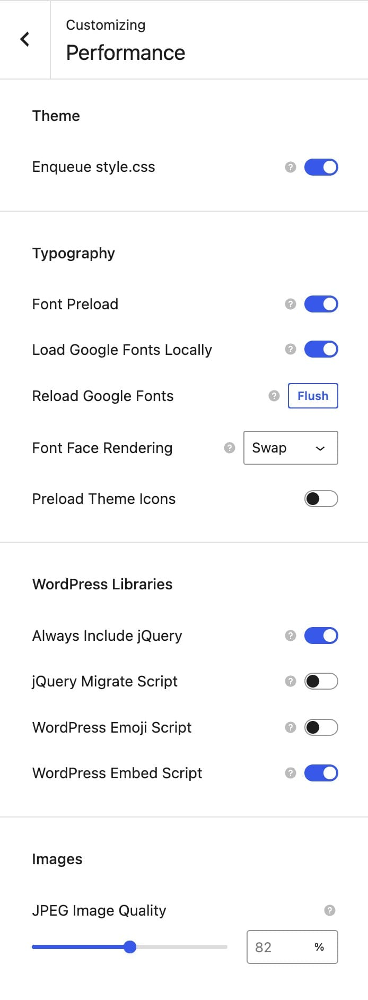

# Performance

A fast site keeps visitors and ranks better. Kalium has a screen of settings that help, but they're the finishing touches, not the main event.

**The three things that actually make the biggest difference** are your images, your hosting, and how many plugins you're running. Get those right first, then come back to this screen.

Everything below is at **Appearance -> Customize -> Performance**.

<figure><figcaption></figcaption></figure>

***

## Fonts

These three matter most, because fonts block text from appearing until they arrive.

#### Load Google Fonts Locally

**Off by default. Turn this on.**

Downloads your Google Fonts and serves them from your own server instead of Google's. It's faster, one less server to connect to, and it means visitor data isn't sent to Google, which helps with GDPR.

There's very little reason not to enable this.

#### Font Preload

**On by default.**

Tells the browser to start downloading fonts immediately, rather than waiting until it finds the text that needs them. It reaches Self-Hosted fonts only.

#### Font Face Rendering

**Default: Swap.**

What the browser does while a font is still downloading:

* **Swap**: show the text immediately in a fallback font, then swap when the real one arrives. **Best for most sites**: visitors can start reading straight away.
* **Block**: show nothing until the font arrives. It looks cleaner, but visitors stare at a blank space.
* **Fallback** and **Optional**, compromises that give up on a slow font entirely.
* **Auto**: leaves it to the browser.


[advanced-settings.md](../typography/fonts/advanced-settings.md)


***

## Scripts

Each of these removes something your site may not need.

#### WordPress Emoji Script

**On by default, which means the script loads.** Turn it **off** to drop it.

WordPress loads a script to support emoji in older browsers. Every modern browser handles emoji natively, so turning this off is safe, emoji still work.

#### WordPress Embed Script

**On by default, which means the script loads.** Turn it **off** to drop it.

It is the script that turns a pasted link into an embedded frame, a Twitter post for instance. If you don't embed posts from other WordPress sites, you don't need it.

#### Always Include jQuery

**Off by default.**

Kalium only loads jQuery when something needs it. Turn this on only if a plugin breaks without it, some older plugins assume it's always there.

#### jQuery Migrate Script

Only appears when **Always Include jQuery** is on. It's a compatibility layer for very old jQuery code. If nothing on your site needs it, switching it off saves a file.

***

## Other settings

#### Enqueue style.css

**On by default.** Leave it alone unless you know you need to change it.

#### Preload Theme Icons

Loads Kalium's icon font earlier, so icons don't appear a moment after the rest of the page.

#### JPEG Image Quality

How hard WordPress compresses your JPEGs, from 50 to 100. It starts at 82%, which is WordPress's own default. If you change it, regenerate your thumbnails so existing images are recompressed.

***

### The things that matter more

If your site is slow, these will make a far bigger difference than any setting above.

#### 1. Your images

**Usually the single biggest cause of a slow site.**

* **Resize before uploading.** 2000px on the longest edge is plenty. A photo straight from a phone is several times larger than any screen needs.
* **Compress them**, with an image optimization plugin or before uploading.
* **Set sensible image sizes** in each area, and regenerate thumbnails afterwards.


[image-problems.md](../troubleshooting/image-problems.md)


#### 2. Your hosting

Cheap shared hosting is slow in a way no setting can fix. If your site is slow and your images are already optimized, this is usually why.


[bad-hosting-environment.md](../troubleshooting/bad-hosting-environment.md)


#### 3. Your plugins

Every active plugin adds work to every page load. Deactivate and **delete** anything you're not using, a deactivated plugin still takes up space and still needs updating.

#### 4. A caching plugin

One good caching plugin makes more difference than every setting on the Performance screen combined.


**Be careful with the optimization features**\
Minify, combine and delay JavaScript. They can speed a site up, and they're also the most common cause of broken menus, sliders and galleries.

Turn them on **one at a time**, checking your site after each. If something breaks, you know which one did it.



[plugin-conflicts.md](../troubleshooting/plugin-conflicts.md)


#### 5. Load styles only where they're needed

If you have a long stylesheet that only applies to your shop, a CSS snippet with conditions loads it on shop pages and nowhere else.


[css-and-javascript-snippets.md](../template-parts/creating-template-parts/code-snippets/css-and-javascript-snippets.md)


***

### Measuring it

Test before and after you change anything, or you're guessing.

**PageSpeed Insights** and **GTmetrix** are both free. Test the same page each time, and test more than once, the first load after a change is always slower because caches are empty.

Pay attention to how the page _feels_ as well as the score. A site that scores 85 and shows text instantly is better than one scoring 95 that sits blank for two seconds.
