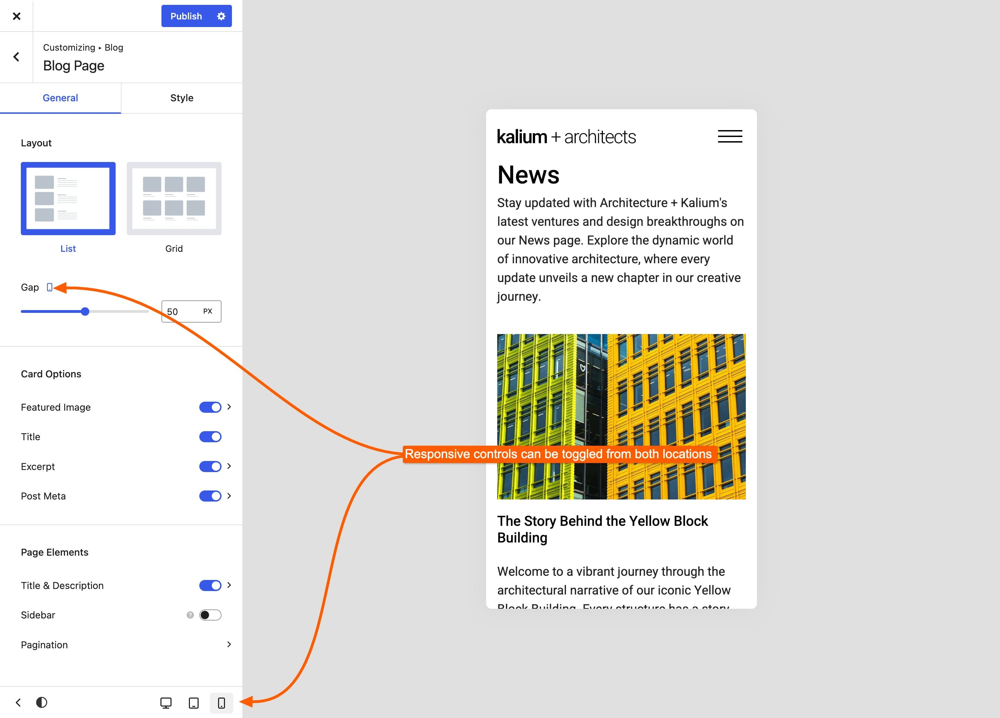

# Responsive Settings

Kalium is responsive throughout: your site reflows to fit whatever screen it's viewed on. But "fits the screen" and "looks right on the screen" aren't the same thing, and that's what these settings are for.

**Many Kalium settings can hold a different value per device.** A heading that's 48px on a desktop can be 28px on a phone. A grid that's four columns wide can be one.

***

### Setting a different value per device

Look for the small **device icons** beside a setting's label. Where they appear, the setting is responsive.

1. Find the setting, spacing, font size, column counts and padding usually are
2. Click the **device icon** for tablet or mobile
3. Set the value for that device

<figure><figcaption></figcaption></figure>

**A device with no value set inherits from the next size up.** So a value set for desktop applies to tablet and mobile until you give those their own. This is why you only need to change the sizes that actually need changing.


Getting this wrong is the single most common cause of "it looks fine on my computer but broken on my phone". Before assuming something is a bug, check whether the setting has device icons and what the mobile value is.


***

### Changing the number of columns on mobile

Column settings are responsive. Open the one for the area you're changing, switch to the mobile icon, and set the count:

* **Customize -> Blog -> Blog Page -> Columns**
* **Customize -> Portfolio -> Portfolio Page -> Columns**
* **Customize -> WooCommerce -> Product Catalog -> Product Columns**

One column is usually right for phones. Two can work for a product grid if the images are simple.

***

### Changing text size on mobile

1. Go to **Kalium -> Typography**
2. Open the font or appearance setting for the element you want to change
3. Switch to the **mobile** device icon
4. Set the size there

Phones get their own size and your desktop layout is untouched.

Headings are the usual culprit. A 56px display heading that looks striking on a desktop is overwhelming on a phone, 28 to 32px is more typical.


[font-sizes.md](../typography/font-sizes.md)


***

### Hiding something on mobile

Many areas have a **Visible On** or **Enable On** control listing the three devices. Turn off the device where it shouldn't appear:

* **Customize -> Sidebars -> Visible On**
* **Customize -> Header -> Sticky Header -> Enable On**
* Template Part **Container Settings -> Visibility**
* Builder elements have their own per-device visibility

Where no such control exists, a CSS snippet with a media query will do it.


[container-settings.md](../template-parts/settings/container-settings.md)


***

### When the mobile menu takes over

**Appearance -> Customize -> Header -> Mobile Menu -> Breakpoint** sets the screen width below which the mobile menu replaces the desktop one.

Raise it if your menu has many items and starts wrapping on tablets. Lower it if you have few items and want the full menu on smaller screens.


[mobile-menu.md](../general/header/mobile-menu.md)


***

### Making images fit better on mobile

When a grid reflows to one column, images with different shapes can make the page look untidy, one portrait, one landscape, one square.

Set an **Aspect Ratio** in the area's **Featured Image** settings. Every image is then cropped to the same shape, and the grid stays even at any width.

After changing an aspect ratio, regenerate your thumbnails so existing images are recut.

***

### Checking your work

The Customizer has device preview buttons at the bottom of the panel, desktop, tablet and mobile. They're the quickest way to check a change without leaving the screen.

They're a preview, not a real phone. Before launching, open the site on an actual device: real phones have different fonts, a different scrollbar and a browser bar that takes up space.

***

### When something is wrong on mobile only

Problems that only appear on phones (content hidden behind the header, sideways scrolling, hover effects that don't work) have their own article:


[mobile-problems.md](../troubleshooting/mobile-problems.md)

