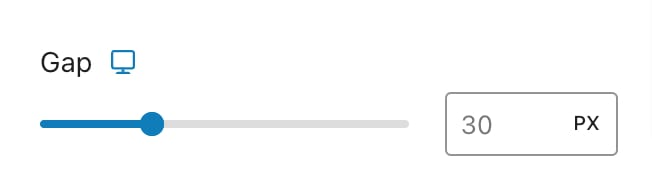
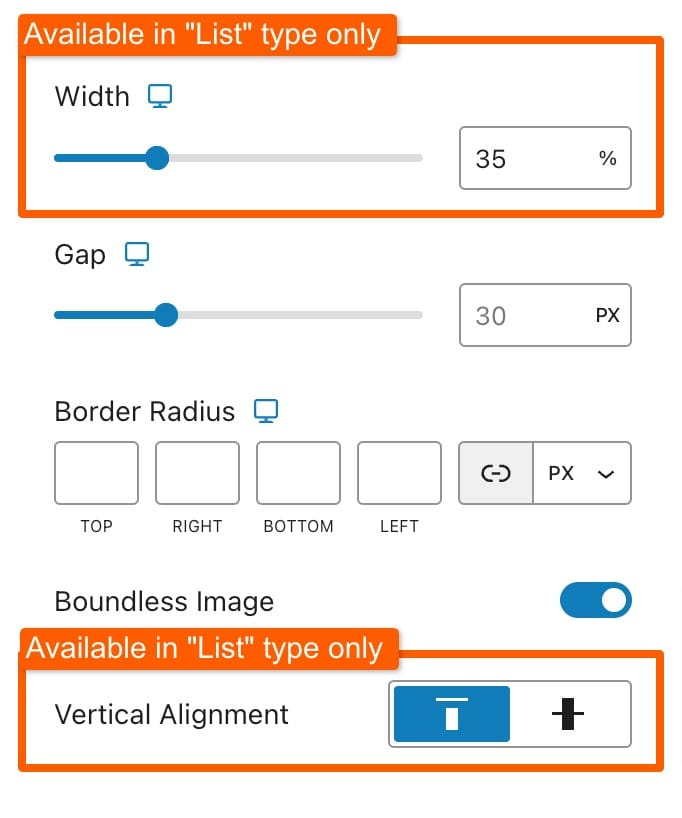
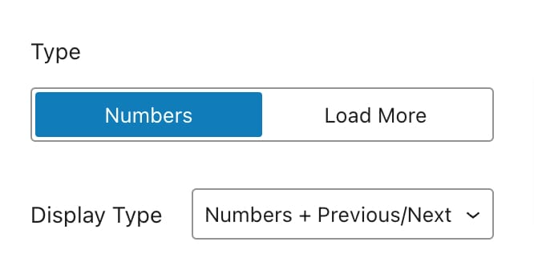
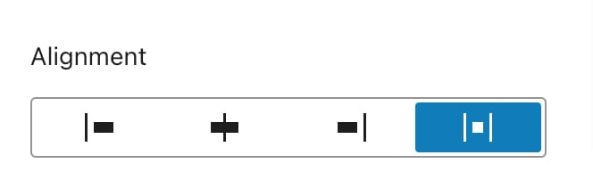

# Blog Page

The Blog Page settings in the Customizer allow you to change the appearance and layout of your blog posts. To access these settings, navigate to **Appearance -> Customize -> Blog -> Blog Page**.&#x20;

<figure><figcaption></figcaption></figure>

## Layout

You can choose how your blog posts are arranged on the page:

<figure><figcaption></figcaption></figure>

#### List Options

The **List Layout** presents posts in a single column, making it ideal for a clean and straightforward blog appearance. In this layout, you can adjust the following settings:

<figure><figcaption></figcaption></figure>

* **Gap**: Controls the vertical space between each post. The gap can be set from 0px (no space) to 100px (a larger space).

#### Grid Options

The **Grid Layout** displays posts in multiple columns, providing a more dynamic and visually engaging presentation. This layout includes several customization options:

<figure><figcaption></figcaption></figure>

* **Columns**: Determines the number of columns in which your posts will be arranged. Options range from 1 to 4 columns.
* **Gap**: Sets the spacing between the posts in the grid. This gap can range from 0px to 100px.
* **Masonry Mode**: Enables a staggered, masonry-style grid layout where posts of varying heights are arranged to fill gaps.

***

## Card Options

Customize the appearance of each post card using the following settings:

* [**Featured Image**](blog-page.md#featured-image): Toggle to show or hide the featured image on the post card. When turned on, additional settings for hover effects, image placeholders, and image size become available.
* **Title**: Toggle to show or hide the post title on the post card.&#x20;
* [**Excerpt**](blog-page.md#excerpt): Toggle to show or hide the post excerpt (description) on the post card. When enabled, you can configure the excerpt length.
* [**Post Meta**](blog-page.md#post-meta): Toggle to show or hide post metadata (date, categories) on the post card. When turned on, further customization options will show.

### Featured Image

The Featured Image settings allow you to control how the featured image on each post card appears. This option includes several additional settings:

<figure><figcaption></figcaption></figure>

* **Hover Effect**: Manage the visual effects that appear when hovering over the featured image.
* **Image Placeholder**: Define the appearance of a placeholder shown while the featured image is loading.

When any of them is enabled, additional settings for these options will be available under the **Style** tab.

#### Hover Effect

These settings control what happens when a user hovers over the featured image. These options include:

<figure><figcaption></figcaption></figure>

* **Background**: Choose a color for the hover effect background that appears when a user hovers over the image.
* **Offset**: Adjust how far the hover effect extends from the edges of the image, affecting the visual impact on hover.
* **Icon**: Select an icon to display on hover:
  * **None**: No icon will be shown.
  * **Eye Icon**: Choose between a static or animated eye icon.
  * **Custom Icon**: Upload and use a custom icon of your choice.

#### Image Placeholder

Manage the visual element that appears while the featured image is loading. This helps ensure that there is always a visual component in place:

<figure><figcaption></figcaption></figure>

* **Color**: Set a color for the placeholder that appears while the image is loading.
* **Image**: Choose an image to use as a placeholder during the loading process.&#x20;

#### Image Size

Control the dimensions of the featured image:

<figure><figcaption></figcaption></figure>

* **Image Size**: Select from predefined sizes or define a custom size for the featured image.
* **Aspect Ratio**: Choose from predefined aspect ratios or set a custom ratio, with options for responsive adjustments.

#### Style

The Style tab includes settings that affect the overall appearance of the featured image in card:

<figure><figcaption></figcaption></figure>

* **Width**: Set the width of the featured image. This option is available for the **List** layout only.
* **Gap**: Adjust the space between the featured image and the content below.
* **Border Radius**: Set how rounded the corners of the featured image should be.
* **Boundless Image**: Toggle to extend the image to the edges of the card, ignoring padding, border, or background settings.
* **Vertical Alignment**: Set the vertical alignment of the featured image within the card to Top or Bottom. This option is available for the **List** layout only.

### Excerpt

The Excerpt setting determines whether post excerpts are displayed on the post cards. When turned on, you can configure the following option:

<figure><figcaption></figcaption></figure>

* **Max Words**: Specify the maximum number of words to display in the excerpt. This controls the length of the excerpt shown on each post card.

### Post Meta

The **Post Meta** option lets you control the visibility of additional post information on the post card. When this setting is turned on, you can customize the following options:

<figure><figcaption></figcaption></figure>

* **Date**: Toggle to show or hide the post date.
* **Category**: Toggle to show or hide the post category.
* **Display Icon**: Toggle to show or hide an icon next to the metadata.&#x20;

***

## Page Elements

The **Page Elements** section allows you to customize additional components of your Blog Page. Here are the available options:

<figure><figcaption></figcaption></figure>

* [**Title & Description**](blog-page.md#title-and-description): Toggle this option to show or hide the title and description.
* [**Sidebar**](blog-page.md#sidebar): Use this toggle to include or exclude the sidebar from your Blog Page.&#x20;
* [**Pagination**](blog-page.md#pagination): Configure how posts are divided across multiple pages. This section includes several pagination options and settings that will be explained further below.

***

### Title & Description

This setting allows you to control the visibility and content of the title and description displayed on your Blog Page.

<figure><figcaption></figcaption></figure>

* **Blog Title**: Enter a title for your Blog Page in the input field. This title will appear at the top of the page and helps to identify and label the blog section of your site.
* **Blog Description**: Use the textarea to provide a description for your Blog Page. This description can offer a brief overview or introduction to the content of your blog and will be displayed below the blog title.

Before you can use these options, you need to toggle the setting to "on" to enable the display of the title and description.

***

### Sidebar

Customize the appearance and placement of the sidebar on your Blog Page with these settings:

<figure><figcaption></figcaption></figure>

#### Sidebar Align

Choose the alignment of the sidebar:

* **Left**: Position the sidebar on the left side of the Blog Page.
* **Right**: Position the sidebar on the right side of the Blog Page.

#### Sidebar Widgets

Click the provided link to access the widget management area. Here, you can add and configure widgets to populate the sidebar with content such as recent posts, categories, or custom text.


For additional styling and customization of the sidebar, you can adjust the global sidebar settings located under **Appearance -> Customize -> Sidebars**. This area allows you to manage the overall look and feel of sidebars across your site, check the [sidebar styling article](../../general/sidebars/).


***

### Pagination

Configure how posts are divided across multiple pages to manage navigation. You can choose between two types of pagination:

* [**Numbers**](blog-page.md#numbers)
* [**Load More**](blog-page.md#load-more)

#### Numbers

Display numbered pagination for navigation.

<figure><figcaption></figcaption></figure>

#### Display Type

* **Numbers**: Show only page numbers.
* **Numbers + Previous/Next**: Display page numbers along with Previous and Next buttons for easier navigation.
* **Previous/Next**: Show only Previous and Next buttons.

***

#### Load More

Use a button to load more posts as users scroll down the page.

<figure><figcaption></figcaption></figure>

* **Infinite Scroll**: Toggle this to enable or disable infinite scrolling, where more posts load automatically as users scroll down the page.
* **Loading Effect**: Choose a loading effect to display while new posts are being fetched:
  * **Spinner**: A spinning icon indicating loading.
  * **Pulsate**: A pulsating effect indicating loading.

***

#### Alignment

Set the alignment of pagination controls for both types:

<figure><figcaption></figcaption></figure>

* **Left**: Align pagination controls to the left.
* **Center**: Center-align pagination controls.
* **Right**: Align pagination controls to the right.
* **Space Between**:  Distribute space between items (Available only for Numbers type)

## Style Tab

The **Style** tab provides options to customize the appearance of post card on the blog page. These settings allow you to adjust the overall look and feel of the cards.

<figure><figcaption></figcaption></figure>

#### Card Style

* **Background**: Choose a background color for the post card. When a background color is set, padding will automatically be applied to the card to ensure proper spacing and alignment.
* **Title**: Select a color for the post title on the card.&#x20;
* **Text**: Choose a color for the excerpt text on the card.
* **Padding**: Adjust the padding inside the card to control the space between the content and the card edges. This option includes responsive settings, allowing you to define different padding values for different screen sizes.
* **Border**: Customize the card's border by setting the width, size, and type (e.g., solid, dashed). This option also includes responsive settings, enabling you to define different border styles for different screen sizes.
* **Border Radius**: Set how rounded the corners of the card should be. The border radius option includes responsive settings, allowing for different levels of rounding on various devices.
* **Box Shadow**: Apply a shadow effect to the card, giving it a three-dimensional appearance. This option allows you to adjust the intensity and direction of the shadow.

