# Creating a Blog Page

By default, WordPress allows you to designate a page as your blog, which then serves as a dynamic feed for your posts. This means that whenever you publish a new post, it automatically appears on this page, keeping your content organized and easily accessible for your readers.

In this guide, we’ll walk you through the steps to create and set up your blog page in WordPress. We’ll cover everything from creating the page to configuring it as your posts page. With a few simple steps, you'll have your blog up and running, ready to showcase your latest content and engage with your audience.

If you don’t want to use the default homepage as your blog page and prefer to create a separate page for your blog, follow these steps:

1. In the WordPress sidebar, go to **Pages** **->** **Add New**.
2. Enter a title for your blog page. Common titles include **"Blog"**, **"Thoughts"**, or **"News"**.
   * Optionally, add a description to introduce your blog or provide context for your readers.
3. Click **Publish** to make your blog page live on your site.

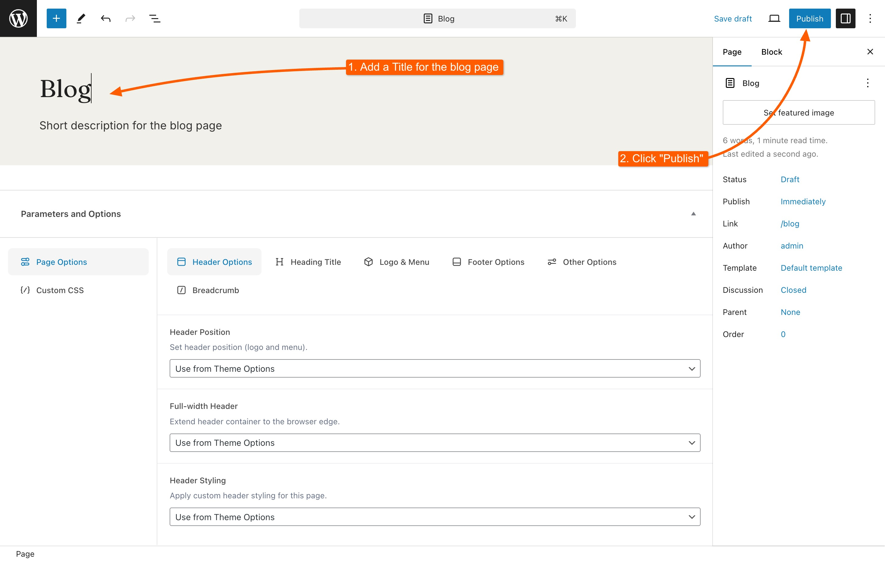

## Setting Your Blog Page as the Posts Page

After creating your blog page, you need to designate it as the page that will display your blog posts:

1. Navigate to **Settings** **->** **Reading** in the WordPress sidebar.
2. In the **Front page displays** section, select **A static page (select below)**.
3. In the **Posts page** dropdown menu, choose the blog page you created earlier.
4. Click **Save Changes** to apply the settings.

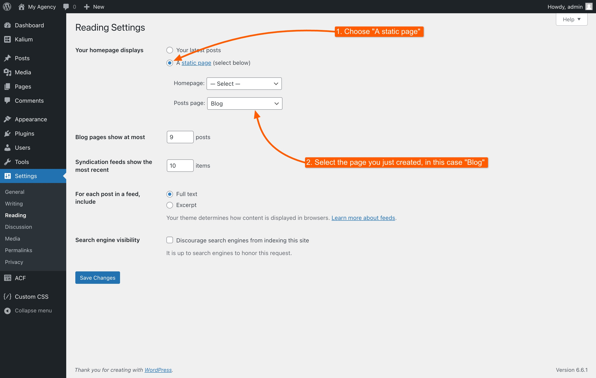

Now, your blog page is set to display all your posts. You can view it by going to **yoursite.com/blog**.

## Creating a Blog Page with Elementor

If you want to move beyond the basic WordPress blog archive, Elementor’s powerful page builder can help you design a blog page that matches your vision. With its easy-to-use interface and extensive customization options, Elementor allows you to create a visually appealing and functional blog page.

### Create a New Page

Go to your WordPress dashboard and under **Pages** from the left-hand menu, and click **Add New** **Page** to create a new page.

### Set Up the Page

1. Enter a title for your blog page (e.g., "Blog" or "Latest News").
2. Click the **Edit with Elementor** button to start customizing your page with Elementor.

<figure>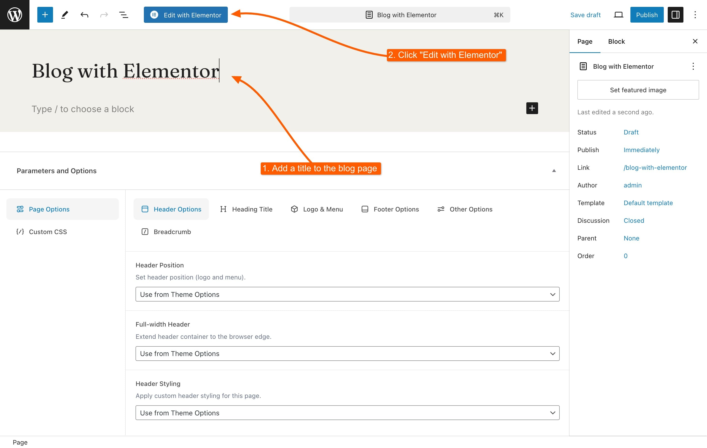<figcaption></figcaption></figure>

### Add the Blog Posts Widget

From the left widget area of Elementor, under the **Kalium** section, drag or click the **Blog Posts** widget onto your page (right area).

<figure>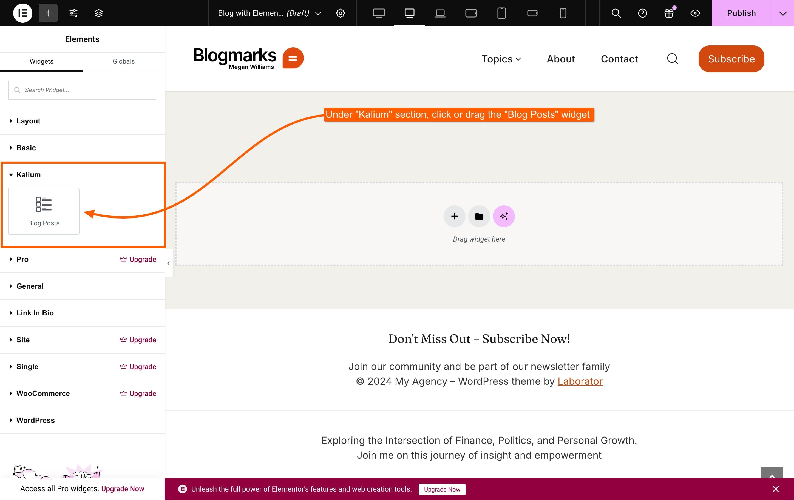<figcaption></figcaption></figure>

### Configure the Blog Posts Widget

Under the **Content** tab, adjust the layout options to fit your needs. These settings will override the default [Blog Page options](blog-page.md).

<figure>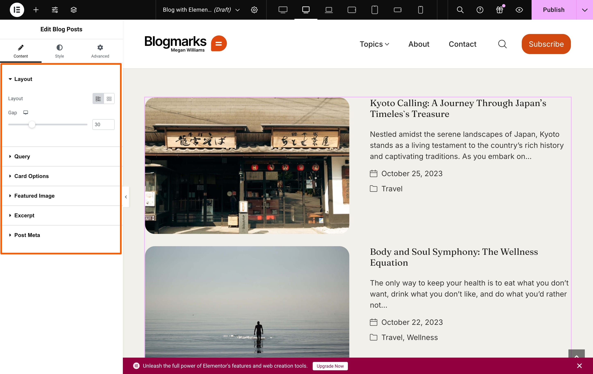<figcaption></figcaption></figure>

Switch to the **Style** tab in the widget settings. You can choose to [inherit styles from the Customizer](blog-page.md#style-tab) or set new styles directly in Elementor.

<figure><figcaption></figcaption></figure>

### Publish Your Page

Once you're satisfied with the setup, click the **Publish** button in the top right corner to make your blog page live.

## Creating a Blog Page with WPBakery

WPBakery Page Builder enables you to create a blog page with a personalized touch. Instead of using the default WordPress blog archive, WPBakery lets you build a blog page from scratch, offering extensive customization to achieve your desired look and layout.

### Create a New Page

Go to your WordPress dashboard, select **Pages** from the left-hand menu, and click **Add New Page** to create a new page.

### Set Up the Page

1. Enter a title for your blog page (e.g., "Blog" or "Latest News").&#x20;
2. Click the **WPBakery** button to start customizing your page with the WPBakery Page Builder.

<figure>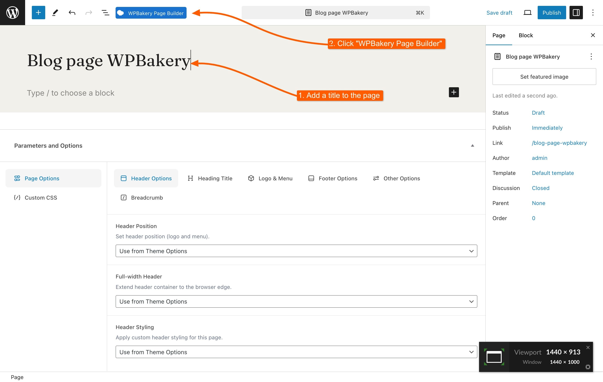<figcaption></figcaption></figure>

### Choose Editor

Choose between "**Backend**" or "**Frontend**" editor. For this example, we'll use the Backend editor.

<figure>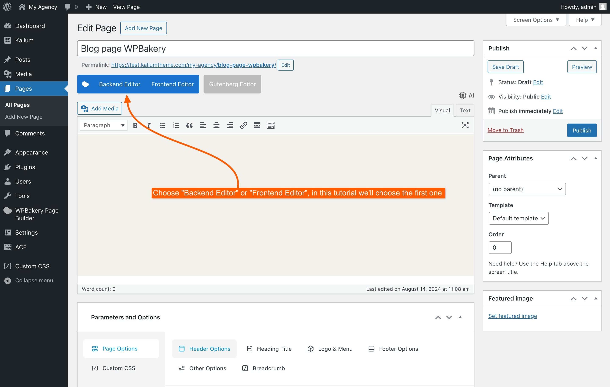<figcaption></figcaption></figure>

### Select Layout

Choose the **Default Layout** for your blog page.

<figure>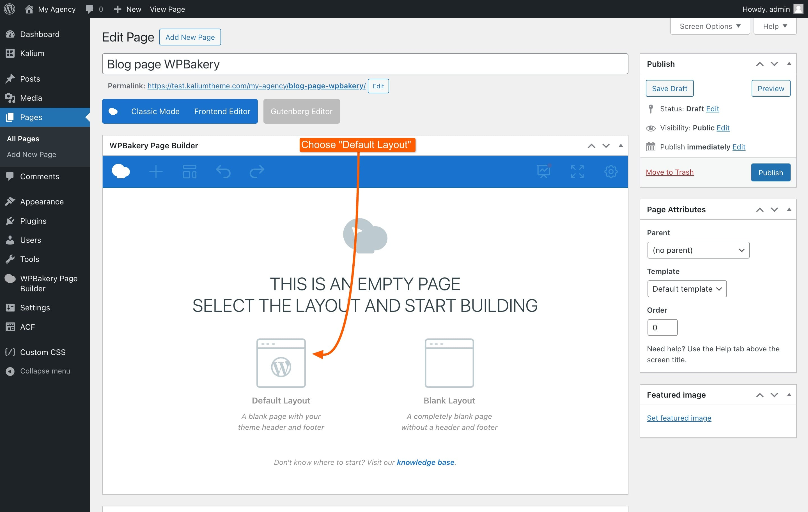<figcaption></figcaption></figure>

### Add Blog Posts Element

Click the **+ Add Element** button.

<figure>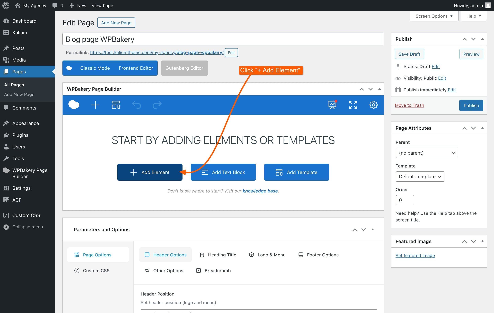<figcaption></figcaption></figure>

In the popup that appears:

* Switch to the **Laborator** tab and select **Blog Posts**.
* Alternatively, use the search bar to find the element directly.

<figure>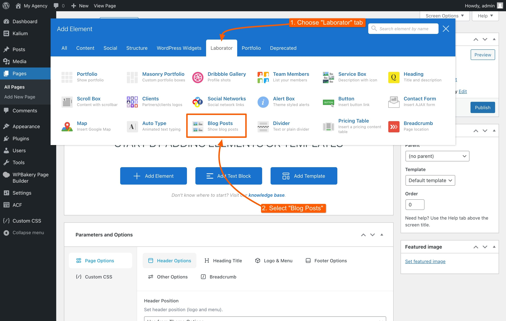<figcaption></figcaption></figure>

### Customize the Blog Posts Widget

Set the options in the Blog Posts widget to overwrite the [layout and style of the Blog Page](blog-page.md) under the Customizer. Click **Save Changes** to apply your settings.

<figure>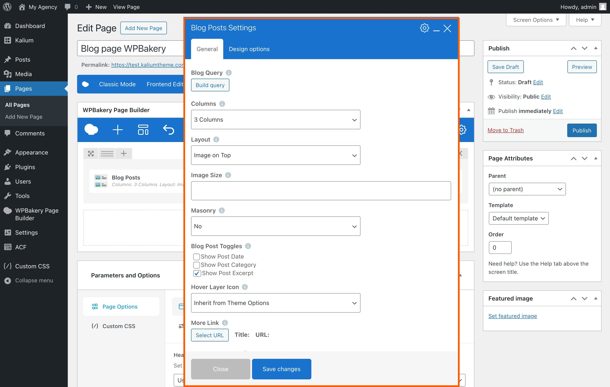<figcaption></figcaption></figure>

### Publish Your Page

When you're done customizing the blog page, click the **Publish** button on the right side to make your blog page live.
