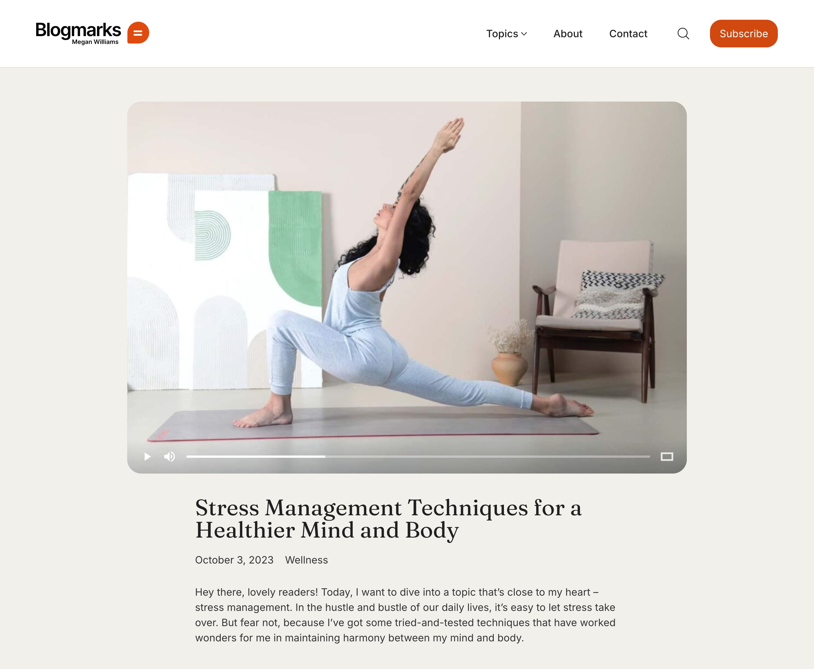

# Creating a Blog Post

Now that your [Blog page](creating-a-blog-page.md) is set up, it's time to dive into creating engaging content. Whether you're sharing personal stories, news updates, or insights on your favorite topics, WordPress makes it easy to publish and manage your blog posts.

Follow these steps to create your first blog post and make the most out of the available post formats:

## Creating Your First Blog Post

Before getting started, let's start creating the first blog post, you can do so by navigating to the WordPress sidebar, go to **Posts** **->** **Add New**.

<figure><figcaption></figcaption></figure>

1. Enter a  title for your blog post that captures the essence of your content.
2. Write the main content of your post in the **Content** area. Here, you can add text, images, and other media.
3. Set a featured image to visually represent your post. This image will appear prominently on your blog and in previews.
4. Choose the appropriate format for your post from the **Format** section on the right.&#x20;
5. Assign at least one category to organize your post. Categories help readers find related content.
6. Add any tag if you wish to the post.
7. Click **Publish** to make your post live or **Update** to save changes to an existing post.

## Blog Post Formats

WordPress supports various post formats, each designed to display different types of content. Kalium enhances this by providing custom post layouts for each format, ensuring that your posts look beautiful and engaging no matter the format you choose.

These are the supported blog post formats:

* [Audio](creating-a-blog-post.md#audio-format)
* [Gallery](creating-a-blog-post.md#gallery-format)
* [Image](creating-a-blog-post.md#image-format)
* [Link](creating-a-blog-post.md#link-format)
* [Quote](creating-a-blog-post.md#quote-format)
* [Standard](creating-a-blog-post.md#standard-format)
* [Video](creating-a-blog-post.md#video-format)

Additionally, Kalium automatically detects the relevant content within your post and displays it in the featured area. For example, if you include an audio file in an audio post format, Kalium will automatically pick the first audio file in the post and use it as the featured content, displaying it in the featured image area.

To choose a specific post format when creating or editing a post, on the right sidebar under **Format** click the **Standard** link, then from the format popup choose the type:

<figure><figcaption>
Instructions on how to choose a post format
</figcaption></figure>

Below, we’ll explain each format and how Kalium optimizes the layout for them.

### Standard Format

The Standard format is the default and most commonly used format. It displays your post content with a featured image. It’s perfect for general posts.

### Video Format

Use the Video format to feature videos directly in your post. You can embed videos from YouTube, Vimeo, or upload a self-hosted video.

<figure><figcaption>
Video post format preview
</figcaption></figure>

To use the Video format in Kalium, follow these steps:

1. Ensure you have chosen **Video** in the Format section on the right side of the editor.
2. Add a **Video** block using the Gutenberg editor. You can use a self-hosted video or any video from YouTube or Vimeo. Kalium will automatically use the first video in your post as the featured video.

In the Parameters and Options area under "**Video Post Settings**", you can set options such as **Video Resolution** and **Auto Play Video:**

<figure><figcaption></figcaption></figure>

### Quote Format

The Quote format is designed to highlight quotes. Use it to feature a quote prominently at the top of your post.

<figure><figcaption>
This is how Quote post looks like
</figcaption></figure>

### Image Format

The Image format is basically the same as the Standard Format but if you forget to add a featured image to your post, it will automatically take the first image that you have in the post (if you have any).

### Link Format

The Link post format is specifically designed for sharing external links. This format allows you to direct readers to another website or resource without needing extensive content within the post itself. Steps to use the link format are as follows:

1. When creating or editing your post, choose **Link** in the **Format** section on the right.
2. In the post editor, enter the URL of the external site you want to link to.

### Gallery Format

The Gallery format is used when you want to add an image slider.

<figure><figcaption>
A preview of a Gallery post, notice the gallery arrows
</figcaption></figure>

To create a Gallery post, make sure that you have selected **Gallery** on the **Format** section on the right.

Then in the **Parameters and Options** -> **Post Slider Images**, you can add images to populate the slider.

<figure><figcaption></figcaption></figure>

On the frontend, the **Featured Image** will show first, followed by the images you have added in **Post Slider Images** based on your order.

### Audio Format

<figure><figcaption>
Audio post format preview with a featured image
</figcaption></figure>

To use the Audio format in Kalium, follow these steps:

1. Make sure you have chosen **Audio** in the Format section on the right side of the editor.
2. To include an audio in your post, use the Gutenberg editor to add an **Audio** block to your content. Kalium will automatically detect the first audio block within the post and use it as the featured content, showing it prominently in the featured image area.

In the **Parameters and Options** area under **Audio Post Settings**, you can select the option **Auto Play Audio** to play the audio automatically, as explained below:

<figure><figcaption></figcaption></figure>

## Post Settings

When creating or editing a blog post in Kalium, you can use Post Settings to customize options specific to that post. These settings allow you to override the global options set in the [Post Page](post-page.md) section of the Customizer, giving you more control over how each post appears. Access the post settings by scrolling down to **Parameters and Options** **→** **Post Settings**.

<figure><figcaption></figcaption></figure>


For other options under **Parameters and Options**, please check the [In Page Options](../../general/header/in-page-options.md) article for more details.


#### Post Settings

* **Featured Image Placing:** Choose how the featured image is displayed in your post.&#x20;
  * Inherit ([Use from theme options](post-page.md#featured-image))&#x20;
  * Boxed
  * Wide
  * Full-Width
  * Hide
* **Image Size:** Adjust the size of the featured image
  * Inherit ([Use from theme options](post-page.md#image-size))&#x20;
  * Default
  * Original
* **Related Posts:** Configure whether related posts are displayed or not, or inherit the options.
  * Inherit ([Use from theme options](post-page.md#related-posts))&#x20;
  * Show
  * Hide
