# Post Page

The Post Page section, accessible via **Appearance -> Customize -> Blog -> Post Page**, lets you define the layout and styling of your individual blog posts. This area is designed to give you control over how your content is presented, with options for adjusting the featured image, configuring post metadata, and enabling additional elements like social sharing or author information.&#x20;

<figure>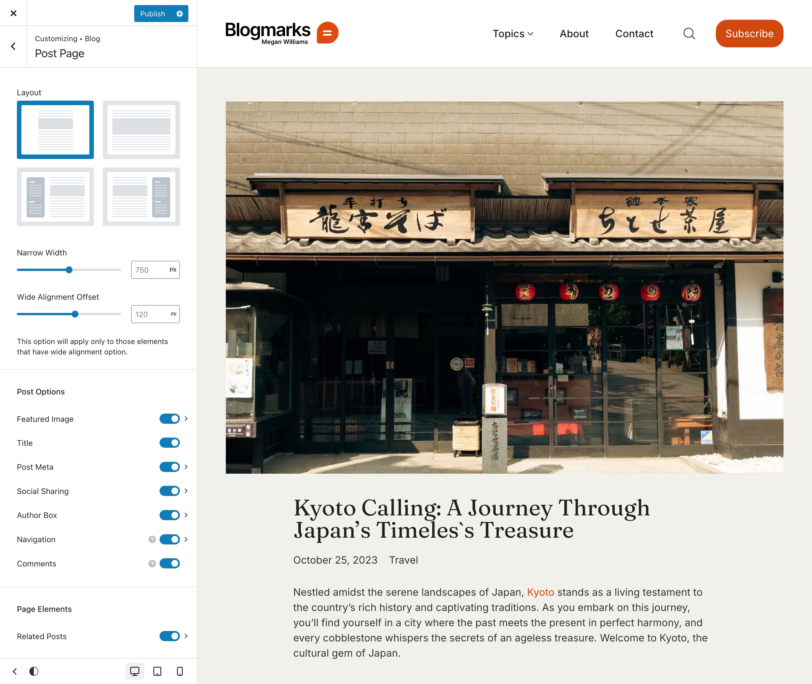<figcaption></figcaption></figure>

## Layout

Choose how your post page layout will be structured. The available options are:

<figure>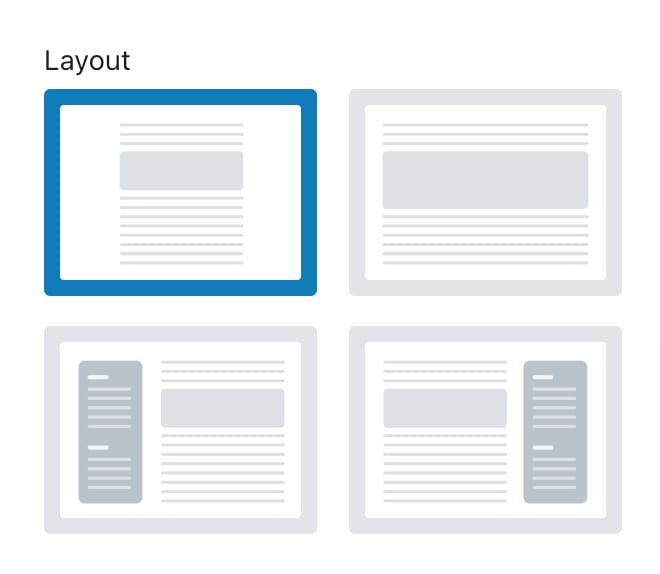<figcaption></figcaption></figure>

* **Narrow**: Displays posts in a narrower format, ideal for a focused reading experience.
* **Normal**: Provides a standard width for post content, balanced for readability.
* **Sidebar Left**: Places the sidebar on the left side of the post, offering additional navigation or widgets.
* **Sidebar Right**: Positions the sidebar on the right side of the post, useful for supplementary content or links.

***

<figure>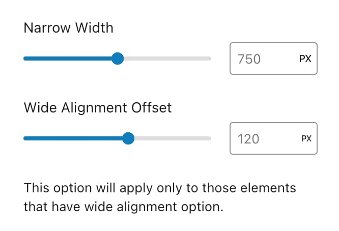<figcaption></figcaption></figure>

* **Narrow Width**: Controls the width of the content area when the “**Narrow**” layout is selected. You can adjust the width using a range from 600 pixels (minimum) to 900 pixels (maximum). This allows for a more compact or expanded narrow layout depending on your design needs.
* **Wide Alignment Offset**: This setting applies to elements with “Wide Alignment” in the Gutenberg editor. It adjusts the offset from the edges of the content area. The range for this offset is from 20 pixels to 200 pixels. This option is available for both the “**Narrow**” and “**Normal**” layouts, allowing for precise control over how wide-aligned content elements are positioned relative to the rest of the page.

***

* **Sidebar Widgets**: This option will appear when either the "**Sidebar Left**" or "**Sidebar Right**" layout is selected, allowing you to manage and populate sidebar widgets. For additional styling and customization of the sidebar please read the [sidebar styling article](../../general/sidebars/).

***

## Post Options

Here are the available options you can configure for your post pages. Each of these is a toggle, allowing you to turn the feature on or off. Some options have additional settings, while others do not:

<figure>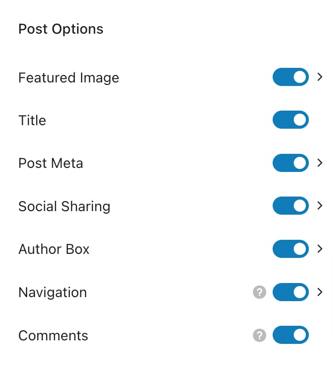<figcaption></figcaption></figure>

* [**Featured Image**](post-page.md#featured-image): Toggle to show or hide the featured image on the post page.&#x20;
* **Title**: Enable or disable the post title within the post.&#x20;
* [**Post Meta**](post-page.md#post-meta): Show or hide metadata such as date, categories, and tags.&#x20;
* [**Social Sharing**:](post-page.md#social-sharing) Toggle to enable or disable social sharing buttons.&#x20;
* [**Author Info**](post-page.md#author-info): Enable or disable the author information at the bottom of the post.&#x20;
* [**Navigation**](post-page.md#navigation): Toggle to enable or disable navigation links for previous and next posts.&#x20;
* **Comments**: Show or hide the comments section at the bottom of the post.&#x20;

### Featured Image

Control the display and style of the featured image on your posts. You can choose between a boxed, wide or full-width layout for the image and adjust its appearance, including gallery auto-play settings if applicable. These are the options for managing the featured image:

#### Layout

<figure>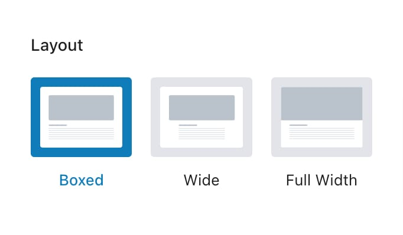<figcaption></figcaption></figure>

* **Boxed**: Contains the image within a boxed frame.
  * **Sidebar below**: A toggle that, when enabled, places the sidebar below the featured image instead of beside it.
* **Wide**: Contains the image within a boxed frame but wider than the content, available only in **Normal** and **Narrow** types.
* **Full Width**: Displays the image across the full width of the post page.

#### Image Size

Control the dimensions of the featured image:

<figure>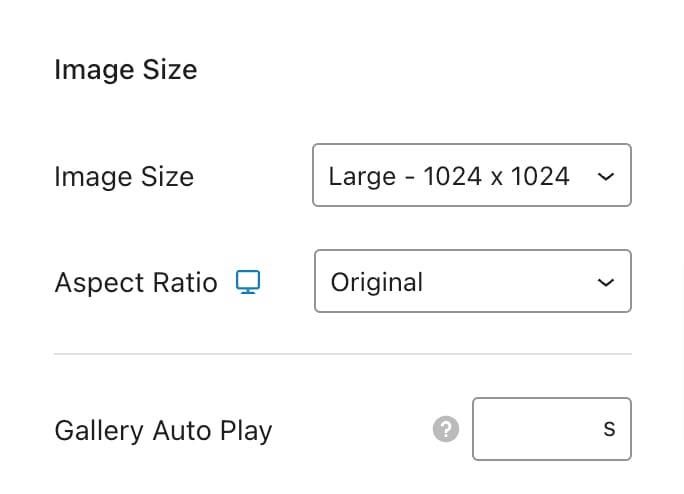<figcaption></figcaption></figure>

* **Image Size**: Select from predefined sizes or define a custom size for the featured image.
* **Aspect Ratio**: Choose from predefined aspect ratios or set a custom ratio, with options for responsive adjustments.
* **Gallery Auto Play**: Set an auto-switch interval for images in a gallery.

#### Style Tab

<figure>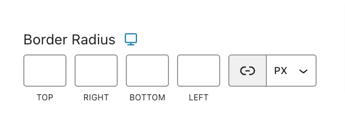<figcaption></figcaption></figure>

* **Border Radius**: Adjust the roundness of the image corners.

### Post Meta

Display or hide metadata associated with the post, such as the publication date, categories, and tags.

<figure>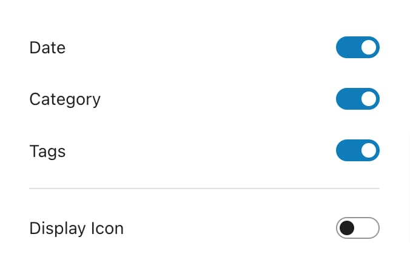<figcaption></figcaption></figure>

* **Date**: Toggle to show or hide the post date.
* **Category**: Toggle to show or hide the post category.
* **Tags**: Toggle to show or hide post tags.
* **Display Icon**: Toggle to show or hide an icon next to the metadata.

### Social Sharing

Allow visitors to share your post on various social networks directly from the post page. These are the options for social sharing:

<figure><figcaption></figcaption></figure>

#### Style

* **Labels**: Displays text labels for sharing buttons.
* **Icons**: Displays only icons for sharing buttons.

#### Share Networks

Add or remove sharing networks from the following options:

* Facebook
* X (Twitter)
* Pinterest
* Email
* LinkedIn
* Tumblr
* VKontakte
* WhatsApp
* Telegram
* Print

### Author Info

Show or hide the author box at the end of your posts. This section can include the author’s avatar and a brief description or biography. These are the options for the author box:

<figure>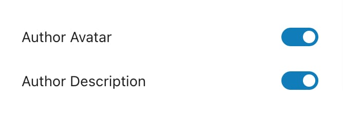<figcaption></figcaption></figure>

* **Author Avatar**: Toggle to show or hide the author's avatar.
* **Author Description**: Toggle to show or hide the author's bio or description.

#### Style Tab

<figure>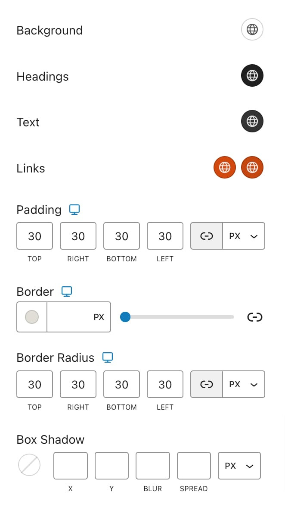<figcaption></figcaption></figure>

* **Background**: Set a background color for the author info section.
* **Headings**: Customize the color of the headings.
* **Text**: Set the color for the text content.
* **Links**: Customize the color of links, with separate options for normal and hover states.
* **Padding**: Adjust the padding around the author info section.
* **Border**: Set the border width, style, and color.
* **Border Radius**: Adjust the roundness of the borders.
* **Box Shadow**: Add a shadow effect to the author info section.

### Navigation

Manage the navigation links that appear at the bottom of your posts.

* **Reverse Order**: Enable this option to swap the 'Previous' and 'Next' links, allowing you to customize the order of blog navigation.

### Related Posts

<figure>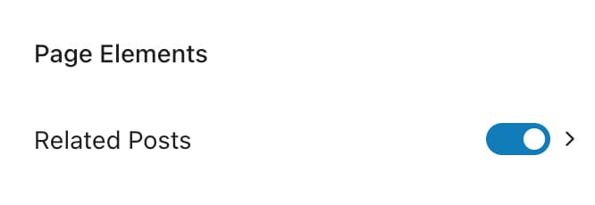<figcaption></figcaption></figure>

Display related posts at the end of the current post. You can configure which posts to relate based on tags, categories, or other criteria, and adjust the number of posts shown and their layout. These are the options for related posts:

#### Posts

<figure>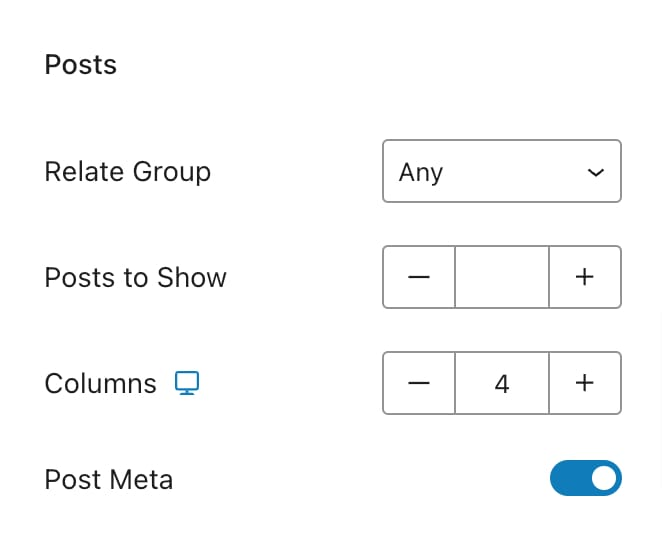<figcaption></figcaption></figure>

* **Relate Group**: Choose the criteria for related posts—Any, Tag, or Category.
* **Posts to Show**: Select the number of related posts to display, from 1 to 12.
* **Columns**: Set the number of columns for related posts, ranging from 1 to 4, with responsive options.
* **Post Meta**: Toggle to show or hide metadata on related posts.

#### Container

<figure>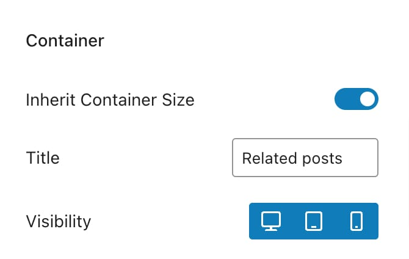<figcaption></figcaption></figure>

* **Inherit Container Size**: Toggle to make the related posts container match the size of the main content container.
* **Title**: Input a custom title for the related posts section.
* **Visibility**: Choose to show or hide the related posts section on specific devices.

#### Style Tab

<figure>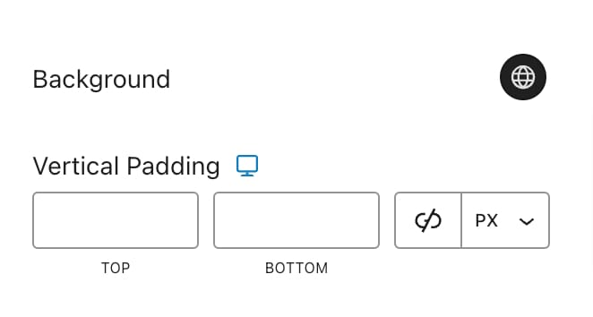<figcaption></figcaption></figure>

* **Background**: Set a background color for the related posts section.
* **Vertical Padding**: Adjust the vertical padding for spacing around the related posts.
