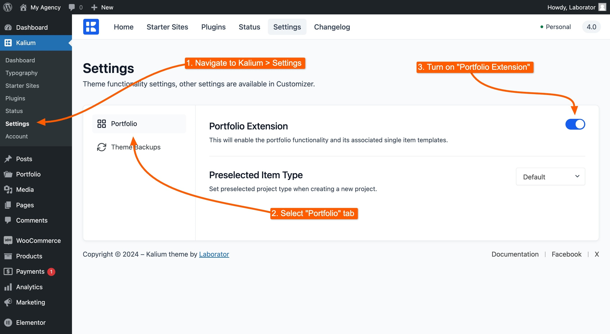

# Portfolio

The Portfolio has been an integral part of the Kalium theme since its inception, starting from version 1. It’s not just a feature—it’s a source of pride for the theme.&#x20;

Designed with flexibility and creativity in mind, the Portfolio section allows you to showcase your work in a visually stunning and highly customizable manner, making it a favorite among users.

<figure><figcaption></figcaption></figure>

## How To Enable Portfolio

To enable the Portfolio feature in Kalium, follow these steps:

1. Navigate to **Kalium -> Settings** from your WordPress dashboard.
2. Click on the **Portfolio** tab to access the Portfolio settings.
3. Turn the **Portfolio Extension** toggle to **On**.

This will activate the Portfolio feature on your site, allowing you to create and manage your portfolio projects within Kalium.

<figure><figcaption></figcaption></figure>
