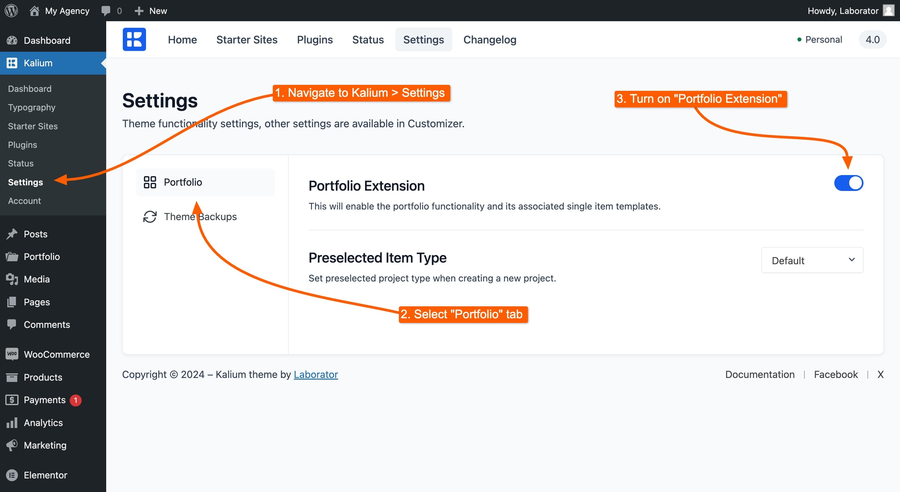

# Portfolio

The Portfolio has been an integral part of the Kalium theme since its inception, starting from version 1. It’s not just a feature, it’s a source of pride for the theme.&#x20;

Designed with flexibility and creativity in mind, the Portfolio section allows you to showcase your work in a visually stunning and highly customizable manner, making it a favorite among users.

<figure><figcaption></figcaption></figure>

## How To Enable Portfolio

To enable the Portfolio feature in Kalium, follow these steps:

1. Navigate to **Kalium -> Settings** from your WordPress dashboard.
2. Click on the **Portfolio** tab to access the Portfolio settings.
3. Turn the **Portfolio Extension** toggle to **On**.

This will activate the Portfolio feature on your site, allowing you to create and manage your portfolio projects within Kalium.

<figure><figcaption></figcaption></figure>

***

## It isn't only for portfolios

**The portfolio module isn't tied to the Portfolio post type.** On the same settings screen, **Portfolio Post Types** lets you hand the entire module (the project layouts, galleries, filters and hover effects) to any other post type on your site.

That's how a **Case Studies**, **Services** or **Projects** section gets Kalium's project layouts while keeping its own name everywhere your visitors see it. Each post type gets its own complete set of Portfolio options, independent of the others.


[portfolio-post-types.md](portfolio-post-types.md)


***

## Where the settings live

The portfolio has settings in three places, and knowing which is which saves a lot of searching:

| Where | What it controls |
| --- | --- |
| **Kalium -> Settings -> Portfolio** | Whether the module is on, and which post types use it |
| **Appearance -> Customize -> Portfolio** | How listings and project pages look site-wide |
| **Parameters and Options**, on a page using the Portfolio template | One particular listing |
| **Parameters and Options**, on a project | One particular project, its layout and gallery |


[portfolio.md](../../getting-started/theme-settings/portfolio.md)



**Portfolio pages showing a critical error?** That's almost always Advanced Custom Fields Pro being inactive, the project fields are ACF fields. Install it from **Kalium -> Plugins**.

**Project links returning 404?** Go to **Settings -> Permalinks** and save once.

