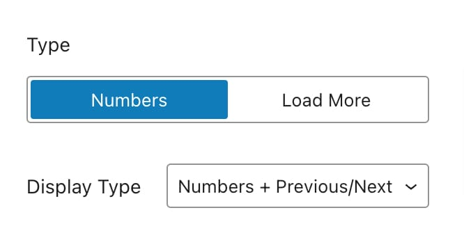
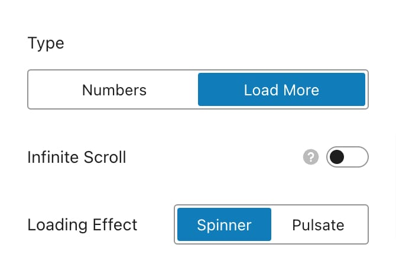
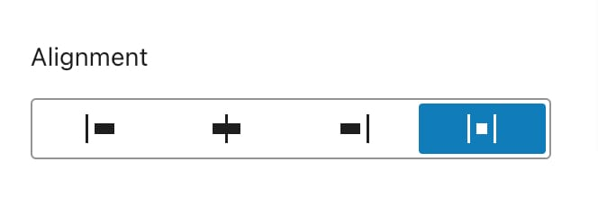

# Portfolio Page

The **Portfolio Page** (or, in WordPress terms, the _Portfolio Archive_) allows you to customize the general layout of all the projects that are listed. To customize the Portfolio page, navigate to **Appearance -> Customize -> Portfolio -> Portfolio Page**.

<figure><figcaption></figcaption></figure>

***

## Layout

On the Portfolio page, you can select between two layout options:

<figure><figcaption></figcaption></figure>

### Type 1

This layout aligns the image and content in a vertical flow, with the image positioned above the title and category.

<figure><figcaption></figcaption></figure>

### Type 2

This layout displays the portfolio title and details as an overlay on top of the featured image, which becomes visible when the user hovers over the image.

<figure><figcaption></figcaption></figure>

***

## Grid Options

Grid options allow you to customize the layout of portfolio items, including the number of columns, spacing between items, and more.

<figure><figcaption></figcaption></figure>

* **Items Per Page:** Defines the total number of items to fetch from the database and display per page.
* **Columns:** Defines the number of columns per row for displaying portfolio items across different viewports.
* **Columns Gap:** Sets the spacing between portfolio items in the grid layout.
* **Layout Mode:** A special alignment feature that uses masonry for item placement, allowing for a dynamic, staggered grid layout.

### Masonry Layout

A grid layout where items are arranged in a staggered, column-based manner, optimizing space usage and visual appeal. It uses the **Isotope** library to make this alignment possible, as current CSS specification does not support native masonry layout.

<figure><figcaption></figcaption></figure>

### Fit Rows Layout

A layout option where items are arranged in rows with uniform height, filling the available space. Unlike Masonry, which adjusts item placement based on height, Fit Rows ensures consistent row heights.

<figure><figcaption></figcaption></figure>

***

## Card Options

You can customize the appearance of each entry using the following options:​

<figure><figcaption></figcaption></figure>

***

### Featured Image

The Featured Image settings let you control the display of the featured image on each post card. This section offers several additional configuration options:

<figure><figcaption></figcaption></figure>

* **Hover Overlay:** You can toggle the hover overlay on or off, which appears over the image when enabled.
* **Offset:** The offset of the hover overlay layer, which sets the distance from the edges of the image.
* **Icon:** The icon displayed in the center of the hover overlay can be a pre-defined icon, such as the **Animated Eye** Icon or **Static Eye** Icon, or you can upload your own image to be shown within the overlay.

<figure><figcaption></figcaption></figure>

You can select an image as the Custom Icon and adjust its width accordingly.

#### Image Size

Control the dimensions of the featured image:

<figure><figcaption></figcaption></figure>

* **Image Size**: Select from predefined sizes or define a custom size for the featured image.
* **Aspect Ratio**: Choose from predefined aspect ratios or set a custom ratio, with options for responsive adjustments.

#### Style

The Style tab contains settings to customize the overall appearance of the featured image on the card.

<figure><figcaption></figcaption></figure>

* **Border Radius**: Set how rounded the corners of the featured image should be.
* **Hover Overlay**
  * **Background:** The background type can be a _solid color_ or the _dominant color_ extracted from the image.
  * **Background Color:** Visible when the background is set to Color, this option applies a solid color to the background, with adjustable opacity.
  * **Color Opacity:** Visible when the background is set to Dominant Color, this option adjusts the opacity of the dominant color.

***

### Like Feature

When enabled, the like feature will be active across all items in the portfolio module.

Displays the number of likes on portfolio items. Users can click the like icon to add a like, which updates the total count for each item.

Optionally, you can change the icon for the like button:

<figure><figcaption></figcaption></figure>

***

### Subtitle

Optionally, you can display a subtitle under the item title on portfolio items, with options to show categories, parent categories, tags, or a custom subtitle.

<figure><figcaption></figcaption></figure>

* **Subtitle Content:** The content type to show under the title.
  * Categories&#x20;
  * Parent Categories&#x20;
  * Tags&#x20;
  * Subtitle
* **Separator:** The separator for categories and tags.

***

### Reveal Effect

The Reveal Effect applies animations to portfolio items as they come into view within the viewport. There are three main animations:

* Fade
* Slide
* Fade Zoom In

With alternatives to stagger mode, which animates items sequentially, one after another.

***

### Content Alignment

Available only for layout **Type 2**, this option lets you set the alignment of the _title_ and _subtitle_ within the featured image.

***

## Page Elements

The Page Elements section lets you customize additional components of your Portfolio Page. Here are the available options:

<figure><figcaption></figcaption></figure>

***

### Title & Description

You can set the heading for the portfolio items, including the title and description, and adjust their alignment in relation to the filters if enabled.

<figure><figcaption></figcaption></figure>

You can adjust the layout of the heading after going inside the section:

<figure><figcaption></figcaption></figure>

* **Heading and Filter Layout:** Adjusts the alignment of the title and description in relation to the filters, if enabled.
* **Portfolio Title:** Sets the heading title for the portfolio items.
* **Portfolio Description:** Provides the description displayed with the portfolio items.

#### Heading Layouts

Depending on the layout you choose, the title and description will appear as follows:​

<figure><figcaption>
Left
</figcaption></figure>

<figure><figcaption>
Center
</figcaption></figure>

<figure><figcaption>
Space between
</figcaption></figure>

***

### Filters

Filters are a crucial part of the portfolio experience. They enable users to interactively sort and view items based on their selected criteria. Additionally, filters support browser history, allowing selections to be retained even without refreshing the page.

Previously, Kalium supported only one filter type. Now, you can add two filter types to enhance the user experience, allowing for a more detailed lookup of your portfolio catalog.

<figure><figcaption></figcaption></figure>

You can choose to use either one or both filter types.

#### Show All / Reset

This option adds a **Show All** link as the first filter, which resets the current filters. If two filter types are active, it will reset the selection for the current term only.

<figure><figcaption></figcaption></figure>

You can use custom text for reset, default is _All_.

#### Count

Displays the number of items containing each filter term, shown beside the filter link. This count helps users understand how many items match each specific filter.​

Two styles are available for the count display, with support for both prefix and suffix.

<figure><figcaption></figcaption></figure>

* **Show Count:** Enables or disables the counter.
* **Style:** The style of the counter.
  * **Style 1:** Inline text&#x20;
  * **Style 2:** Sup text
* **Before:** Text to display before the count number.
* **After:** Text to display after the count number.

#### Subcategories

By default, this feature is enabled. For category hierarchies, when a term with sub-terms is selected, it will filter to show only the sub-terms, hiding the current row of filters and displaying the relevant sub-term row.

This helps narrow down the results more effectively.

#### Dynamic Heading

This feature helps users see active filters and additional information. When enabled, it updates the heading title with the current category or tag name, the heading description with the category or tag description, or both.

Available options:

* Disable (_default_)
* Change title&#x20;
* Change description
* Change title and description

#### Link Format

Link format determines how filter links appear in the browser’s address bar. You can choose between three options:

* **None:** Disables link history completely.
* **Hash:** Appends a hash to the URL, showing current filter information.
* **Absolute Link:** Updates the URL to include the term archive link.

#### Default Category & Tag

You can set a default selected category or tag by choosing the desired term from the list:

<figure><figcaption>
Category options
</figcaption></figure> <figure><figcaption>
Tag options
</figcaption></figure>

#### Filter Label

The filter label adds a text prefix before the filters to explain their purpose. You can leave this field empty if you prefer not to display any label.

***

### Full Width Container

This option allows you to expand the container’s width to span the entire viewport, overriding the default content width. This setting is useful for creating wide layouts or for elements that need to stretch across the entire screen, such as banners or full-width sections.

<figure><figcaption>
Full width portfolio container
</figcaption></figure>

After activating the **Full Width Container** option, additional settings will appear, allowing you to fine-tune the layout for better control over the design:

<figure><figcaption></figcaption></figure>

* **Portfolio Heading:** Decide if the heading should extend across the full width of the container or remain within its standard width.
* **Stretch Items to the Edge:** This option extends the portfolio items to align with the container’s edges, creating a more immersive layout. By default, container spacing is applied if this option deactivated.


If your settings aren’t taking effect, you might be using a _**Page Template**_ or _**Page Builder Element**_ to display the portfolio, which has its own standalone options and should be configured inside their respective options interface.


***

### Pagination

Configure how portfolio items are divided across multiple pages to manage navigation. You can choose between two types of pagination:

* [**Numbers**](portfolio-page.md#numbers)
* [**Load More**](portfolio-page.md#load-more)

#### Numbers

Display numbered pagination for navigation.

<figure><figcaption></figcaption></figure>

#### Display Type

* **Numbers**: Show only page numbers.
* **Numbers + Previous/Next**: Display page numbers along with Previous and Next buttons for easier navigation.
* **Previous/Next**: Show only Previous and Next buttons.

***

#### Load More

Use a button to load more posts as users scroll down the page.

<figure><figcaption></figcaption></figure>

* **Infinite Scroll**: Toggle this to enable or disable infinite scrolling, where more posts load automatically as users scroll down the page.
* **Loading Effect**: Choose a loading effect to display while new posts are being fetched:
  * **Spinner**: A spinning icon indicating loading.
  * **Pulsate**: A pulsating effect indicating loading.

***

#### Alignment

Set the alignment of pagination controls for both types:

<figure><figcaption></figcaption></figure>

* **Left**: Align pagination controls to the left.
* **Center**: Center-align pagination controls.
* **Right**: Align pagination controls to the right.
* **Space Between**:  Distribute space between items (Available only for Numbers type)

***

### Lightbox Type

In this section, you can customize the options specific to **Lightbox** for portfolio item types.

<figure><figcaption></figcaption></figure>

* **Browse Mode:** If set to **Linked** mode, the lightbox’s previous and next arrows will navigate through all the projects displayed in the list.
* **Link Format:** Determines how the links appear in the browser’s address bar.
  * **None:** Disables link history completely.
  * **Hash:** Appends a hash to the URL, showing current lightbox information.
  * **Absolute Link:** Updates the URL to include the item single page link.&#x20;
