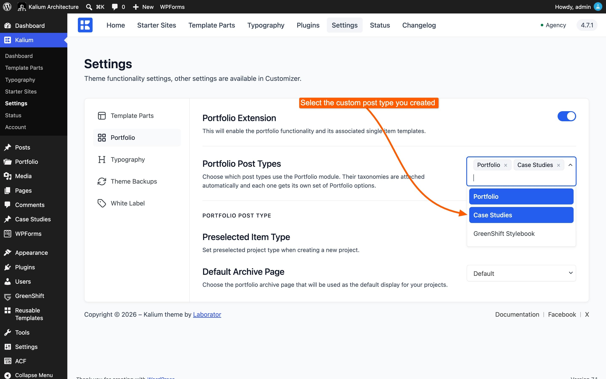

# Portfolio Post Types

Kalium's portfolio gives you seven project layouts, galleries, filters and hover effects. Most sites use it for a portfolio, which is what it's called.

But **the module isn't tied to the Portfolio post type**. You can give the whole thing to any other post type on your site, so a **Case Studies** section gets the same project layouts and galleries, and is still called Case Studies everywhere your visitors see it.

***

### What a post type gains

Tick a post type in the settings and it receives the complete module:

* **Its taxonomies attached automatically**, so category filters work
* **Its own complete set of Portfolio options** in the Customizer, named after the post type
* **The Parameters and Options panel** on its items, Project Layout, Project Gallery, Checklists and everything else
* **Its own Preselected Item Type and Default Archive Page**

Nothing is shared with the Portfolio post type. Each one keeps its own settings, so your Case Studies can use a Carousel layout while your Portfolio uses Columned.

***

### Adding a post type

1. Go to **Kalium -> Settings -> Portfolio**
2. Under **Portfolio Post Types**, tick the post type you want
3. Click **Save**

Its Customizer screens appear right away.

<figure><figcaption></figcaption></figure>


**Only public post types appear in the list.** If you can't see the one you want, it was registered as private, either by the plugin that created it, or in the code that added it.


***

### Setting it up

Two more settings appear for **each** post type you tick, named after it:

**Preselected Item Type**\
The project layout new items start on. If most of your case studies use the same layout, set it here rather than choosing it every time.

**Default Archive Page**\
The page used as that post type's listing.

***

### Two things to do after saving


**If the new options don't show in the Customizer**, save the settings page, then reload the Customizer. The screens are registered on the next load.

**If your item URLs return a 404 error**, go to **Settings -> Permalinks** and click **Save Changes** once. Nothing needs altering, saving is what rebuilds the addresses. This happens whenever you add or remove a post type here.


***

### Removing a post type

Untick it and save.

**Nothing is deleted.** The post type keeps all its posts and goes back to using its own templates. It simply stops using the portfolio module, and its Portfolio option screens disappear.

**Your settings are kept**, so ticking it again later restores everything exactly as it was.

***

### A worked example

Say you run a design studio. You want a **Portfolio** of visual work, and a separate **Case Studies** section with longer write-ups. Both should use Kalium's project layouts, but a visitor should never see the word "portfolio" on a case study.

1. Create the **Case Studies** post type, with a plugin like Custom Post Type UI, or however you normally add one
2. Go to **Kalium -> Settings -> Portfolio** and tick **Case Studies**
3. Save, then visit **Settings -> Permalinks** and save once
4. Open the Customizer. There's now a **Case Studies** group beside **Portfolio**
5. Set up the listing layout there, independently of your Portfolio
6. Back in Settings, set **Preselected Item Type** for Case Studies to the layout you'll use most

Now both sections have the full module, their own settings, and their own names.

***

### Turning the portfolio off entirely

If your site has no use for a portfolio at all, switch **Portfolio Extension** off at **Kalium -> Settings -> Portfolio**. That removes the module, its post type and its Customizer screens.

Nothing is deleted, your projects stay in the database and come back if you switch it on again.


[portfolio.md](../../getting-started/theme-settings/portfolio.md)


***

### Common questions

**A post type I ticked has no Portfolio options.**\
Save the settings page, then reload the Customizer.

**My items return a 404.**\
**Settings -> Permalinks**, save once.

**My Portfolio options disappeared from the Customizer.**\
Either **Portfolio Extension** is off, or the post type was unticked.

**The post type I want isn't in the list.**\
Only public post types appear.


[settings-not-applying.md](../../troubleshooting/settings-not-applying.md)

