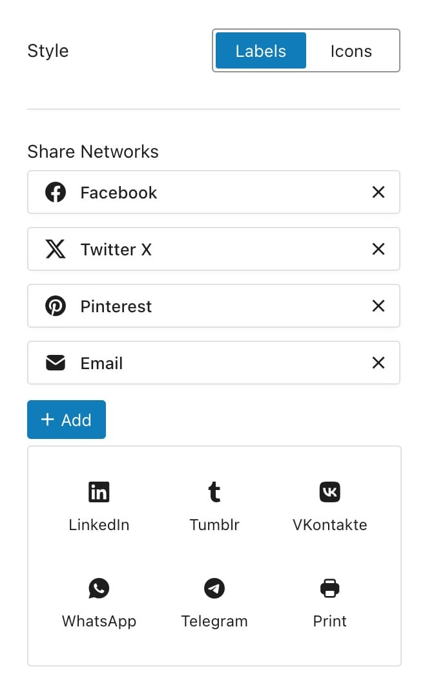

# Project Page

Although each project has its own set of options, this section will guide you through the common settings that apply to all projects.

To customize the project page settings, navigate to **Appearance -> Customize -> Portfolio -> Project Page**.​

<figure><figcaption>
Project page options
</figcaption></figure>

## Navigation

This feature allows users to navigate between individual project pages seamlessly by providing next and previous buttons. This functionality ensures a smooth and intuitive browsing experience through your project portfolio.

To begin, select one of the two available layouts:

<figure><figcaption></figcaption></figure>

Both layouts share the same functionality options, but they define different visual appearances.

### Standard

<figure><figcaption></figcaption></figure>

This layout appends the navigation controls at the end of the portfolio content and includes a “Back to Projects” link centered in the middle.

### Fixed

<figure><figcaption></figcaption></figure>

This layout keeps the navigation arrows fixed at the bottom edge of the browser window. You can position the arrows at the **Left**, **Center**, or **Right** of the window:

<figure><figcaption></figcaption></figure>


Fullscreen portfolio item types use this navigation as the only option due to their design structure, ensuring a consistent and seamless browsing experience.


***

Other available options for navigation include:

<figure><figcaption></figcaption></figure>

* **Project Title Navigation:** If enabled, this will replace the default “Previous” and “Next” labels with the project titles.
* **Same Category Navigation:** Navigate only within the same category as the current project.
* **Reverse Order:** Enabling this option swaps the functionality of the **Previous** and **Next** links in your portfolio, allowing you to customize the sequential order of navigation.
* **Category as Archive Link:** The category of the current project will be used as the **Back to Archive** link.
* **Archive Link:** The link used to redirect to the portfolio archive page.

### In-Page Navigation Options

Some of these functionalities can be adjusted on a per-project basis. On the project edit page, scroll to **Parameters and Options -> General Details -> Prev-Next Navigation**.

<figure><figcaption></figcaption></figure>

## Social Sharing

Allow visitors to share the projects on various social networks directly from the post page. Here are the options for social sharing:

<figure><figcaption></figcaption></figure>

#### Style

* **Labels**: Displays text labels for sharing buttons.
* **Icons**: Displays only icons for sharing buttons.

#### Share Networks

Add or remove sharing networks from the following options:

* Facebook
* X (Twitter)
* Pinterest
* Email
* LinkedIn
* Tumblr
* VKontakte
* WhatsApp
* Telegram
* Print

## Lightbox

This option enables the _Lightbox_ feature for gallery images. When activated, clicking on images within project galleries will open them in a larger, overlay view, providing a clearer and more detailed view.


This feature does not apply to **Lightbox item types** but affects only images inside galleries.​


## Image Captions

In project galleries, this setting controls images with caption text.

* **Image Captions:** Toggle captions on or off for all gallery images.
* **Caption Position:** Placement of the caption element.
  * **Hover:** Show captions only when the user hovers over the image.
  * **Below:** Display the caption consistently below the image.
