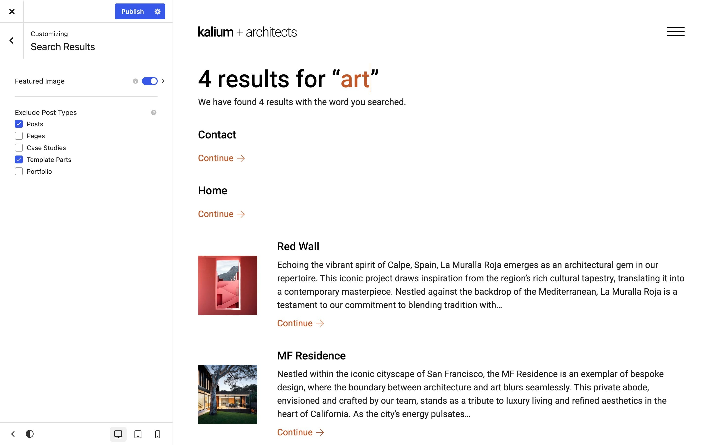

# Search Results

When a visitor searches your site, WordPress builds a results page for them. Kalium gives you control over what goes on it, which types of content are included, and whether each result shows a picture.

Everything here is under **Appearance -> Customize -> Search Results**.



<figure><figcaption></figcaption></figure>

***

### Featured Image

**On by default.**

Shows each result's featured image beside it. Results with a picture are easier to scan than a list of plain titles, so this is usually worth keeping on.

Turning it on reveals a **Featured Image** panel with the settings covered below.

***

### Exclude Post Types

Tick any type of content you'd rather **not** appear in search results:

* Posts
* Pages
* Products
* Gutenberg attrs
* Template Parts
* Portfolio


**Tick Template Parts.** They're stored as a post type, so they're searchable by default, which means a visitor can land on a raw header or a section fragment with no context. Almost every site should exclude them.

If you've ever wondered why a strange, half-built page appeared in your search results, this is why.


Excluding a type doesn't hide it from your site. It only keeps it out of search results.

***

## Featured Image settings

These appear once **Featured Image** is on.

### General

#### Image Size

Which stored image size to load. The default is **Thumbnail, 150 x 150**, which is plenty for a small image beside a result.

Choose **Custom Image Size** to set your own dimensions.


Changing the image size doesn't resize pictures you've already uploaded. **Regenerate your thumbnails** afterwards, or nothing will visibly change.


#### Aspect Ratio

The shape each image is cropped to. **This setting is per device.**

_Original_ keeps each image's own shape. Choosing a ratio (_Square_, _Wide_, _Portrait_ and so on) crops everything to match, which makes the results list look tidier since every row is the same height.

Choose **Custom** to enter your own ratio.

### Style

#### Width

How wide the image is, in pixels. The default is 120px. **Per device**, so you can use a smaller image on phones.

#### Border Radius

Rounds the corners of each image. Set all four corners together, or unlink them to set each separately. **Per device.**

***

### Designing the whole results page

The settings above control the standard results list. If you want to design the search results page yourself (your own layout, your own message when nothing is found) create a **Template Part** of type _Page_ with a display condition of _General Page -> Search Page_.


[replace-a-page.md](../template-parts/creating-template-parts/replace-a-page.md)


***

### Adding a search box to your header

The results page is only half of it, visitors need somewhere to search from. The header has a search element you can switch on, with an optional animated icon.


[elements.md](../general/header/custom-header/elements.md)


***

### Common questions

**My template parts show up in search results.**\
Tick **Template Parts** under **Exclude Post Types**.

**Products don't appear in search results.**\
Check they aren't ticked under **Exclude Post Types**. WooCommerce also has its own search behavior worth checking.

**The images are the wrong shape.**\
That's **Aspect Ratio**, not Image Size, and it's per device, so check tablet and mobile separately.

**The images are blurry.**\
Raise **Image Size**, then regenerate your thumbnails.


[image-problems.md](../troubleshooting/image-problems.md)

