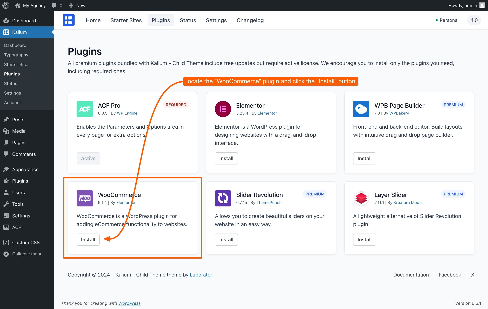
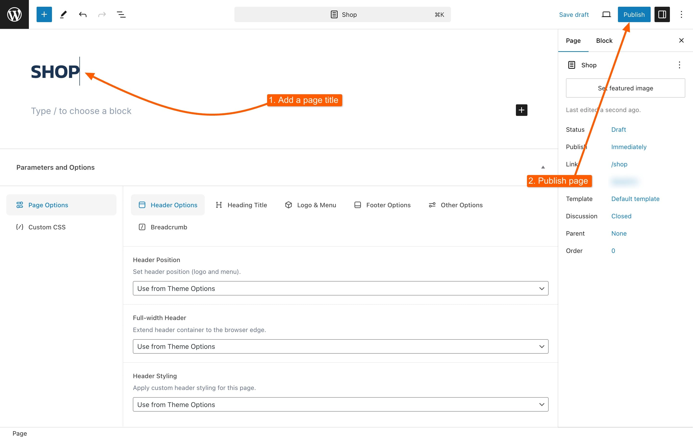
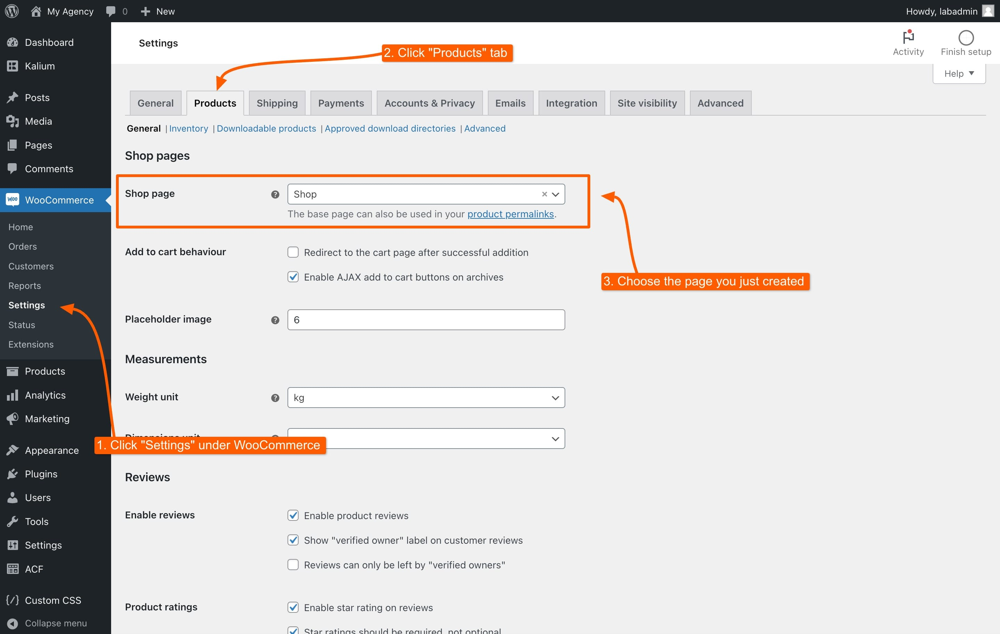

# WooCommerce

Kalium’s shopping system is built on WooCommerce, the most popular eCommerce plugin for WordPress. With Kalium, you can easily customize your WooCommerce store to match your brand’s style.

Kalium works smoothly with WooCommerce, so you can build the online store you want without hassle. It lets you style your shop, cart, and checkout pages to create a unique shopping experience.&#x20;

In this section, we'll walk you through the basics of setting up WooCommerce, including installation, creating and assigning your shop page, and adding products to your store.

## Installing WooCommerce

Getting WooCommerce up and running with Kalium is easy:

<figure><figcaption></figcaption></figure>

1. Go to **Kalium -> Plugins**: In your WordPress dashboard.
2. Locate WooCommerce: Find the WooCommerce plugin in the list.
3. Click the **Install** button, and once the installation is complete it will automatically activate.

## Creating the Shop Page

After you’ve installed WooCommerce, you’ll be prompted to go through the WooCommerce setup guide. This guide will help you configure essential settings and automatically creates the essential pages and other setup like currency, payment methods, and shipping options. It’s a good idea to follow this guide to ensure everything is set up correctly.

However, if you skipped the setup guide or didn’t follow all the steps, you’ll need to manually create and assign your Shop page. Here’s how to do it:

### How to Create the Shop Page

1. Go to **Pages -> Add New Page** in your WordPress dashboard.
2. Name the page "Shop" (or choose another name if you prefer).
3. Click **Publish** to make the page live.

<figure><figcaption></figcaption></figure>

### Assigning the Shop Page

1. Go to **WooCommerce -> Settings**.
2. Click on the **Products** tab.
3. In the **Shop page** section, select the page you just created from the dropdown menu.
4. Click **Save changes** to confirm.

<figure><figcaption></figcaption></figure>

This process ensures that WooCommerce knows which page to use as your main shop page where all your products will be displayed. The same process applies to other essential pages like Cart, Checkout, My Account, and others. You can assign these pages in the WooCommerce settings under their respective sections, ensuring that each page functions correctly within your store.

## Adding Products

With WooCommerce installed and your Shop page set up, it’s time to start adding products:

1. Go to **Products -> Add New**
2. **Enter Product Details**:
   * **Product Name**: Give your product a clear, descriptive name.
   * **Product Description**: Add a detailed description in the main content area.
   * **Product Data**: Below the content area, you’ll find the "Product Data" box. Here, you can set the product type (e.g., Simple, Grouped, External, Variable), price, inventory details, shipping information, and more.
   * **Product Short Description**: Add a brief description that will appear next to the product image on the product page.
   * **Product Categories and Tags**: Assign your product to categories and add relevant tags to make it easier for customers to find.
   * **Product Image**: Set a main product image and, if needed, add additional gallery images.
3. Click **Publish**: Once you've filled in all the details, click the "Publish" button. Your product is now live and visible on your Shop page.

For more information on how to add and manage different types of products please refer to the WooCommerce documentation links below:

* [Adding a simple product](https://woocommerce.com/document/managing-products/add-product/#adding-a-simple-product)
* [Adding a Grouped product](https://woocommerce.com/document/managing-products/add-product/#adding-a-grouped-product)
* [Adding an external/affiliate product](https://woocommerce.com/document/managing-products/add-product/#adding-an-external-affiliate-product)
* [Adding a variable product](https://woocommerce.com/document/variable-product/)

## Customizing WooCommerce

To adjust the appearance and style of your WooCommerce store, navigate to **Appearance -> Customize -> WooCommerce**. While the general WooCommerce settings manage functionality and configurations, this section is dedicated to customizing the look and feel of your store. Here, you can fine-tune various design aspects to align with your branding.

<figure><figcaption></figcaption></figure>

## Helpful Resources

If you’re new to WooCommerce or want to learn more, check out these resources:

* [**WooCommerce – Official Site**](https://woocommerce.com/): Get the latest updates and information about WooCommerce.
* [**WooCommerce Documentation**](https://docs.woocommerce.com/): Find guides and videos to help you get started.
* [**WooCommerce Guided Tour Videos**](https://woocommerce.com/guided-tour-videos/): Watch how-to videos made by WooThemes to learn about WooCommerce features.
* [**WooCommerce Community Forums**](https://wordpress.org/support/plugin/woocommerce/): Join the community to ask questions and get support.
* [**WooCommerce Built-In Shortcodes**](https://docs.woocommerce.com/document/woocommerce-shortcodes/): See all the shortcodes you can use to customize your store.

With Kalium and WooCommerce, building a great online store is simple and easy.
