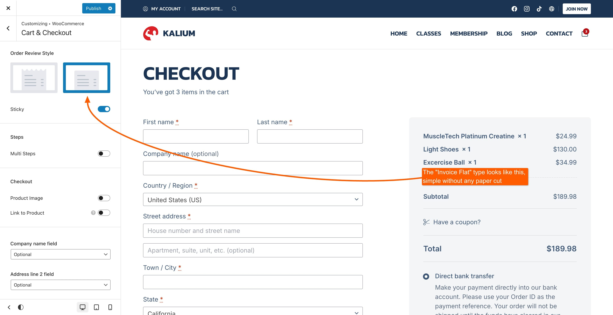
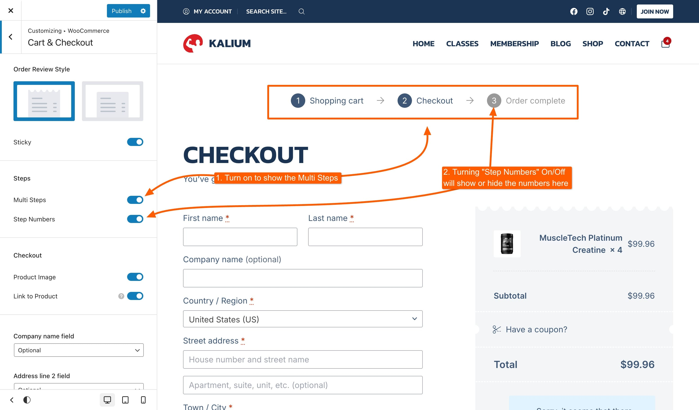
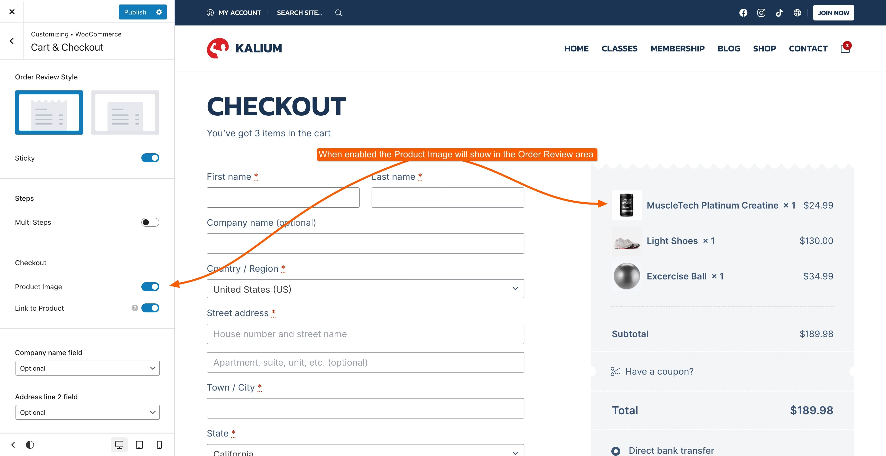
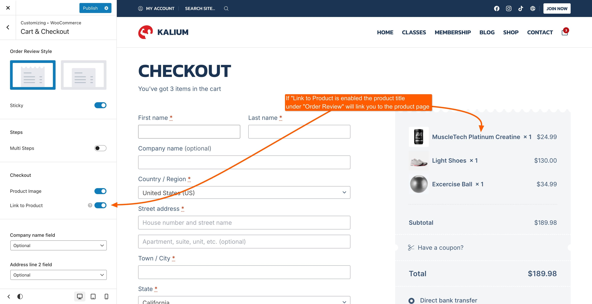

# Cart & Checkout

This section in WooCommerce allows you to customize how the checkout process is displayed to your customers, offering several options to enhance the shopping experience. This section is located under **Appearance -> Customize -> WooCommerce -> Cart & Checkout**.

### Order Review Style

Choose how the order review is shown during cart and checkout, it has the following options:

* **Invoice Cut**: Displays the order summary in a cut style for a more dynamic look.
* **Invoice Flat**: Shows the order summary in a simple, flat layout.
* **Sticky**: Keeps the order review visible as customers scroll down the page, ensuring they can always see their order details.

<figure><figcaption>
Invoice Flat
</figcaption></figure> <figure><figcaption>
Invoice Cut
</figcaption></figure>

### Steps

Configure how the cart and checkout process is structured to enhance the user experience on your store’s cart and checkout pages, these are the options:

* **Multi Steps**: Breaks the checkout process into multiple steps, guiding customers through each phase of the purchase.
* **Step Numbers**: Allows you to toggle the visibility of step numbers during the checkout process.

<figure><figcaption></figcaption></figure>

### Checkout

Options for customizing the appearance and functionality of the checkout page.

<figure><figcaption>
Product Image Option
</figcaption></figure> <figure><figcaption>
Link to Product Option
</figcaption></figure>

* **Product Image**: Shows or hides product images in the order review section.
* **Link to Product**: Makes product names clickable, allowing customers to view product details directly from the checkout page.
