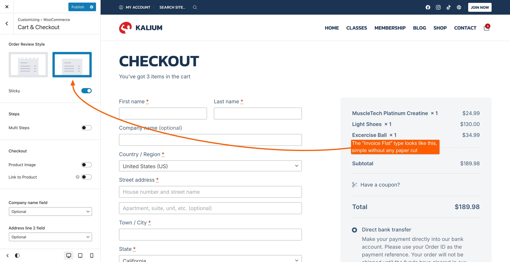
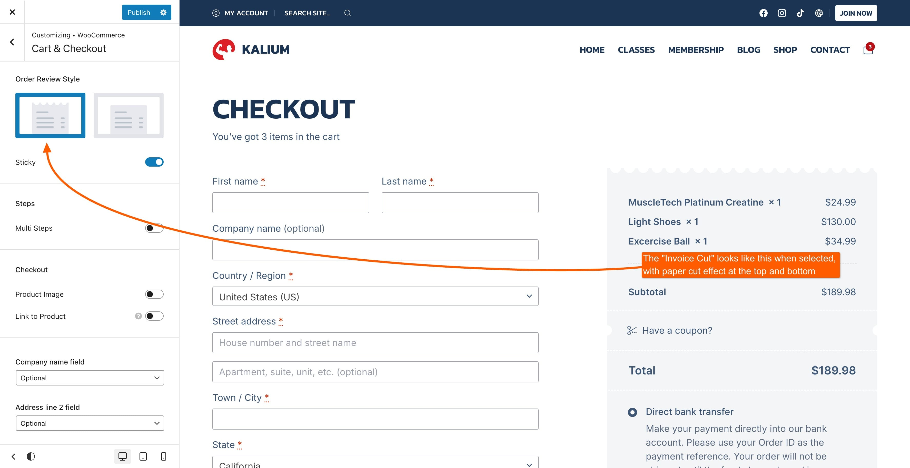
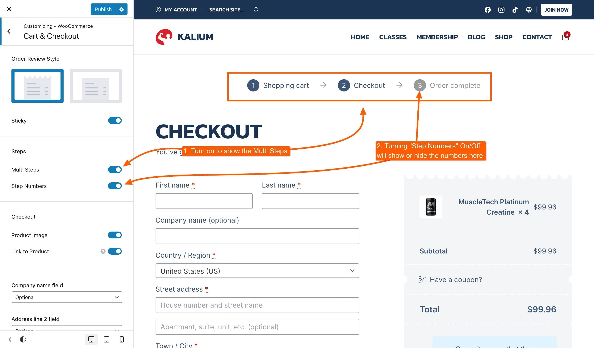
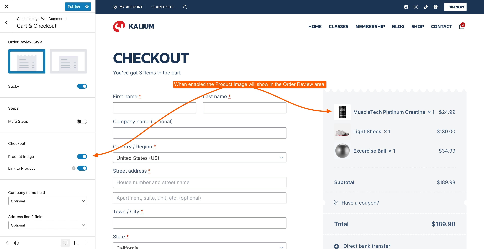
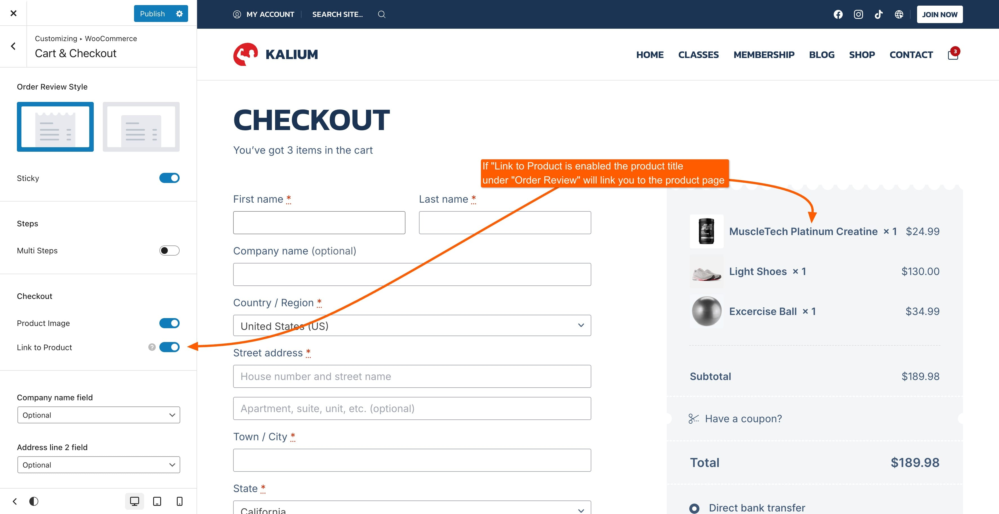

# Cart & Checkout

This section in WooCommerce allows you to customize how the checkout process is displayed to your customers, offering several options to enhance the shopping experience. This section is located under **Appearance -> Customize -> WooCommerce -> Cart & Checkout**.

### Shop Order Review Style

Choose how the order review is shown during cart and checkout. There are two styles:

* **Invoice Cut**: Displays the order summary in a cut style for a more dynamic look. This is the default.
* **Invoice Flat**: Shows the order summary in a simple, flat layout.

**Sticky** is a separate toggle beside them, not a third style. Turn it on and the order review stays visible as customers scroll, whichever style you chose.

<figure><figcaption>
Invoice Flat
</figcaption></figure> <figure><figcaption>
Invoice Cut
</figcaption></figure>

### Steps

Configure how the cart and checkout process is structured to enhance the user experience on your store’s cart and checkout pages, these are the options:

* **Multi Steps**: Breaks the checkout process into multiple steps, guiding customers through each phase of the purchase.
* **Step Numbers**: Appears once Multi Steps is on, and toggles the visibility of the step numbers. On by default.

<figure><figcaption></figcaption></figure>

### Checkout

Options for customizing the appearance and functionality of the checkout page.

<figure><figcaption>
Product Image Option
</figcaption></figure> <figure><figcaption>
Link to Product Option
</figcaption></figure>

* **Product Image**: Shows or hides product images in the order review section.
* **Link to Product**: Makes product names clickable, allowing customers to view product details directly from the checkout page.
