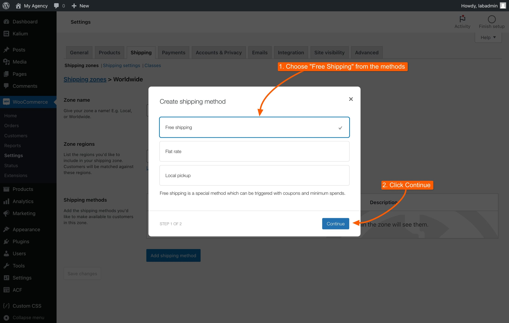

# Free Shipping Bar

The Free Shipping Bar is an effective tool to motivate customers to increase their order size by showcasing how much more they need to spend to qualify for free shipping. This feature, found under **Appearance -> Customize -> WooCommerce -> General Settings**, can be turned on or off and can be strategically placed on different pages to maximize its impact and encourage larger purchases.

<figure><figcaption></figcaption></figure>

### Setup Instructions

Before the Free Shipping Bar can be displayed, you need to set up a shipping zone in WooCommerce. Follow these steps:

#### Step 1

Navigate to **WooCommerce -> Settings** in your WordPress dashboard.

1. Navigate to **WooCommerce -> Settings** in your WordPress dashboard.
2. Click on the **Shipping** tab.
3. Click **Add shipping zone** and configure the zone details.

<figure><figcaption></figcaption></figure>

#### &#x20;Step 2

1. Set up a **Zone Name**, for example "**Worldwide**"
2. Choose a geographical region under **Zone regions**
3. Add a **Shopping method** by clicking the **"Add shipping method**" button

<figure><figcaption></figcaption></figure>

#### Step 3

1. Choose a shipping method, in this case choose **Free shipping**
2. Click the "**Continue**" button, to continue to the next step

<figure><figcaption></figcaption></figure>

#### Step 4

1. Name the shipping method, we've chosen "Free Shipping"
2. Choose when to apply the free shipping, we've chosen "**A minimum order amount**" to spend to get a free shipping.
3. Set a **Minimum order amount**, e.g. $150
4. Click "**Create and save**" to finalize.

<figure><figcaption></figcaption></figure>

Now that you’ve created the shipping zone in WooCommerce, you can proceed with customizing the Free Shipping Bar. The options for configuring its appearance and messages are detailed below.

### Free Shipping Bar Options

Now that you’ve added free shipping zones in WooCommerce, you can configure the Free Shipping Bar to enhance its visibility and impact. The options are located under **Appearance -> Customize -> WooCommerce -> General Settings**, you can turn it on or off from there directly . The options for customization are explained below.&#x20;

<figure><figcaption></figcaption></figure>

<figure><figcaption>
Free Shipping Bar options in Customizer
</figcaption></figure>

#### Locations to Show

Select where you want the Free Shipping Bar to appear on your site. You can choose multiple locations to maximize its visibility:

* **Mini Cart Drawer**: Displays the bar in the mini cart drawer.
* **Cart Page**: Shows the bar on the cart page.
* **Checkout Page**: Appears on the checkout page.
* **Product Page**: Visible on individual product pages.

#### Initial Message

Enter a custom message to prompt customers to spend more to qualify for free shipping. For example, "Spend $50 more to enjoy free shipping."

#### Qualified for Free Shipping Message

Enter a message to congratulate customers who meet the free shipping threshold. For example, "Congratulations! You qualify for free shipping."

#### Available Shortcodes

Use shortcodes to personalize the messages:

* `[amount_left]` Displays the amount remaining to reach the free shipping threshold.
* `[min_amount]` Shows the minimum amount required to qualify for free shipping.
