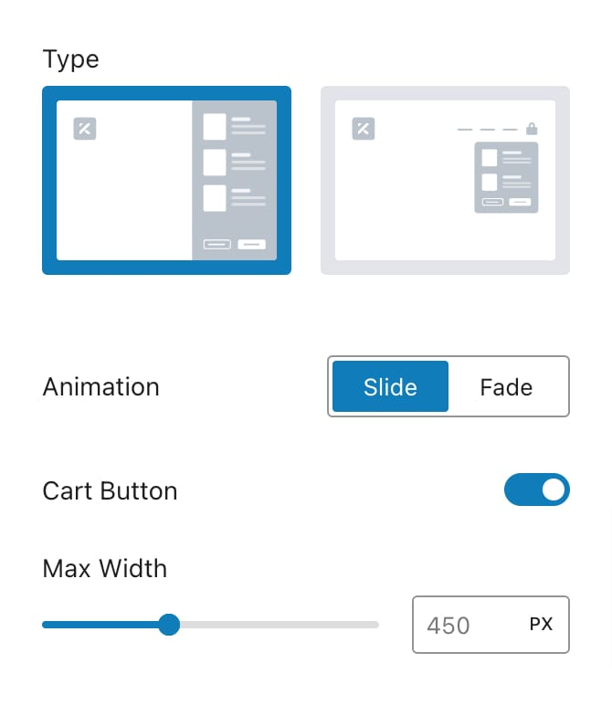

# Mini Cart

A mini cart is a great feature that lets users quickly view their cart contents without going away from their current page. Located under **Appearance -> Customize -> WooCommerce -> General Settings**, the **Mini Cart** settings enable you to control how this cart preview appears and behaves, providing a seamless shopping experience.

There are two types of mini cart, and they are:

<figure><figcaption></figcaption></figure>

* **Drawer**: Appears as a sliding panel from the side of the page.
* **Popup**: Displays as a pop-up window over the current page.

<figure><figcaption>
Drawer Type
</figcaption></figure> <figure><figcaption></figcaption></figure>

### Options (for Drawer)

* **Animation**: Select the animation style for the drawer’s appearance.
  * **Slide**: The drawer slides into view from the side.
  * **Fade**: The drawer fades in gently.
* **Cart Button**: Toggle the visibility of the "Go to Cart" button within the drawer.
* **Max Width**: Set the maximum width of the drawer, with a range from 300 to 700 pixels.

### Style (for Drawer)

<figure><figcaption></figcaption></figure>

* **Separators**: Choose the color of the separators within the drawer.
* **Background**: Select the background color for the drawer.
* **Headings**: Pick the color for headings in the drawer.
* **Text**: Choose the color for text within the drawer.
* **Padding**: Adjust the inner padding of the drawer, with responsive options to ensure it looks good on all devices.
* **Border**: Define the border style around the drawer, including responsive options.
* **Border Radius**: Set the border radius to create rounded corners, with responsive options available.
* **Box Shadow**: Add a shadow effect to the drawer for a more pronounced appearance.
* **Offset**: Adjust the drawer’s position relative to the edges of the browser window. This includes vertical and horizontal offsets, allowing you to fine-tune where the drawer appears on the screen.

