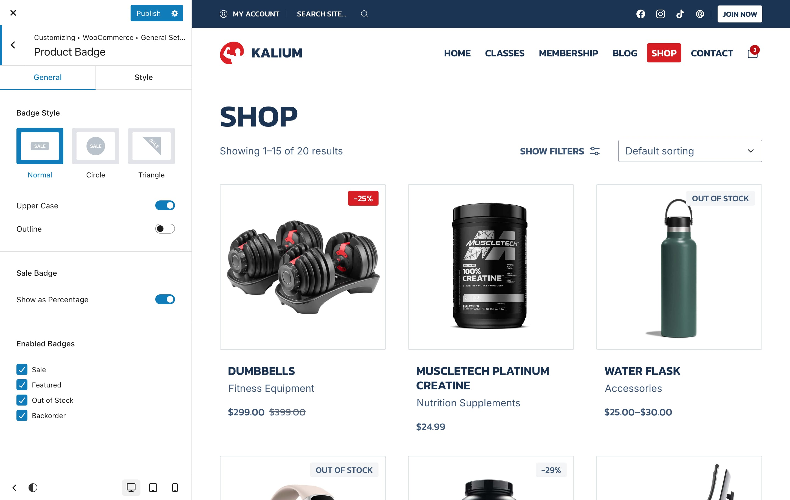
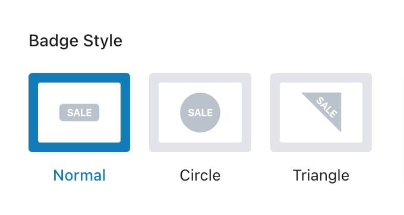
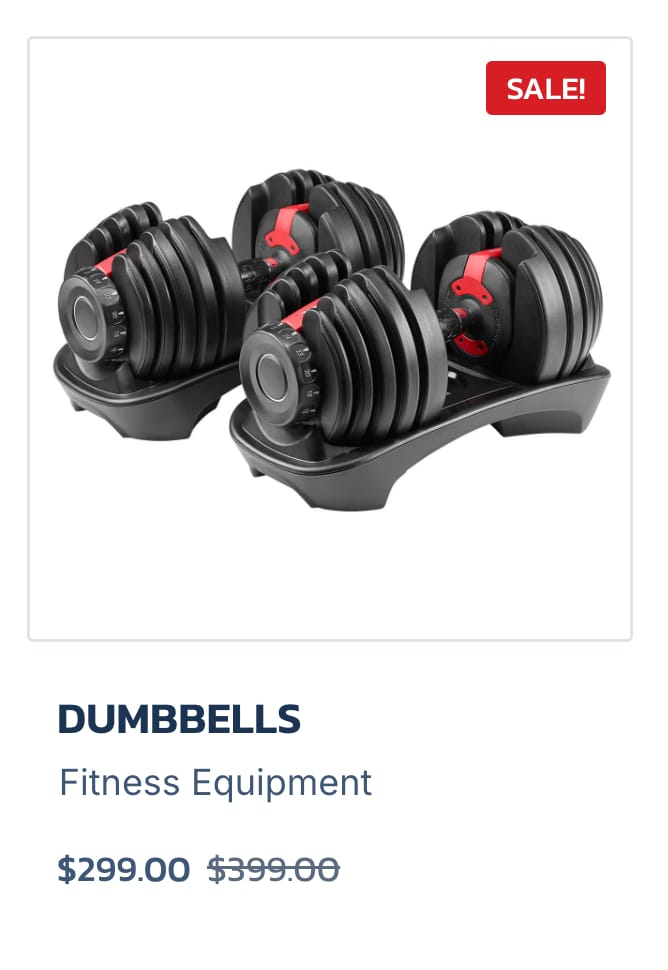
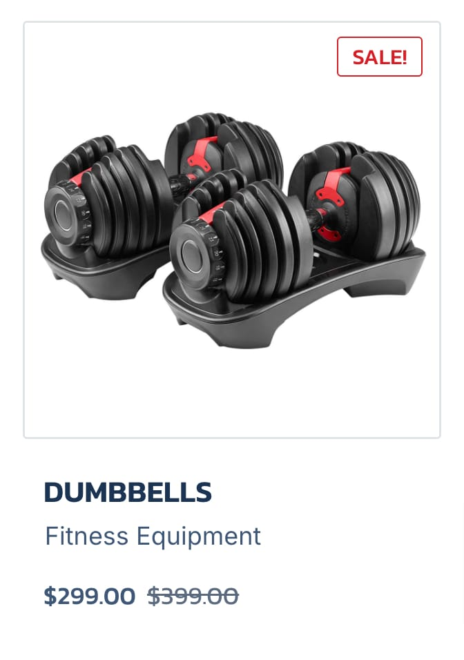
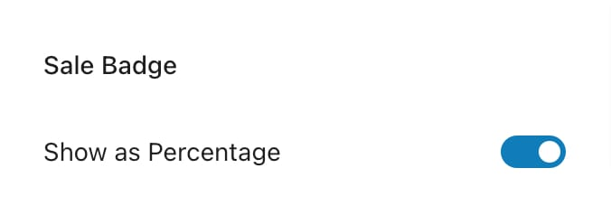
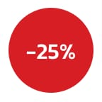
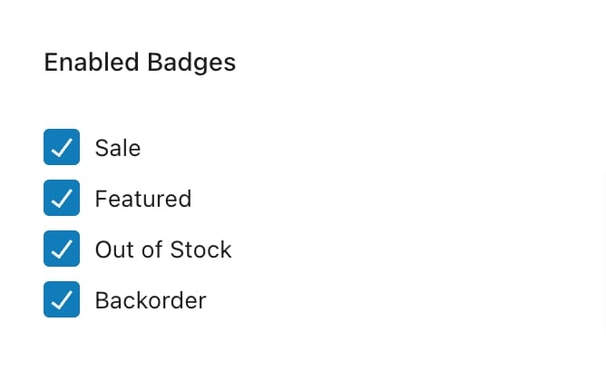
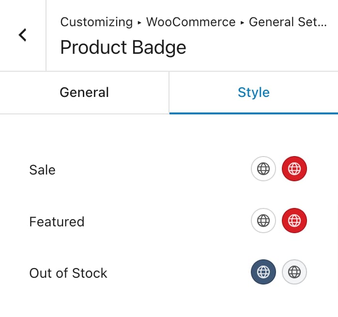

# Product Badges

Customize these badges to fit your store's design and effectively draw attention to important product details. You can find these settings under **Appearance -> Customize -> WooCommerce -> General Settings -> Product Badge**, the options are explained below.

<figure><figcaption></figcaption></figure>

## Badge Style

Customize the appearance of your product badges by selecting from the following styles:

<figure><figcaption></figcaption></figure>

#### Normal

A standard badge shape.

* **Upper Case**: Toggle this option to automatically convert badge text to uppercase.
* **Outline**: Toggle to switch between an outlined version or a filled badge.

<figure><figcaption>
Default Badge
</figcaption></figure> <figure><figcaption>
Outlined Badge
</figcaption></figure>

#### Circle

A circular badge style.

* **Upper Case**: Toggle this option to automatically convert badge text to uppercase.
* **Size**: Adjust the size range of the badge.
* **Radius**: Set the border radius for a more rounded badge.
* **Fixed Size**: Toggle to maintain a fixed size, preventing the badge from resizing with text. This is particularly useful for badges with longer texts, such as "Out of stock."

#### Triangle&#x20;

A triangular badge that can be used on the edges of the image.

* **Upper Case**: Toggle this option to automatically convert badge text to uppercase.
* **Size**: Adjust the size range for the badge.

### Sale Badge

Options related only to the sale badge

<figure><figcaption></figcaption></figure>

**Show as Percentage**: Toggle this option to display the sale discount as a percentage instead of the default "SALE!" text. This provides a clear view of the discount offered.

Here is an example of how they look:

<figure><figcaption>
Sale Badge With Percentage  
</figcaption></figure> <figure><figcaption>
Default WooCommerce  Sale Badge
</figcaption></figure>

## Enabled Badges

Select which badges you want to display on your products:

<figure><figcaption></figcaption></figure>

* **Sale**
* **Featured**
* **Out of Stock**
* **Backorder**

## Style

Customize the colors for each badge type:

<figure><figcaption></figcaption></figure>

* **Sale**: Choose the text color and background color for sale badges.
* **Featured**: Select the text color and background color for featured product badges.
* **Out of Stock**: Adjust the text color and background color for out-of-stock badges.
