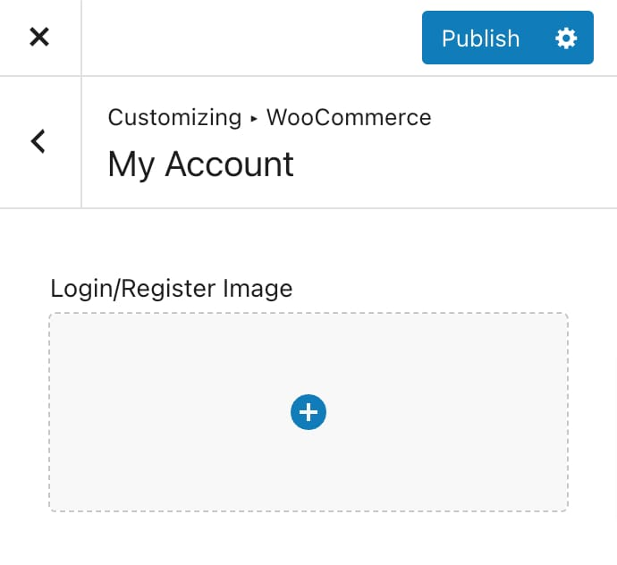
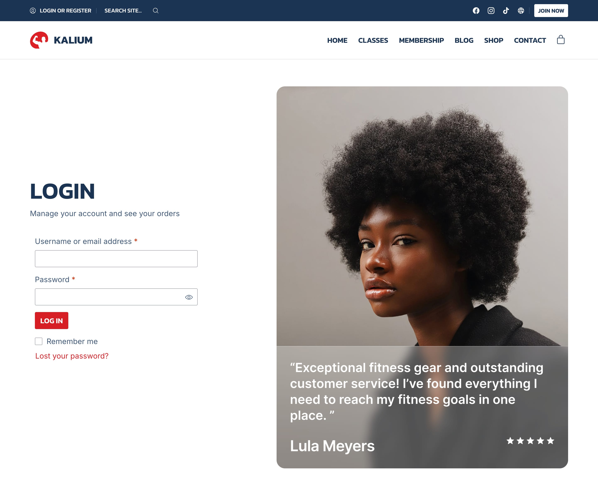

# My Account

The My Account section in WooCommerce allows you to add an image next to the login and registration forms. You can find this option under **Appearance -> Customize -> WooCommerce -> My Account**.

<figure><figcaption></figcaption></figure>

To add an image, simply click or drag an image into the upload area. If you don't select an image, none will be displayed by default.

Here are screenshots showing how the option looks and how the form can appear with an image added:

<figure><figcaption></figcaption></figure>
