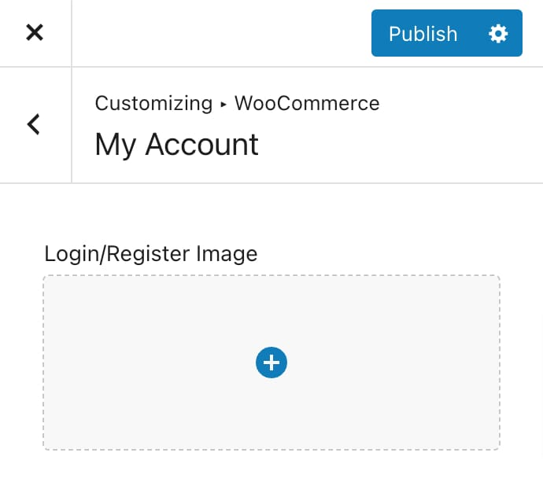
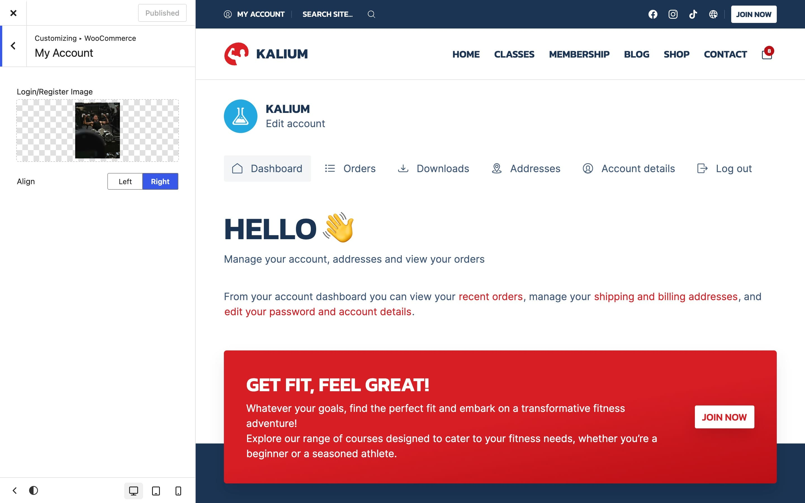
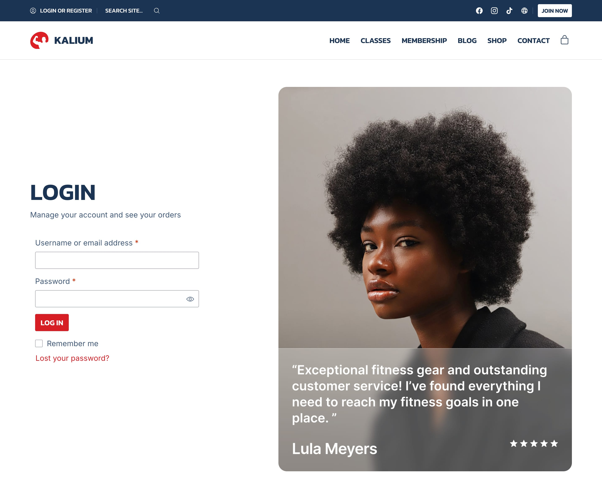

# My Account

The My Account section in WooCommerce allows you to add an image next to the login and registration forms. You can find this option under **Appearance -> Customize -> WooCommerce -> My Account**.

<figure><figcaption></figcaption></figure>

A plain login form on a blank page is one of the least welcoming pages on a shop. An image beside it makes the page feel like part of your site rather than a system screen, a lifestyle photo, a product shot, or simply your brand colors.

***

### Login/Register Image

Click or drag an image into the upload area. If you don't select one, no image is displayed and the form is shown on its own.

**A tall image works best**, since it sits beside a form rather than above it. Something around 800 x 1000 pixels is a good starting point.

***

### Align

Once an image is set, a second option appears:

**Right**\
The image sits to the right of the form. This is the default.

**Left**\
The image sits to the left, with the form on the right.

<figure><figcaption></figcaption></figure>

Here are screenshots showing how the option looks and how the form can appear with an image added:

<figure><figcaption></figcaption></figure>


The image is decorative and is hidden on smaller screens so the form gets the full width. There's no need to worry about how it looks on a phone.


***

### What else is on the My Account page

The rest of the page (the tabs for orders, downloads, addresses and account details) is WooCommerce's own, under **WooCommerce -> Settings -> Accounts & Privacy**. That's where you control whether customers can register, whether they can order without an account, and which sections they see.

Kalium styles those pages to match your site, but the content and behavior belong to WooCommerce.

***

### Doing more with the page

If you want to change the layout itself (add a welcome message, your support details, a promotion for signed-in customers) create a **Template Part** of type _Section_ and place it with a **WooCommerce -> My Account Page** condition.


[creating-a-section](../../template-parts/creating-template-parts/creating-a-section/)


***

### Common questions

**The Align option isn't showing.**\
It only appears once an image is set.

**The login form isn't visible.**\
This was fixed in a past release, along with a broken reset password layout when the account image was enabled. Update Kalium.

**Customers can't register.**\
That's WooCommerce, not Kalium: **WooCommerce -> Settings -> Accounts & Privacy**, and enable account creation on the My Account page.


[shop-problems.md](../../troubleshooting/shop-problems.md)

