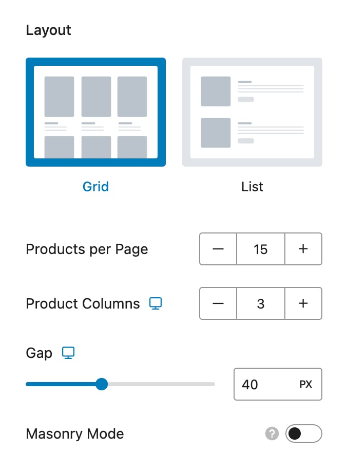
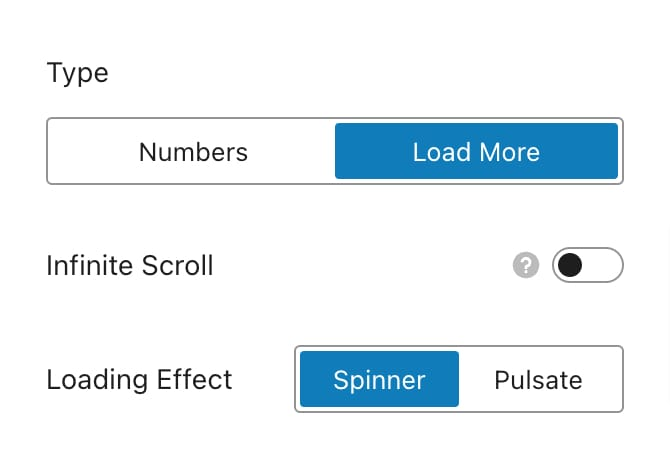

# Product Catalog

Customizing the appearance and style of your shop page is essential for creating a visually appealing and user-friendly online store. The Product Catalog settings in WooCommerce allow you to control many aspects of how products are shown on your shop page. You can find these settings under **Appearance -> Customize -> WooCommerce -> Product Catalog**.

## Layout

<figure><figcaption></figcaption></figure>

Choose between two main layout styles for displaying your products:

* Grid
* List

#### Products per Page

Set the number of products to display per page for the **Grid** layout

#### Product Columns

Adjust the number of columns for the grid layout. This option is responsive, allowing you to configure different column numbers for various device sizes.

#### Masonry Mode

Enable this mode to position product blocks based on available vertical space rather than static rows, creating a more dynamic and visually engaging layout.

## Card

A product card is the visual representation of a product in your catalog. It showcases essential details like the product image, title, price, and other optional information you may wish to include. There are two types of product cards available:

* [**Grid Product Card**](product-card.md#grid-product-card)
* [**List Product Card**](product-card.md#list-product-card)

For a comprehensive guide on each type of product card and detailed customization options, refer to the dedicated article available through the links below.


[product-card.md](product-card.md)


## Page Heading

Manage what appears in the page heading:

### Breadcrumb

Toggle to show or hide the breadcrumb navigation.

<figure><figcaption></figcaption></figure>

### Page Title

Toggle to show or hide the page title.

<figure><figcaption></figcaption></figure>

### Results Count

Toggle to show or hide the number of products found.

<figure><figcaption></figcaption></figure>

### Columns Switcher

Toggle to enable a switcher that allows users to switch between different views. You can specify which options are available in the switcher:

* List
* Grid columns 2
* Grid columns 3
* Grid columns 4
* Grid columns 5
* Grid columns 6

<figure><figcaption>
Step 1
</figcaption></figure> <figure><figcaption>
Step 2
</figcaption></figure>

### Sorting Dropdown

Toggle to show or hide the sorting dropdown menu for filtering products.

## Options

The "Options" section provides additional customization settings to refine the appearance and functionality of your shop page. This section includes settings for the sidebar, catalog mode, and pagination.

### Sidebar

Configure the visibility and placement of the sidebar on your shop page. You can choose to display or hide the sidebar, or adjust its position to fit your design needs. To turn on the sidebar simply switch the toggle to on and then it will become a section which you can click:

<figure><figcaption></figcaption></figure>

#### Sidebar Alignment

Choose the alignment of the sidebar:

<figure><figcaption></figcaption></figure>

* **Left**: Position the sidebar on the left side of the Shop Page.
* **Right**: Position the sidebar on the right side of the Shop Page.

<figure><figcaption></figcaption></figure>

#### Sidebar Toggle

This feature provides a convenient way to manage the visibility of the sidebar based on user preferences, it will show a toggle button to show and hide the shop sidebar. Ideal for large shops, it allows users to filter products without navigating away from their current page.

<figure><figcaption></figcaption></figure>

#### Toggle Action

You can choose how the sidebar should behave when the toggle is activated:

* Sidebar
* Off-Canvas

<figure><figcaption>
Sidebar
</figcaption></figure> <figure><figcaption>
Off-Canvas
</figcaption></figure>

#### Sidebar Type

This option keeps the sidebar in its default position on the page, with the following settings:

* **Default State**: Determine the sidebar's initial state:
  * **Hide Sidebar**: The sidebar will be hidden by default.
  * **Show Sidebar**: The sidebar will be visible by default.
* **Animate Sidebar**: Enable this toggle to animate the sidebar's visibility when the filter is turned on or off, creating a smooth transition effect.

#### Off Canvas Type

This option moves the sidebar off the main page area, allowing it to slide in and out as needed:

* **Off-Canvas Title**: Set a custom title, such as "Filter Products," for the off-canvas sidebar, providing context to users about what the sidebar contains.

<figure><figcaption></figcaption></figure>

#### Toggle Button Text

Customize the text for the buttons that control the sidebar toggle:

* **Show**: Input the text that will appear on the button when the sidebar is hidden and the user can click to show it.
* **Hide**: Input the text that will appear on the button when the sidebar is visible and the user can click to hide it.

<figure><figcaption></figcaption></figure>

#### Sidebar Widgets

The easiest and fastest way to manage your sidebar widgets is by clicking the **"Sidebar Widgets"** link within the customization options. This link will redirect you directly to the widget management area, where you can add, remove, or rearrange widgets with ease.

If you’re looking for more detailed instructions on adding widgets to your sidebar, or if you encounter any issues, please check the [adding widgets to the sidebar guide](../../../general/sidebars/troubleshooting-sidebar.md#adding-widgets-to-your-sidebar). This guide provides step-by-step instructions and troubleshooting tips to ensure your sidebar is set up exactly as you need.


For additional styling and customization of the sidebar, you can adjust the global sidebar settings located under **Appearance -> Customize -> Sidebars**. This area allows you to manage the overall look and feel of sidebars across your site, check the [sidebar styling article](../../../general/sidebars/).


### Catalog Mode

Enable catalog mode to transform your shop into a product catalog. When activated, catalog mode hides the cart and checkout functionalities, including the "Add to Cart" buttons. This mode is ideal for sites that wish to display products without facilitating online purchases, offering a streamlined browsing experience focused solely on product showcasing. It has the following options

* **Catalog Mode** - Toggle to turn on or off the catalog mode.
* **Hide Prices** - When switched on, the prices will hide from the products all over the site.&#x20;

<figure><figcaption></figcaption></figure> <figure><figcaption></figcaption></figure>

### Pagination

Customize how pagination appears on your shop page. You can choose from different pagination styles and control how many products are shown per page. This setting helps manage the navigation and display of products, making it easier for customers to browse through your catalog.

* [**Numbers**](./#numbers)
* [**Load More**](./#load-more)

#### Numbers

Display numbered pagination for navigation.

<figure><figcaption></figcaption></figure>

#### Display Type

* **Numbers**: Show only page numbers.
* **Numbers + Previous/Next**: Display page numbers along with Previous and Next buttons for easier navigation.
* **Previous/Next**: Show only Previous and Next buttons.

***

#### Load More

Use a button to load more posts as users scroll down the page.

<figure><figcaption></figcaption></figure>

* **Infinite Scroll**: Toggle this to enable or disable infinite scrolling, where more posts load automatically as users scroll down the page.
* **Loading Effect**: Choose a loading effect to display while new posts are being fetched:
  * **Spinner**: A spinning icon indicating loading.
  * **Pulsate**: A pulsating effect indicating loading.

***

#### Alignment

Set the alignment of pagination controls for both types:

<figure><figcaption></figcaption></figure>

* **Left**: Align pagination controls to the left.
* **Center**: Center-align pagination controls.
* **Right**: Align pagination controls to the right.
* **Space Between**:  Distribute space between items (Available only for Numbers type)

## Category Box

The Category Box settings allow you to manage the appearance of product categories on your shop page. Before configuring these options, ensure you have set up product categories and enabled them on the Shop page under **Shop page display**. The columns of categories is inherited from the Product Columns, for example if you have set 2 product columns per row it will show 2 categories per row also, as seen in the image below.

<figure><figcaption></figcaption></figure>

### Category Box Types

Choose from six different styles for displaying categories:

* **Type 1**: Title and text inside the image box, bottom left.
* **Type 2**: Title and text inside the image box, center.
* **Type 3**: Title and text inside the image box, top left.
* **Type 4**: Title and text outside the image box, bottom left.
* **Type 5**: Title and text outside the image box, center.
* **Type 6**: Title and text inside the image box with a background, center.

This is how they look live in your site:

<figure><figcaption>
Type 1
</figcaption></figure> <figure><figcaption>
Type 2
</figcaption></figure> <figure><figcaption>
Type 3
</figcaption></figure>

<figure><figcaption>
Type 4
</figcaption></figure> <figure><figcaption>
Type 5
</figcaption></figure> <figure><figcaption>
Type 6
</figcaption></figure>

### Additional Options

* **Show Count**: Toggle this option to display the number of products within each category.
* **Separate Categories**: Shows only when "**Show products & categories**" is selected under  [**Shop Page Display**](./#shop-page-display), toggle this option to separate categories from products into different sections, see examples below:

<figure><figcaption>
Separate Categories Turned Off By default categories show next to products
</figcaption></figure> <figure><figcaption>
Separate Categories Turned On Categories showing in a separate row from products
</figcaption></figure>

#### Shop Page Display

Customize what appears on your main shop page with the following options:

* **Show Products**: Display only products on the shop page.
* **Show Categories**: Display only product categories.
* **Show Categories & Products**: Display both product categories and products.

<figure><figcaption>
Show Products
</figcaption></figure> <figure><figcaption>
Show Categories
</figcaption></figure> <figure><figcaption>
Show Categories &#x26; Products
</figcaption></figure>

#### Category Display

Manage how product category pages are displayed:

* **Show Products**: Display products within each category.
* **Show Subcategories**: Display subcategories within each category.
* **Show Subcategories & Products**: Display both subcategories and products within each category

#### Default Product Sorting

Set the default sorting order for products in the catalog:

* **Default Sorting (Custom Ordering + Name)**: Sort products based on custom ordering and name.
* **Popularity**: Sort products by popularity.
* **Average Rating**: Sort products by average rating.
* **Newest**: Sort products by newest first.
* **Price (Low to High)**: Sort products by price from lowest to highest.
* **Price (High to Low)**: Sort products by price from highest to lowest.
