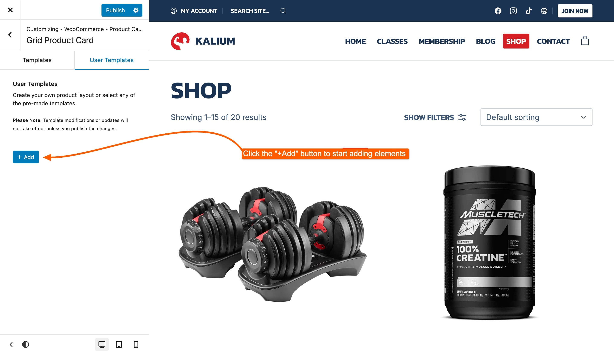
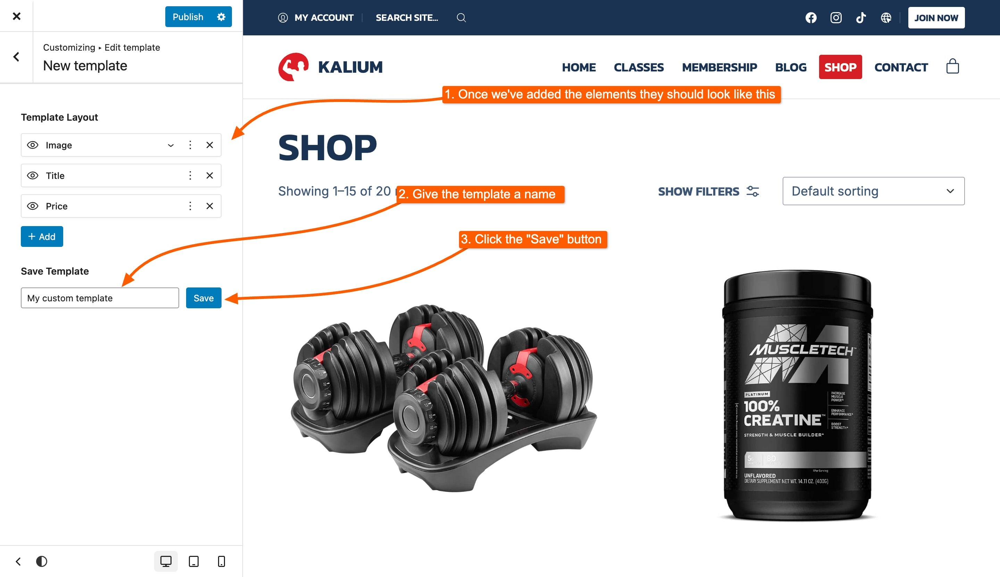

# Product Card

A product card serves as the visual representation of a single product in your catalog. It acts as an individual element designed to be duplicated and displayed in a repeating loop throughout your product listings. Each card typically showcases key information, including the product image, title, price, and any other details you choose to include. There are two distinct types of product cards:

<figure><figcaption>
Grid Product Card
</figcaption></figure> <figure><figcaption>
List Product Card
</figcaption></figure>

### Grid Product Card

This layout is used when you select the Grid type in your catalog settings. It organizes products in a neat, grid-like arrangement, making it perfect for showcasing multiple items in an attractive and orderly fashion.&#x20;

<figure><figcaption></figcaption></figure>

The Grid Product Card offers two distinct tabs for customization:

* **Templates Library**: Choose from a variety of pre-designed grid templates included with the theme, or modify any of them.
* **User Templates**: Create custom grid layouts or modify existing ones, the modified pre-made templates will show under this list here.

<figure><figcaption>
Templates tab
</figcaption></figure>

### List Product Card

Style and design the appearance of product cards in the list view.

<figure><figcaption></figcaption></figure>

List Product Card offers two tabs for customization:

* **Templates Library**: Choose from a variety of pre-designed list templates included with the theme, or modify any of them.
* **User Templates**: Create custom list layouts or modify existing ones, the modified pre-made templates will show under this list here.

<figure><figcaption></figcaption></figure>

### Creating a Custom Template

If you want to create your own custom template instead of using any of the pre-made templates, or if you’re editing an existing template, follow these steps. Below, each element available for customization is explained in detail.

#### 1. Access the User Templates Tab

Start by accessing the **User Templates** tab under the Grid Product Card or List Product Card section.

<figure><figcaption></figcaption></figure>

#### 2. Click + Add Button

Click the **+ Add** button to begin creating your custom template. Each time you want to add a new element, you'll need to click the **+ Add** button again.

<figure><figcaption></figcaption></figure>

#### 3. Add Elements to Your Template

Select and add elements such as **Row**, **Title**, **Image**, and **Price** to build your template. Remember, once an element is added, it will be automatically hidden from the elements list, as it cannot be added twice (except for rows). You can drag and drop elements to nest them, reorder them, or adjust their layout.

<figure><figcaption></figcaption></figure>

#### 4. Name and Save Template

In this example, we used three simple and crucial elements: **Image**, **Title**, and **Price** to create an effective product card layout. Once you’ve arranged all the elements, provide a name for your template. This will help you easily identify it later. After naming your template, save it to ensure your work is not lost.&#x20;

<figure><figcaption></figcaption></figure>

#### 5. Publish Changes

Finally, publish the changes in the customizer to view your new template live on your site.

<figure><figcaption></figcaption></figure>

Each template has the following options shown as icons

* Duplicate
* Customize
* Delete

## Product Card Elements

When customizing your product card, you have a variety of elements to choose from. These elements allow you to tailor the card to suit your design needs. Some elements can be expanded to include additional items, giving you greater flexibility in how you display your products.

#### Elements

* **Row** (Nestable)
* **Title**
* **Image** (Nestable)
* **Price**
* **Add to Cart**
* **Sale Badge**
* **Description**
* **Category**
* **Attribute**
* **Wishlist**
* **Swap on Hover** (Nestable)
* **Hover Block** (Nestable)

#### Element Options

When working with product card elements, each one offers various options to customize and manage your layout. Regardless of the element type, you will encounter three core options:

* **Expand/Collapse** (applicable only to Nestable elements): This option allows you to expand or collapse the element to view or hide its nested content.&#x20;
* **Options**: This provides additional settings specific to the element you are working with.
* **Remove**: Use this to remove any unwanted elements from the template.

<figure><figcaption>
Element Options: <strong>Expand/Collapse</strong>, <strong>Options</strong> and <strong>Remove</strong>
</figcaption></figure>

You can also drag and drop elements to reorder them or add new elements within nested components.&#x20;

***

### Element Tabs

Each product card element comes with three specific tabs when clicking the options icon  in the top right area, with the availability of tabs varying by element type:

* Content
* Style
* Advanced

Below is an example of all three tabs of one of the elements:

<figure><figcaption>
Content tab
</figcaption></figure> <figure><figcaption>
Style tab
</figcaption></figure> <figure><figcaption>
Advanced tab
</figcaption></figure>

Here’s a brief overview of what you can expect from each:

#### Content Tab

Allows you to manage the core content of the element. This includes adding or editing text, images, and other media. Explore the options in this tab to customize what appears in each element.

#### Style Tab

Provides options to adjust the visual appearance of the element. You can change fonts, colors, backgrounds, and other stylistic details to match your design preferences. Check out the available styling options for each element below.

#### Advanced Tab

Offers comprehensive customization for fine-tuning the element’s layout and behavior. Here’s a breakdown of the options available:

**Layout**

* **Margin**: Adjust the space around the element.
* **Padding**: Set the space inside the element’s border.
* **Position**: Choose between Default, Absolute, or Relative positioning.
  * **Position Offset**: Available when Absolute is selected; adjust the element’s offset from its position.
* **Overflow**: Control content overflow with options like Default, Auto, Visible, Scroll, Hidden, Hidden X, or Hidden Y.
* **CSS Classes**: Add custom CSS classes to the element.

**Visibility**

* **Visibility**: Set to Always, Hover, or Hidden.
  * **Hover Options**:
    * **Hover Animation**: Choose from None, Fade, Fade Up, Fade Down, Fade Left, Fade Right, Scale Up, Scale Down, Slide Up, Slide Down, Slide Left, or Slide Right.
    * **Animation Duration**: Select Normal, Slow, or Fast.
    * **Animation Delay**: Input delay time in milliseconds (MS).

**Border**

* **Border**: Customize the border color and width.
* **Border Radius**: Adjust the corner rounding of the border.

**Text**

* **Font Size**: Set the size of the text.
* **Text Align**: Choose Global, Left, Center, or Right alignment.
* **Text Transform**: Select from Global, Uppercase, Lowercase, or Capitalized text transformation.

**Dimensions**

* **Width**: Specify the width of the element.
* **Height**: Specify the height of the element.
* **Min Width**: Set the minimum width.
* **Min Height**: Set the minimum height.

**Custom CSS**

* **Custom CSS**: Write your own CSS rules for the element. Use `#self` to target the wrapper element.

Each tab and its options allow you to fully customize and control the appearance and behavior of your product card elements.

***

### Row

Define the structure and spacing of rows in your template. You can add other elements inside the row to organize your layout. Each row contains a single element: **Column**. The column can hold all other elements.

<figure><figcaption>
Content Tab
</figcaption></figure> <figure><figcaption>
Style Tab
</figcaption></figure> <figure><figcaption>
Row when expanded
</figcaption></figure>

### Title

Display the product title within the card.

<figure><figcaption></figcaption></figure>

### Image

Add the product image to your layout. You can also include additional elements inside the image, similar to how you can customize the row.

<figure><figcaption></figcaption></figure> <figure><figcaption></figcaption></figure>

### Price

Show the product price in the card.

### Add to Cart

Include an "Add to Cart" button for quick purchasing.

<figure><figcaption>
Content tab
</figcaption></figure> <figure><figcaption>
Style tab
</figcaption></figure>

### Sale Badge

Feature a badge to indicate discounted items.

<figure><figcaption></figcaption></figure>

### Description

Provide a brief product description.

<figure><figcaption>
Content tab
</figcaption></figure> <figure><figcaption>
Style tab
</figcaption></figure>

### Category

Display the product category within the card.

<figure><figcaption></figcaption></figure>

### Attribute

Show specific product attributes.

<figure><figcaption></figcaption></figure>

### Wishlist

Add an option for users to save products to their wishlist.&#x20;

<figure><figcaption>
Content tab
</figcaption></figure> <figure><figcaption>
Style
</figcaption></figure>


This element requires the **YITH Wishlist** plugin to be installed and activated in order to be used in the custom card template.


### Swap on Hover

Enable a feature to swap content when hovering over the card.&#x20;

The suppported elements that can be swapped on hover are:

* Title
* Price
* Add to Cart
* Category
* Attribute

<figure><figcaption>
Swap on Hover when Expanded
</figcaption></figure> <figure><figcaption>
Available Elements
</figcaption></figure> <figure><figcaption>
Content tab
</figcaption></figure>

### Hover Block

Customize the block that appears on hover. It functions similarly to the row, allowing you to add any elements inside it, but includes special effects triggered by hovering.

<figure><figcaption>
Hover Block when Expanded
</figcaption></figure> <figure><figcaption>
Style tab
</figcaption></figure>

