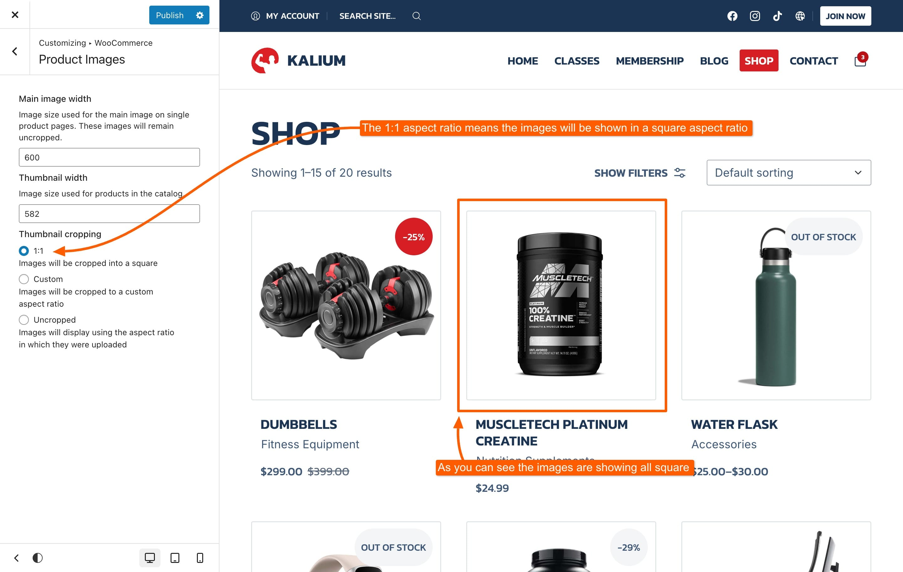
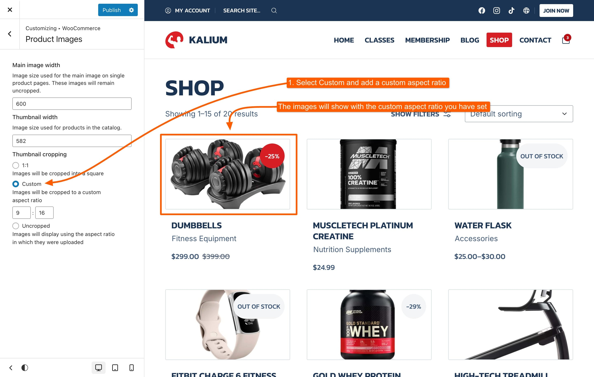
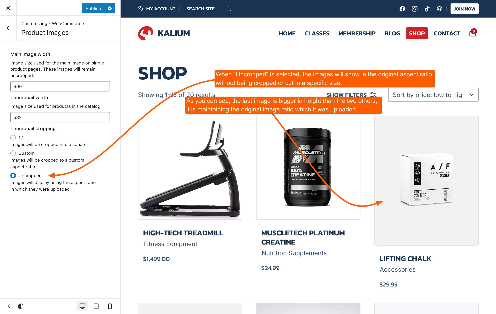

# Product Images

Customize the display of product images across your WooCommerce store with the settings found under **Appearance -> Customize -> WooCommerce -> Product Images**. These options allow you to adjust how images appear on single product pages and throughout your catalog, helping you create a visually appealing and consistent look for your products.


**This section comes from WooCommerce itself, not Kalium.** It decides the sizes WordPress generates for your product images.

How those images are then *displayed* — the gallery style, the card layout, hover effects — is set in Kalium's own screens under **Product Catalog** and **Product Page**.



**Changing any of these settings does not resize images you've already uploaded.** After changing them you must **regenerate your thumbnails**, or nothing will visibly change and it will look as though the setting did nothing.

A plugin such as Regenerate Thumbnails does this, and most hosts offer it too.


### Main Image Width

This setting controls the width of the main product image on single product pages. Images displayed here will remain uncropped, preserving their original aspect ratio. Adjusting this width allows you to optimize the display of product images for different screen sizes and layouts, ensuring that they are shown in the best possible quality.

### Thumbnail Width

This option determines the size of product images in your catalog, including product grids and lists. By setting the thumbnail width, you can control how large or small product images appear in these areas, making it easier to create a visually appealing and consistent product display.

### Thumbnail Cropping

#### 1:1

Crops images into a square shape. This option ensures that all thumbnails have the same dimensions, creating a uniform look across your product catalog.

<figure><figcaption></figcaption></figure>

#### Custom

Allows you to crop images to a custom aspect ratio. This flexibility enables you to match the image dimensions to your specific design requirements or layout preferences.

<figure><figcaption></figcaption></figure>

#### Uncropped

Displays images using the original aspect ratio in which they were uploaded. This option preserves the natural dimensions of your images but may result in varying thumbnail sizes.

<figure><figcaption></figcaption></figure>


**1:1 is the safest choice for most shops.** Uncropped looks fine when every product photo is shot the same way, and untidy the moment one isn't — a grid of mixed portrait and landscape images has uneven rows.


***

### Where Kalium's own image settings live

If you're trying to change how product images *behave* rather than what size they're saved at, you want one of these instead:

| To change | Go to |
| --- | --- |
| The gallery style on a product page | **Customize -> WooCommerce -> Product Page** |
| The image inside a product card, and its hover behavior | **Customize -> WooCommerce -> Product Catalog -> Grid Product Card** |
| The image in product navigation | **Customize -> WooCommerce -> Product Page -> Product Navigation** |


[product-page.md](product-page.md)



[product-card.md](product-catalog/product-card.md)


***

### Common questions

**I changed a setting and nothing happened.**\
Regenerate your thumbnails. Existing images keep the sizes they were saved at.

**My product images are blurry.**\
Raise **Main Image Width** or **Thumbnail Width**, then regenerate thumbnails. If the original upload is small, no setting will help.

**Images look stretched or oddly cropped.**\
That's **Thumbnail Cropping**. Try 1:1 for consistency, or Uncropped to stop cropping entirely.

**Product images don't load on the first visit.**\
A timing issue fixed in a past release — update Kalium.


[image-problems.md](../../troubleshooting/image-problems.md)

