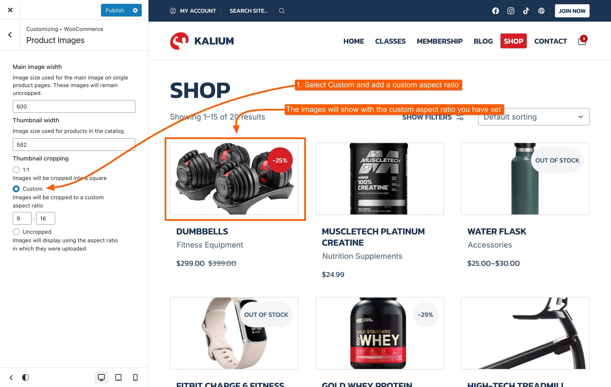

# Product Images

Customize the display of product images across your WooCommerce store with the settings found under **Appearance -> Customize -> WooCommerce -> Product Images**. These options allow you to adjust how images appear on single product pages and throughout your catalog, helping you create a visually appealing and consistent look for your products.

### Main Image Width

This setting controls the width of the main product image on single product pages. Images displayed here will remain uncropped, preserving their original aspect ratio. Adjusting this width allows you to optimize the display of product images for different screen sizes and layouts, ensuring that they are shown in the best possible quality.

### Thumbnail Width

This option determines the size of product images in your catalog, including product grids and lists. By setting the thumbnail width, you can control how large or small product images appear in these areas, making it easier to create a visually appealing and consistent product display.

### Thumbnail Cropping

#### 1:1

Crops images into a square shape. This option ensures that all thumbnails have the same dimensions, creating a uniform look across your product catalog.

<figure><figcaption></figcaption></figure>

#### Custom

Allows you to crop images to a custom aspect ratio. This flexibility enables you to match the image dimensions to your specific design requirements or layout preferences.

<figure><figcaption></figcaption></figure>

#### Uncropped

Displays images using the original aspect ratio in which they were uploaded. This option preserves the natural dimensions of your images but may result in varying thumbnail sizes.

<figure><figcaption></figcaption></figure>
