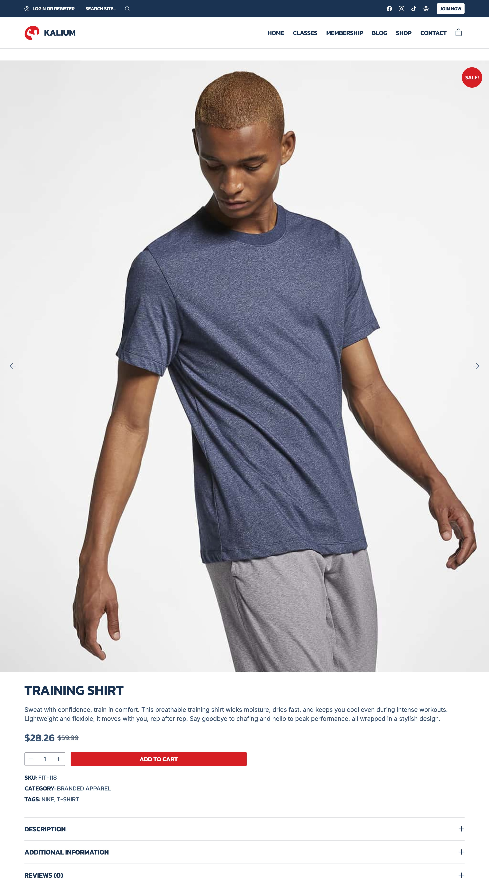
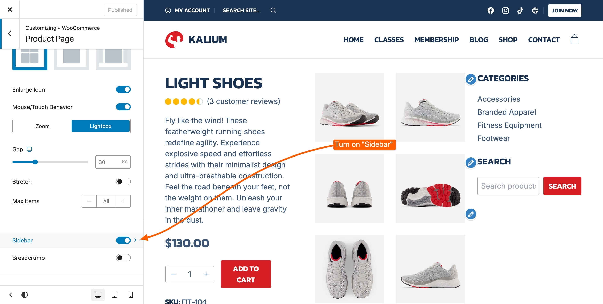
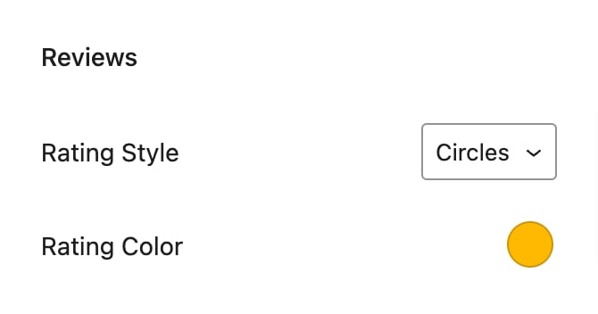
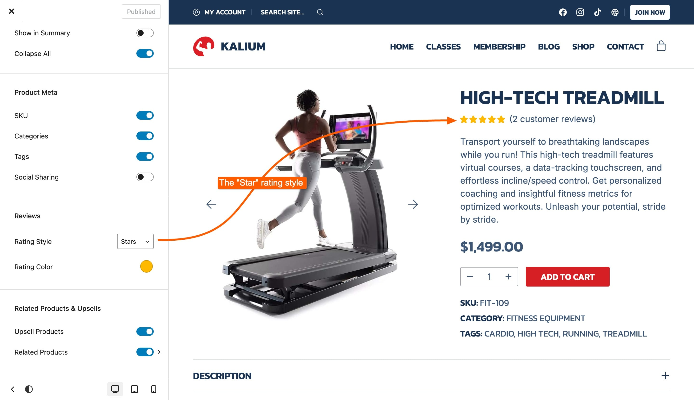
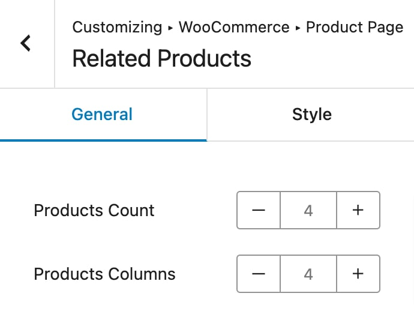

# Product Page

Located under **Appearance -> Customize -> WooCommerce -> Product Page**, this section allows you to design various aspects of your product page to meet your specific needs. From image dimensions to gallery layouts and additional features, you have control over how your products are presented.

## Product Image Width

Determine how wide the product image should be displayed on the product page:

<figure><figcaption></figcaption></figure>

* **Small**: A compact image size that conserves space.
* **Medium**: A balanced option that provides moderate visibility.
* **Large**: Enlarges the image to highlight products more prominently.
* **Container Width**: Expands the image to fill the width of its container.
* **Full Width**: Stretches the image across the entire width of the page for a full-screen effect.

<figure><figcaption>
Small
</figcaption></figure> <figure><figcaption>
Medium
</figcaption></figure> <figure><figcaption>
Large
</figcaption></figure>

<figure><figcaption>
Container Width
</figcaption></figure> <figure><figcaption>
Full Width
</figcaption></figure>

#### Flip Horizontally

Inverts the layout by moving the image to the right and content to the left.

<figure><figcaption></figcaption></figure>

#### Sticky Description

Keeps the description area visible and sticky while scrolling through the gallery.

<figure><figcaption></figcaption></figure>

#### Gallery / Summary Gap

Sets the gap between the gallery and summary containers, with responsive controls for different device sizes. Note: This option does not apply to **Container Width** and **Full Width** types.

<figure><figcaption></figcaption></figure>

## Gallery

Customize the layout and behavior of your product image gallery:

<figure><figcaption></figcaption></figure>

* **Thumbnails Bottom**: Displays thumbnail images below the main product image.
* **Thumbnails Right**: Places thumbnails vertically on the right side of the main image.
* **Thumbnails Left**: Aligns thumbnails vertically on the left side.
* **Grid 1**: Organizes gallery images in a single-column grid.
* **Grid 2**: Arranges images in a two-column grid, below the featured image.
* **Grid 3**: Shows images in a mixed column grid (1/2/1).
* **Grid 4**: Formats images in a two-column grid.
* **Simple**: Presents images without additional thumbnails.
* **Carousel**: Features a rotating carousel of product images.

<figure><figcaption>
Thumbnails Bottom
</figcaption></figure> <figure><figcaption>
Thumbnails Left
</figcaption></figure> <figure><figcaption>
Thumbnails Right
</figcaption></figure>

<figure><figcaption>
Grid 1
</figcaption></figure> <figure><figcaption>
Grid 2
</figcaption></figure> <figure><figcaption>
Grid 3
</figcaption></figure> <figure><figcaption>
Grid 4
</figcaption></figure>

<figure><figcaption>
Simple
</figcaption></figure> <figure><figcaption>
Carousel
</figcaption></figure>

#### Gallery Options

* **Enlarge Icon**: Toggle to show or hide the icon that allows users to enlarge images.
* **Mouse/Touch Behaviour**: Choose the action triggered by clicking or touching an image:
  * **Zoom/Lightbox**: Decide between zooming into the image or opening it in a lightbox.
* [**Gap**](#user-content-fn-1)[^1]: Set the space between gallery images. This option has responsive controls for various device sizes and applies to all gallery types except Simple.
* **Max Items**: Limit the number of images shown in the gallery or select "All" to display every image.
* [**Gallery Auto Play**](#user-content-fn-2)[^2]: Enter the interval (in seconds) for automatic image rotation.
* [**Navigation**](#user-content-fn-2)[^2]: Choose between **Arrows**, **Dots**, or both for navigation controls.
* [**Animation**](#user-content-fn-2)[^2]: Select **Slide** or **Fade** for image transitions.
* [**Carousel Thumbnails**](#user-content-fn-3)[^3]: Enable carousel view for thumbnails.
  * **Auto Thumbnails per View**: Automatically adjusts the number of thumbnails shown per view.
  * **Thumbnails per View**: Manually set the number of thumbnails displayed per view.
* **Max Items**: Limit the number of thumbnail items shown or select "All" to display all thumbnails.

## Sidebar

Configure the visibility and placement of the sidebar on your product page. You can choose to display or hide the sidebar, or adjust its position to fit your design needs. To turn on the sidebar simply switch the toggle to on and then it will become a section which you can click:

<figure><figcaption></figcaption></figure>

#### Sidebar Alignment

Choose the alignment of the sidebar:

<figure><figcaption></figcaption></figure>

* **Left**: Position the sidebar on the left side of the Shop Page.
* **Right**: Position the sidebar on the right side of the Shop Page.

#### Full Height

Set the height of the sidebar to Full Height if you want it to have a 100% height within the container of the product.

#### Sidebar Widgets

The easiest and fastest way to manage your sidebar widgets is by clicking the **"Sidebar Widgets"** link within the customization options. This link will redirect you directly to the widget management area, where you can add, remove, or rearrange widgets with ease.

If you’re looking for more detailed instructions on adding widgets to your sidebar, or if you encounter any issues, please check the [adding widgets to the sidebar guide](../../general/sidebars/troubleshooting-sidebar.md#adding-widgets-to-your-sidebar). This guide provides step-by-step instructions and troubleshooting tips to ensure your sidebar is set up exactly as you need.


For additional styling and customization of the sidebar, you can adjust the global sidebar settings located under **Appearance -> Customize -> Sidebars**. This area allows you to manage the overall look and feel of sidebars across your site, check the [sidebar styling article](../../general/sidebars/).


## Breadcrumb

Manage the breadcrumb navigation on the product page, toggle to enable or disable the breadcrumb navigation.

#### Position

Choose the position of the breadcrumbs within the product page, it has two options:

* **Below Header**: Place the breadcrumb navigation under the header.
* **Above Title**: Position the breadcrumb navigation above the product title.

<figure><figcaption>
Above Title
</figcaption></figure> <figure><figcaption>
Below Header
</figcaption></figure>

## Tabs

Configure the layout and styling of product tabs, which is a crucial WooCommerce feature for products, there are three types of tab styles:

* Tabs
* Accordions
* Stacked

<figure><figcaption></figcaption></figure>

And each of them have the option to show the tab **Titles**, which when toggled will show. Below we'll explain each of the tab styles and their options.

<figure><figcaption></figcaption></figure>

#### Tabs&#x20;

Display product details in a tabbed format:

* **Style**: Choose between **Underline** or **Pills**.
* **Orientation**: Select **Horizontal** or **Vertical** layout.

<figure><figcaption>
Underline Style
</figcaption></figure> <figure><figcaption>
Pill Style
</figcaption></figure>

<figure><figcaption>
Horizontal Orientation
</figcaption></figure> <figure><figcaption>
Vertical Orientation
</figcaption></figure>

#### Accordions

Show product details in expandable sections:

* **Show in Summary**: Toggle to display accordions within the summary or below it.
* **Collapse All**: Set all accordions to be collapsed by default.

<figure><figcaption>
Accordions
</figcaption></figure> <figure><figcaption>
Show in Summary
</figcaption></figure>

#### Stacked

Displays tabs in a vertical stack without additional styling options.

<figure><figcaption>
Stacked
</figcaption></figure>

## Product Meta

Control the visibility of meta information on the product page:

<figure><figcaption></figcaption></figure>

* **SKU**: Show or hide the product SKU.
* **Categories**: Toggle the display of product categories.
* **Tags**: Enable or disable the display of product tags.

<figure><figcaption></figcaption></figure>

#### Social Sharing

Allow visitors to share your product on various social networks directly from the product page. These are the options for social sharing:

<figure><figcaption></figcaption></figure>

#### Style

* **Labels**: Displays text labels for sharing buttons.
* **Icons**: Displays only icons for sharing buttons.

#### Share Networks

Add or remove sharing networks from the following options:

* Facebook
* X (Twitter)
* Pinterest
* Email
* LinkedIn
* Tumblr
* VKontakte
* WhatsApp
* Telegram
* Print

## Reviews

Customize the display of product reviews:

<figure><figcaption></figcaption></figure>

* **Rating Style**: Choose between **Circles** or **Stars** for the rating display.
* **Rating Color**: Select the color for the rating display.

<figure><figcaption>
Star Rating
</figcaption></figure> <figure><figcaption>
Circle Rating
</figcaption></figure>

## Related Products & Upsells

Manage the display of related and upsell products within the product page:

<figure><figcaption></figcaption></figure>

#### Upsell Products

Toggle to show or hide upsell products.

<figure><figcaption></figcaption></figure>

#### Related Products

Show or hide related products in the product page, when toggled it will become a clickable section with the following options:

<figure><figcaption></figcaption></figure>

* **Products Count**: Set the number of related products to display.
* **Product Columns**: Adjust the number of columns for related products.

<figure><figcaption>
General Tab
</figcaption></figure>

Customize the appearance of related products:

<figure><figcaption>
Style Tab
</figcaption></figure>

* **Background**: Choose a background color for the related products section.
* **Padding**: Adjust the top and bottom padding around related products.

[^1]: **Does not apply for:**\
    \- Simple

[^2]: **Applies only for:**\
    \- Thumbnails Bottom\
    \- Thumbnails Left\
    \- Thumbnails Right\
    \- Simple\
    \- Carousel

[^3]: **Applies only for:**\
    \- Thumbnails Bottom\
    \- Thumbnails Left\
    \- Thumbnails Right
