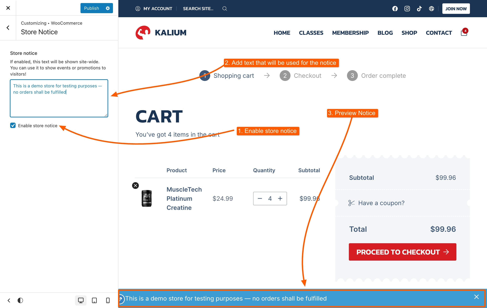

# Store Notice

The Store Notice feature in WooCommerce allows you to display a message across your online store, ideal for announcements or updates.

### How to Use the Store Notice

Navigate to **Appearance -> Customize -> WooCommerce -> Store Notice** in your WordPress dashboard.

<figure><figcaption></figcaption></figure>

It has the following options:

* **Enable/Disable Notice**: Check the box to show the notice bar on your site. Uncheck to hide it.
* **Store Notice**: Enter the message you want to display.

You can preview the notice live as you edit it, making sure it looks just right before going live.
