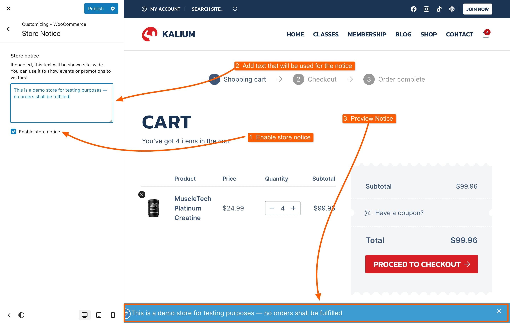

# Store Notice

The Store Notice feature in WooCommerce allows you to display a message across your online store, ideal for announcements or updates.

It's a single bar visible on every page — the right place for something everyone needs to know: a sale, a shipping delay, holiday closing dates.

### How to Use the Store Notice

Navigate to **Appearance -> Customize -> WooCommerce -> Store Notice** in your WordPress dashboard.

<figure><figcaption></figcaption></figure>

It has the following options:

* **Enable/Disable Notice**: Check the box to show the notice bar on your site. Uncheck to hide it.
* **Store Notice**: Enter the message you want to display.

You can preview the notice live as you edit it, making sure it looks just right before going live.

***

### Writing a good notice

**Keep it to one line.** It's a bar, not a paragraph. "Free shipping on orders over $50" works; three sentences about your shipping policy doesn't.

**Say what it means for the customer**, not what happened internally. "Orders placed after 20 December ship in January" beats "Our warehouse is closed for the holidays."

**Turn it off when it's no longer true.** A notice about a sale that ended last month makes a shop look neglected. It's one checkbox — uncheck it.


**Visitors can dismiss the notice**, and once dismissed it stays hidden for them. If you've changed the text and want to check it, use a private browsing window.


***

### Styling it

The notice is styled to match your theme automatically, so it picks up your colors without any work.

To change how it looks, use a CSS snippet or **Appearance -> Customize -> Additional CSS**. The notice has its own class, so you can target it without affecting anything else.


[custom-code.md](../../other/custom-code.md)


***

### When you need more than one line

The Store Notice is deliberately simple — one message, everywhere, no formatting. When that isn't enough, a **Template Part** of type *Section* gives you the full editor and much more control:

* **Rich content** — images, buttons, several lines, your own layout
* **Show it on chosen pages only** — the shop but not the blog, the cart but not the checkout
* **Show it at a chosen time** — a weekend sale banner that appears on Saturday and goes on Sunday night
* **Show it to some visitors only** — logged-in customers, or first-time visitors

Place it with a **Header After** location and a display condition for where it belongs.


[creating-a-section](../../template-parts/creating-template-parts/creating-a-section/)


For something that needs attention rather than a passing glance, a popup may suit better:


[popups.md](../../template-parts/creating-template-parts/popups.md)


***

### Common questions

**The notice doesn't appear.**\
Check the box is ticked and the message isn't empty. If you've dismissed it yourself, try a private browsing window.

**The whole WooCommerce section is missing from the Customizer.**\
WooCommerce isn't active. It's the only option group that disappears entirely without its plugin.

**I want a different notice on different pages.**\
Store Notice shows one message everywhere. Use a Section template part instead.
