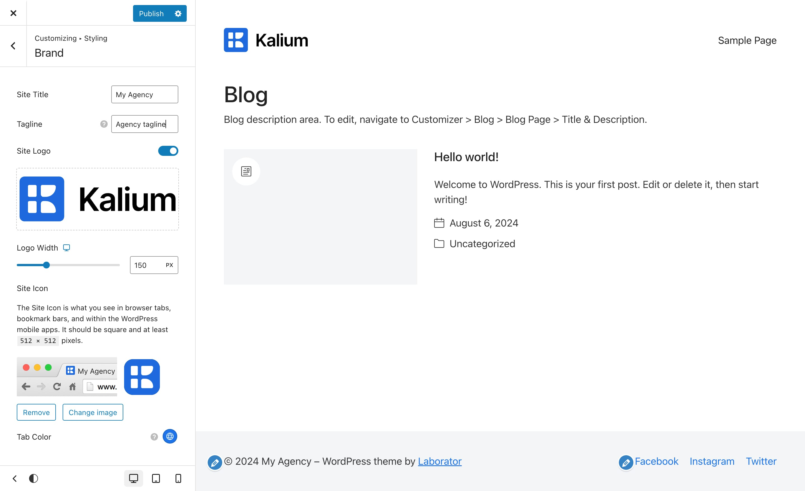

# Brand and Logo

In Kalium, setting up your site's branding is quite simple. You can easily manage your branding elements through the **Appearance** -> **Customize** -> **Styling** -> **Brand** section. You have the option to use a logo or not by switching the toggle. This area allows you to customize the following key brand elements:

<figure><figcaption></figcaption></figure>

* **Site Title**\
  Set the name of your website, which will be displayed in various parts of your site and can enhance your site's identity.
* **Tagline**\
  Add a brief description or slogan for your website, giving visitors a quick insight into what your site is about.
* **Site Logo**\
  Upload your logo to represent your brand visually across your website. You can choose to enable or disable the display of the logo as needed.
  * **Logo Width**\
    Adjust the width of your logo to fit your site's design. Responsive options are available, allowing you to set different logo widths for various devices (desktop, tablet, and mobile) to make sure your logo looks perfect on all screen sizes.
* **Site Icon**\
  The Site Icon is the small image you see in browser tabs, bookmark bars, and within the WordPress mobile apps also known as the favicon. It’s an important branding element for a professional appearance. The icon should be square and at least `512 × 512` pixels in size.
* **Tab Color**\
  This color applies only on browsers that support the `theme-color` feature. It appears on some browsers that support it, allowing you to match your tab color with your site's branding.
