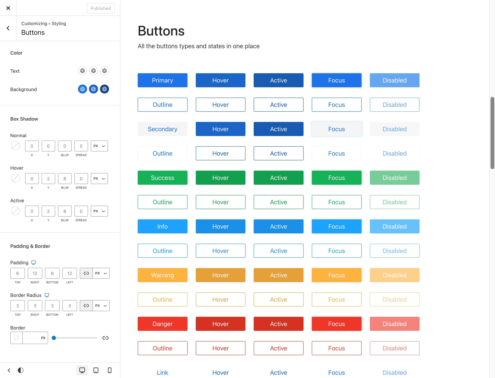
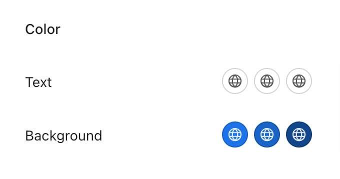
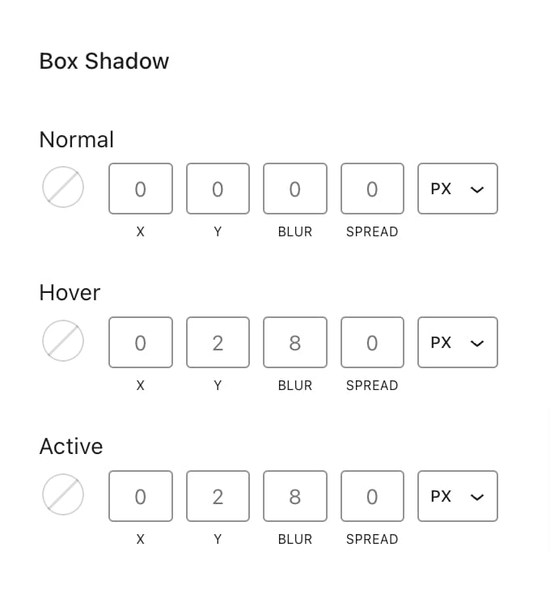
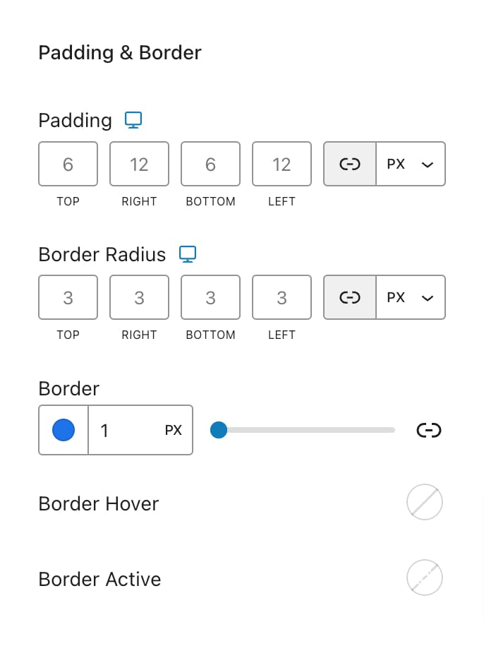

# Buttons

Globally manage the appearance of buttons across your site to have a consistency in design. Customize the button styles under **Appearance** -> **Customize** -> **Styling** -> **Buttons**. Each button style can be set for three states:&#x20;

* Normal
* Hover
* Active

<figure><figcaption></figcaption></figure>

This means that you can define how buttons look by default, how they change when hovered over, and their appearance when actively clicked or pressed. All options related to colors apply to these three states.

***

### Color

<figure><figcaption></figcaption></figure>

#### **Text Color**

Set the color of the text on your buttons. Make sure there is enough contrast with the background color to help users with different abilities read the text easily.

#### Background Color

Choose the background color for your buttons. Ensure it contrasts well with the text color to make it easy to see.

***

### Box Shadow

<figure><figcaption></figcaption></figure>

#### Box Shadow

Add a shadow effect to your buttons. You can adjust the shadow’s color, blur, spread, and position to give the button a 3D look and make it stand out.

***

### Padding & Border

<figure><figcaption></figcaption></figure>

#### Padding

Adjust the space around the button text to change its size and spacing. This setting applies to all buttons and doesn’t change with different states.

#### Border Radius

Set how rounded the corners of the buttons are. This lets you create buttons with either square or rounded edges.

#### Border

Customize the border color, style, and width of your buttons. Keep in mind that the border color on Hover and Active states won’t be visible unless a border width is set. If you want to set the border width and color manually for each of the four sides, click the link icon (🔗) to unlink the values.
