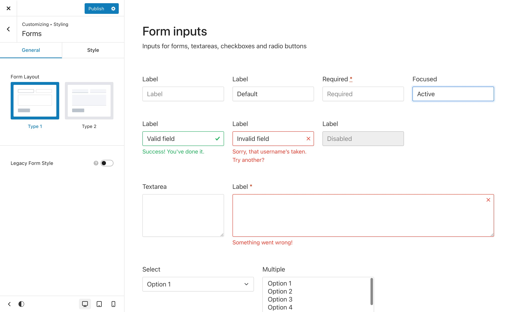
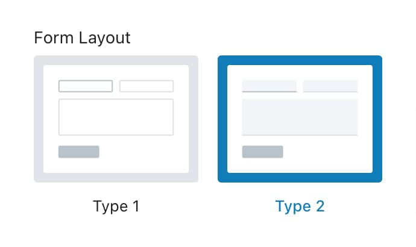
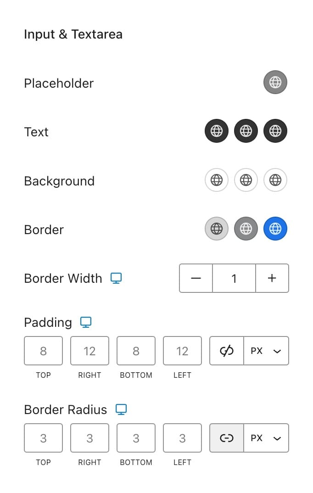
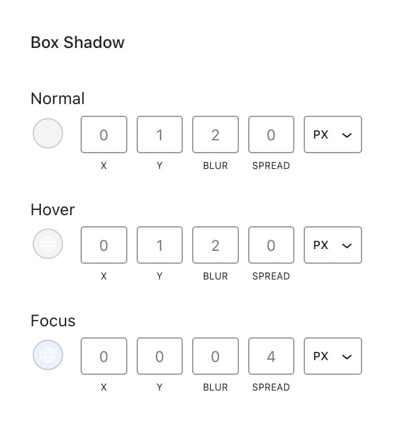
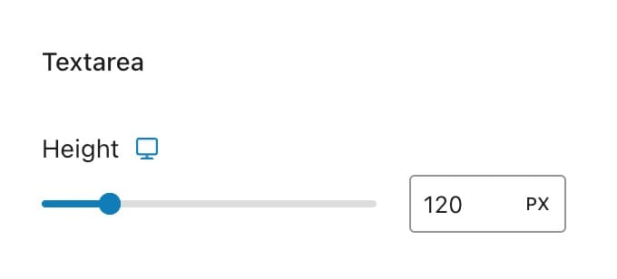
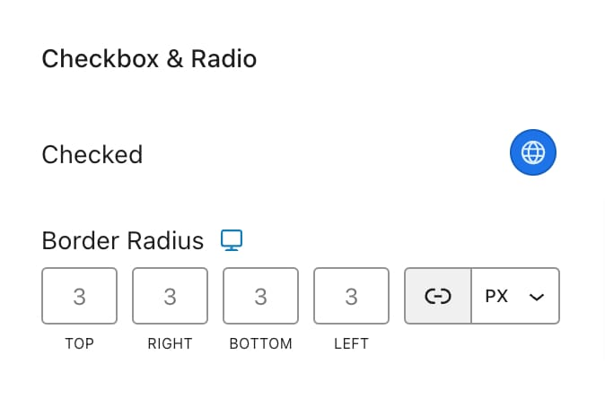

# Forms

Manage the appearance and layout of forms across your entire site to maintain a consistent design. This applies to all forms, including contact forms, search forms, comment sections, checkout pages, and more. You can customize the form styles under **Appearance** -> **Customize** -> **Styling** -> **Forms**.

<figure><figcaption></figcaption></figure>

### General

The General tab in allows you to control the overall layout and style of forms across your site. This tab includes options to choose the layout type and activate the legacy form style if needed.

#### Form Layout

This section lets you select the basic structure of your forms. You can choose between two layout types:

<figure><figcaption></figcaption></figure>

#### Type 1

The default form layout option. This style features a boxed layout, providing a traditional and structured appearance for your forms.

#### Type 2

A more minimalistic layout option where form fields appear as underlined rather than boxed. This style gives your forms a modern and sleek look.


**Legacy Form Style**\
This toggle is available for users who have migrated from Kalium 3 and want to continue using the old Kalium forms. However, it's not recommended to use this option as it is considered legacy and will be removed in future updates.


***

### Style

In the Style tab, you can customize various aspects of the form fields:

#### Input & Textarea

<figure><figcaption></figcaption></figure>

* **Placeholder**: Set the text color for the placeholder in form fields.
* **Text**: Customize the text color for three states — Normal, Hover, and Active.
* **Border**: Define the border color for the three states — Normal, Hover, and Active.
* **Border Width**: Adjust the thickness of the border around form fields.
* **Padding**: Control the space inside the form fields to adjust the size and spacing of the text.
* **Border Radius**: Set how rounded the corners of the form fields are.

#### Box Shadow

Add a shadow effect to the form fields to give them depth and make them stand out, available for the three states (Normal, Hover and Focus).

<figure><figcaption></figcaption></figure>


Some style elements won’t be visible when using Type 2, as it lacks a regular border. Features like border radius and box shadow won’t be applied in this layout.


#### Textarea

<figure><figcaption></figcaption></figure>

* **Height**: Set the height of the textarea field to control how much text space is available.

#### Checkbox and Radio

<figure><figcaption></figcaption></figure>

* **Checked**: Define the color that appears when a checkbox or radio button is selected.
* **Border Radius**: Set the roundness of the checkbox and radio button corners.

### Will Form Styling Apply to Other Form Plugins?

Kalium has been tested with the most well-known form plugins to ensure a seamless design experience. Even though these plugins have their own styling, Kalium will automatically select the necessary styling options so that our styles apply to each form.&#x20;

Make sure to select the **Theme Styled** option in your form plugin settings to make sure Kalium form styles are applied, no matter which plugin you're using.

The supported plugins include&#x20;

* Contact Form 7
* WPForms
* Fluent Forms
* Forminator
* Ninja Forms
